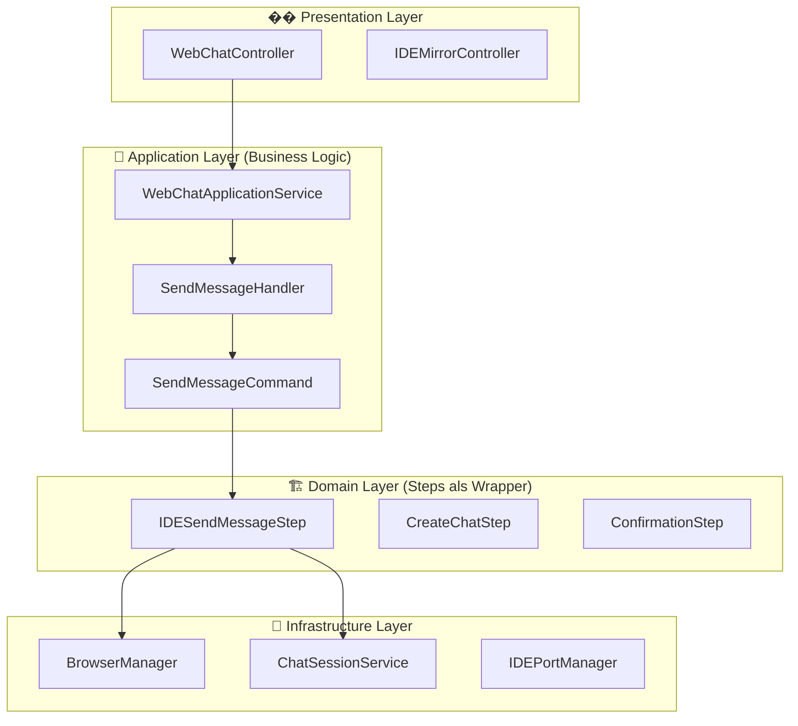
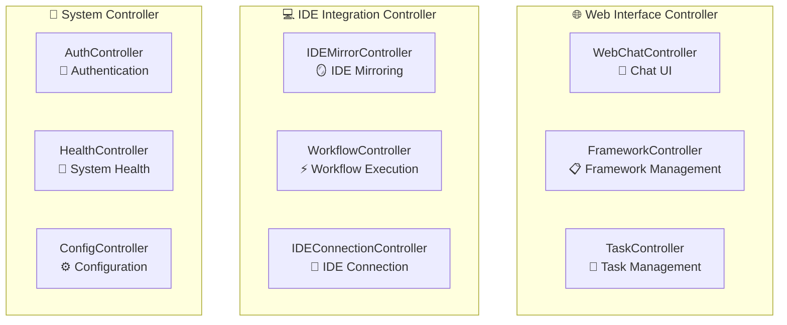
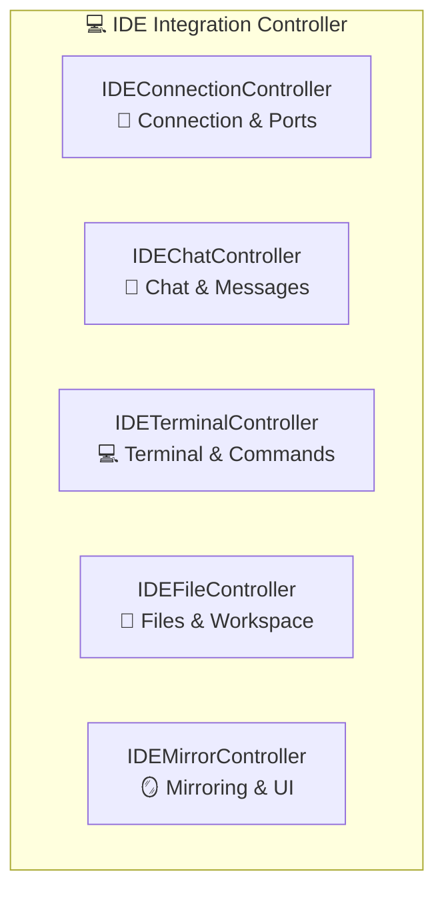

# 🎯 **SAUBERE ARCHITEKTUR-ANALYSE: Steps als Wrapper für Handlers/Commands**

## 📋 **KORREKTUREN & AKTUALISIERUNGEN**

### **✅ README.md wurde korrigiert und aktualisiert:**

1. **✅ Project-Specific Routing korrekt dokumentiert**
   - Alle Task-, Workflow-, Analysis- und Git-Operationen sind project-spezifisch
   - Routing-Pattern: `/api/projects/:projectId/*`
   - Konsistente Verwendung von `projectId` Parameter

2. **✅ Aktuelle Controller-Struktur dokumentiert**
   - 10 Controller statt 6 (wie ursprünglich geplant)
   - Korrekte Verantwortlichkeiten für jeden Controller
   - Aktuelle Endpoints aus Application.js übernommen

3. **✅ IDE vs Project vs Global Routing klar getrennt**
   - **IDE-Specific**: `/api/ide/*` & `/api/ide-mirror/*`
   - **Project-Specific**: `/api/projects/:projectId/*`
   - **Global**: `/api/chat/*`, `/api/auth/*`, `/api/frameworks/*`

4. **✅ Veraltete Controller-Namen korrigiert**
   - `IDEConnectionController` → `IDEController`
   - `FrameworkController` → `ContentLibraryController`
   - Neue Controller hinzugefügt: `AnalysisController`, `GitController`, `ProjectController`, `AuthController`

## 📋 **OPTIMALE LAYER-STRUKTUR**

### **✅ SAUBERE TRENNUNG:**



## 🏗️ **LAYER-AUFTEILUNG**

### **✅ Presentation Layer (API/Controllers)**
```javascript
// ✅ Was gehört hier rein:
backend/presentation/
├── api/
│   ├── WebChatController.js        // ✅ Chat API Endpoints
│   ├── IDEMirrorController.js      // ✅ IDE Mirror API
│   └── WorkflowController.js       // ✅ Workflow API
└── websocket/
    └── WebSocketManager.js         // ✅ Real-time Communication
```

**Verantwortlichkeit:**
- ✅ **HTTP Request/Response Handling**
- ✅ **WebSocket Communication**
- ✅ **Input Validation**
- ✅ **Error Response Formatting**

### **✅ Application Layer (Business Logic)**
```javascript
// ✅ Was gehört hier rein:
backend/application/
├── services/
│   ├── WebChatApplicationService.js    // ✅ Chat Orchestration
│   ├── WorkflowApplicationService.js   // ✅ Workflow Orchestration
│   └── TaskApplicationService.js       // ✅ Task Management
├── handlers/
│   └── categories/
│       ├── management/
│       │   ├── SendMessageHandler.js   // ✅ Message Business Logic
│       │   └── CreateTaskHandler.js    // ✅ Task Business Logic
│       └── ide/
│           └── CreateChatHandler.js    // ✅ Chat Business Logic
└── commands/
    └── categories/
        ├── management/
        │   ├── SendMessageCommand.js   // ✅ Message Business Action
        │   └── CreateTaskCommand.js    // ✅ Task Business Action
        └── ide/
            └── CreateChatCommand.js    // ✅ Chat Business Action
```

**Verantwortlichkeit:**
- ✅ **Business Logic Orchestration**
- ✅ **Command Validation**
- ✅ **Use Case Management**
- ✅ **Event Publishing**
- ✅ **Session Management**

### **✅ Domain Layer (Steps als Wrapper)**
```javascript
// ✅ Was gehört hier rein:
backend/domain/
├── steps/
│   └── categories/
│       ├── chat/
│       │   ├── ide_send_message.js     // ✅ Browser Automation Wrapper
│       │   └── ide_get_response.js     // ✅ Response Detection Wrapper
│       ├── ide/
│       │   ├── create_chat_step.js     // ✅ Chat Creation Wrapper
│       │   └── switch_chat_step.js     // ✅ Chat Switching Wrapper
│       └── completion/
│           └── confirmation_step.js    // ✅ Confirmation Wrapper
├── workflows/
│   └── WorkflowOrchestrationService.js // ✅ Step Orchestration
└── entities/
    ├── ChatMessage.js                  // ✅ Domain Entities
    ├── ChatSession.js                  // ✅ Domain Entities
    └── Task.js                         // ✅ Domain Entities
```

**Verantwortlichkeit:**
- ✅ **Browser Automation (Steps)**
- ✅ **IDE Integration (Steps)**
- ✅ **Response Detection (Steps)**
- ✅ **Domain Entities**
- ✅ **Business Rules**

### **✅ Infrastructure Layer (Services)**
```javascript
// ✅ Was gehört hier rein:
backend/infrastructure/
├── external/
│   ├── BrowserManager.js              // ✅ Browser Control
│   ├── IDEPortManager.js              // ✅ Port Management
│   └── ChatSessionService.js          // ✅ Session Management
├── repositories/
│   ├── ChatRepository.js              // ✅ Data Access
│   └── TaskRepository.js              // ✅ Data Access
└── services/
    └── AITextDetector.js              // ✅ AI Response Detection
```

**Verantwortlichkeit:**
- ✅ **External Service Integration**
- ✅ **Data Persistence**
- ✅ **Browser Control**
- ✅ **Port Management**

## 🔄 **EXECUTION FLOW**

### **✅ Chat Message Flow:**
```javascript
// 1. Presentation Layer
WebChatController.sendMessage()
    ↓
// 2. Application Layer
WebChatApplicationService.sendMessage()
    ↓
// 3. Application Layer (Business Logic)
SendMessageHandler.handle(SendMessageCommand)
    ↓
// 4. Domain Layer (Browser Automation)
IDESendMessageStep.execute(context)
    ↓
// 5. Infrastructure Layer
BrowserManager.typeMessage()
```

### **✅ Workflow Execution Flow:**
```javascript
// 1. Presentation Layer
WorkflowController.executeWorkflow()
    ↓
// 2. Application Layer
WorkflowApplicationService.executeWorkflow()
    ↓
// 3. Domain Layer (Step Orchestration)
WorkflowOrchestrationService.executeWorkflow()
    ↓
// 4. Domain Layer (Individual Steps)
IDESendMessageStep.execute() → CreateChatStep.execute() → ConfirmationStep.execute()
    ↓
// 5. Infrastructure Layer
BrowserManager → ChatSessionService → AITextDetector
```

## 🎯 **STEPS ALS WRAPPER - KONKRETE IMPLEMENTIERUNG**

### **✅ IDESendMessageStep als Wrapper:**
```javascript
class IDESendMessageStep {
  async execute(context = {}) {
    // ✅ 1. Business Logic über Handler
    const handler = new SendMessageHandler(dependencies);
    const command = new SendMessageCommand({
      message: context.message,
      userId: context.userId,
      sessionId: context.sessionId
    });
    
    // ✅ 2. Business Logic ausführen
    const businessResult = await handler.handle(command);
    
    // ✅ 3. Browser Automation (eigentliche Step-Arbeit)
    const browserManager = context.getService('browserManager');
    await browserManager.switchToPort(context.port);
    await browserManager.typeMessage(context.message, true);
    
    // ✅ 4. Response Detection (falls gewünscht)
    if (context.waitForResponse) {
      const aiResponse = await this.waitForAIResponse(browserManager);
      return { ...businessResult, aiResponse };
    }
    
    return businessResult;
  }
}
```

### **✅ CreateChatStep als Wrapper:**
```javascript
class CreateChatStep {
  async execute(context = {}) {
    // ✅ 1. Business Logic über Handler
    const handler = new CreateChatHandler(dependencies);
    const command = new CreateChatCommand({
      title: context.title,
      userId: context.userId
    });
    
    // ✅ 2. Business Logic ausführen
    const businessResult = await handler.handle(command);
    
    // ✅ 3. Browser Automation (eigentliche Step-Arbeit)
    const browserManager = context.getService('browserManager');
    await browserManager.clickNewChat();
    
    return businessResult;
  }
}
```

## 📋 **VORTEILE DIESER ARCHITEKTUR**

### **✅ Business Logic bleibt in Handlers/Commands:**
- ✅ **Session Management**
- ✅ **Validation**
- ✅ **Event Publishing**
- ✅ **Error Handling**
- ✅ **Business Rules**

### **✅ Steps machen Browser Automation:**
- ✅ **IDE Integration**
- ✅ **Message Sending**
- ✅ **Response Detection**
- ✅ **UI Interaction**

### **✅ Klare Trennung:**
- ✅ **Handlers = Was soll gemacht werden**
- ✅ **Steps = Wie wird es gemacht**
- ✅ **Commands = Business Actions**
- ✅ **Services = Infrastructure**

## 🎯 **FAZIT**

**Das ist die SAUBERSTE Architektur für dein Dev Tool!** 🎯

- ✅ **Business Logic in Application Layer (Handlers/Commands)**
- ✅ **Browser Automation in Domain Layer (Steps)**
- ✅ **Infrastructure in Infrastructure Layer (Services)**
- ✅ **Klare Verantwortlichkeiten**
- ✅ **Wiederverwendbare Komponenten**
- ✅ **Testbare Architektur**

**Steps sind Wrapper für Browser Automation, Handlers orchestrieren Business Logic!** 🚀


# �� **CONTROLLER-TRENNUNG: Klare Verantwortlichkeiten**

## 📋 **OPTIMALE CONTROLLER-AUFTEILUNG**

### **✅ SAUBERE CONTROLLER-TRENNUNG:**



## 🎯 **DETAILLIERTE CONTROLLER-AUFTEILUNG**

### **✅ 1. WebChatController (Chat UI)**
```javascript
// ✅ Verantwortlichkeit: Chat Interface für Web UI
backend/presentation/api/WebChatController.js

// ✅ Endpoints (CHAT):
POST   /api/chat                   // Nachricht senden
GET    /api/chat/history           // Chat-Historie
GET    /api/chat/port/:port/history // Port-spezifische Chat-Historie
GET    /api/chat/status            // Chat-Status
GET    /api/settings               // Chat-Einstellungen
GET    /api/prompts/quick          // Quick Prompts
```

**Was macht er:**
- ✅ **Web Chat Interface**
- ✅ **Session Management**
- ✅ **Message History (global & port-specific)**
- ✅ **Chat Status & Settings**
- ✅ **Quick Prompts**

**Was macht er NICHT:**
- ❌ **IDE Integration (das macht IDEController)**
- ❌ **Browser Automation (das macht IDEMirrorController)**
- ❌ **Workflow Execution (das macht WorkflowController)**

### **✅ 2. IDEMirrorController (IDE Mirroring & Browser Automation)**
```javascript
// ✅ Verantwortlichkeit: IDE Mirroring & Browser Automation
backend/presentation/api/IDEMirrorController.js

// ✅ Endpoints (IDE MIRRORING):
POST   /api/ide-mirror/connect     // IDE verbinden
POST   /api/ide-mirror/disconnect  // IDE trennen
GET    /api/ide-mirror/status      // Connection Status
POST   /api/ide-mirror/chat        // Chat Message senden
GET    /api/ide-mirror/state       // IDE State abrufen
POST   /api/ide-mirror/click       // UI Element klicken
POST   /api/ide-mirror/type        // Text eingeben

// ✅ Streaming Endpoints:
GET    /api/ide-mirror/stream      // Real-time Streaming
POST   /api/ide-mirror/stream/start // Streaming starten
POST   /api/ide-mirror/stream/stop  // Streaming stoppen
```

**Was macht er:**
- ✅ **IDE Connection Management**
- ✅ **Browser Automation & UI Interaction**
- ✅ **State Capture & Real-time Streaming**
- ✅ **WebSocket Communication**

**Was macht er NICHT:**
- ❌ **Business Logic (das machen Application Services)**
- ❌ **Session Management (das macht WebChatController)**
- ❌ **Workflow Orchestration (das macht WorkflowController)**

### **✅ 3. WorkflowController (Project-Specific Workflow Execution)**
```javascript
// ✅ Verantwortlichkeit: Project-Specific Workflow & Step Execution
backend/presentation/api/WorkflowController.js

// ✅ Endpoints (PROJECT-BASED):
POST   /api/projects/:projectId/workflow/execute    // Workflow ausführen
GET    /api/projects/:projectId/workflow/status     // Workflow Status
POST   /api/projects/:projectId/workflow/stop       // Workflow stoppen
GET    /api/projects/:projectId/workflow/health     // Workflow Health Check
```

**Was macht er:**
- ✅ **Project-Specific Workflow Orchestration**
- ✅ **Step Execution & Progress Tracking**
- ✅ **Result Aggregation & Status Management**
- ✅ **Workflow Health Monitoring**

**Was macht er NICHT:**
- ❌ **Chat Interface (das macht WebChatController)**
- ❌ **IDE Connection (das macht IDEController)**
- ❌ **UI Automation (das macht IDEMirrorController)**

### **✅ 4. IDEController (IDE Management & Features)**
```javascript
// ✅ Verantwortlichkeit: IDE Management, Features & Workspace Detection
backend/presentation/api/IDEController.js

// ✅ Endpoints (IDE-SPECIFIC):
GET    /api/ide/available                    // Verfügbare IDEs
GET    /api/ide/features                     // IDE Features
POST   /api/ide/start                        // IDE starten
POST   /api/ide/switch/:port                 // IDE wechseln
DELETE /api/ide/stop/:port                   // IDE stoppen
GET    /api/ide/status                       // IDE Status
POST   /api/ide/restart-app                  // User App neustarten
GET    /api/ide/user-app-url                 // User App URL
GET    /api/ide/user-app-url/:port           // User App URL für Port
POST   /api/ide/monitor-terminal             // Terminal überwachen
POST   /api/ide/set-workspace/:port          // Workspace setzen
GET    /api/ide/workspace-info               // Workspace Info
POST   /api/ide/detect-workspace-paths       // Workspace Pfade erkennen
POST   /api/ide/new-chat/:port               // Neuen Chat erstellen

// ✅ VSCode-Specific Endpoints:
POST   /api/ide/start-vscode                 // VSCode starten
GET    /api/ide/vscode/:port/extensions      // VSCode Extensions
GET    /api/ide/vscode/:port/workspace-info  // VSCode Workspace Info
POST   /api/ide/vscode/send-message          // Nachricht an VSCode senden
GET    /api/ide/vscode/:port/status          // VSCode Status

// ✅ Workspace Detection Endpoints:
GET    /api/ide/workspace-detection          // Alle Workspaces erkennen
GET    /api/ide/workspace-detection/:port    // Workspace für IDE erkennen
POST   /api/ide/workspace-detection/:port    // Workspace für IDE erzwingen
GET    /api/ide/workspace-detection/stats    // Detection Statistiken
DELETE /api/ide/workspace-detection/results  // Detection Ergebnisse löschen
POST   /api/ide/workspace-detection/:port/execute // Terminal Command ausführen
```

**Was macht er:**
- ✅ **IDE Discovery & Management**
- ✅ **Port Management & Connection Control**
- ✅ **Workspace Detection & Management**
- ✅ **IDE Features & Capabilities**
- ✅ **VSCode-Specific Operations**
- ✅ **Terminal Monitoring**

**Was macht er NICHT:**
- ❌ **Chat Messages (das macht WebChatController)**
- ❌ **Browser Automation (das macht IDEMirrorController)**
- ❌ **Workflow Execution (das macht WorkflowController)**

### **✅ 5. ContentLibraryController (Content Library Management)**
```javascript
// ✅ Verantwortlichkeit: Framework, Prompt & Template Management
backend/presentation/api/ContentLibraryController.js

// ✅ Endpoints (CONTENT LIBRARY):
GET    /api/frameworks                           // Frameworks auflisten
GET    /api/frameworks/:frameworkId/prompts      // Framework Prompts
GET    /api/frameworks/:frameworkId/templates    // Framework Templates
GET    /api/frameworks/:frameworkId/prompts/:filename    // Prompt File
GET    /api/frameworks/:frameworkId/templates/:filename  // Template File
GET    /api/prompts                              // Alle Prompts
GET    /api/prompts/:category/:filename          // Prompt File
GET    /api/templates                            // Alle Templates
GET    /api/templates/:category/:filename        // Template File
```

**Was macht er:**
- ✅ **Framework Management & Discovery**
- ✅ **Prompt Library Management**
- ✅ **Template Library Management**
- ✅ **Content File Serving**

**Was macht er NICHT:**
- ❌ **IDE Integration (das macht IDEController)**
- ❌ **Chat Interface (das macht WebChatController)**
- ❌ **Browser Control (das macht IDEMirrorController)**

### **✅ 6. TaskController (Project-Specific Task Management)**
```javascript
// ✅ Verantwortlichkeit: Project-Specific Task CRUD & Management
backend/presentation/api/TaskController.js

// ✅ Endpoints (PROJECT-BASED):
POST   /api/projects/:projectId/tasks              // Task erstellen
GET    /api/projects/:projectId/tasks              // Tasks auflisten
GET    /api/projects/:projectId/tasks/:id          // Task Details
PUT    /api/projects/:projectId/tasks/:id          // Task aktualisieren
DELETE /api/projects/:projectId/tasks/:id          // Task löschen
GET    /api/projects/:projectId/tasks/:id/execution // Task Execution Status
POST   /api/projects/:projectId/tasks/:id/cancel   // Task abbrechen
POST   /api/projects/:projectId/tasks/sync-docs    // Docs Tasks synchronisieren
POST   /api/projects/:projectId/tasks/clean-docs   // Docs Tasks bereinigen

// ✅ Script Generation (PROJECT-BASED):
POST   /api/projects/:projectId/scripts/generate   // Script generieren
GET    /api/projects/:projectId/scripts            // Scripts auflisten
POST   /api/projects/:projectId/scripts/:id/execute // Script ausführen
```

**Was macht er:**
- ✅ **Project-Specific Task CRUD Operations**
- ✅ **Task Execution & Status Management**
- ✅ **Task History & Analytics**
- ✅ **Script Generation & Execution**
- ✅ **Documentation Task Management**

**Was macht er NICHT:**
- ❌ **IDE Integration (das macht IDEController)**
- ❌ **Browser Automation (das macht IDEMirrorController)**
- ❌ **Workflow Orchestration (das macht WorkflowController)**

### **✅ 7. AnalysisController (Project Analysis)**
```javascript
// ✅ Verantwortlichkeit: Project Analysis & AI Analysis
backend/presentation/api/AnalysisController.js

// ✅ Endpoints (PROJECT-BASED):
POST   /api/projects/:projectId/analysis           // Project Analysis
POST   /api/projects/:projectId/analysis/ai        // AI Analysis
GET    /api/projects/:projectId/analysis/history   // Analysis History
GET    /api/projects/:projectId/analysis/files/:filename // Analysis Files
GET    /api/projects/:projectId/analysis/report    // Analysis Report
```

**Was macht er:**
- ✅ **Project Analysis Execution**
- ✅ **AI Analysis & Processing**
- ✅ **Analysis History & Reports**
- ✅ **Analysis File Management**

**Was macht er NICHT:**
- ❌ **Task Management (das macht TaskController)**
- ❌ **IDE Integration (das macht IDEController)**
- ❌ **Workflow Execution (das macht WorkflowController)**

### **✅ 8. GitController (Project Git Management)**
```javascript
// ✅ Verantwortlichkeit: Project Git Operations
backend/presentation/api/GitController.js

// ✅ Endpoints (PROJECT-BASED):
POST   /api/projects/:projectId/git/status         // Git Status
POST   /api/projects/:projectId/git/branches       // Git Branches
POST   /api/projects/:projectId/git/validate       // Git Validation
POST   /api/projects/:projectId/git/compare        // Git Compare
POST   /api/projects/:projectId/git/pull           // Git Pull
POST   /api/projects/:projectId/git/checkout       // Git Checkout
POST   /api/projects/:projectId/git/merge          // Git Merge
POST   /api/projects/:projectId/git/create-branch  // Create Branch
POST   /api/projects/:projectId/git/info           // Repository Info

// ✅ Pidea-Agent Git Endpoints:
POST   /api/projects/:projectId/git/pull-pidea-agent      // Pull Pidea-Agent
POST   /api/projects/:projectId/git/merge-to-pidea-agent  // Merge to Pidea-Agent
POST   /api/projects/:projectId/git/pidea-agent-status    // Pidea-Agent Status
POST   /api/projects/:projectId/git/compare-pidea-agent   // Compare with Pidea-Agent
```

**Was macht er:**
- ✅ **Git Operations & Management**
- ✅ **Branch Management**
- ✅ **Repository Information**
- ✅ **Pidea-Agent Integration**

**Was macht er NICHT:**
- ❌ **Task Management (das macht TaskController)**
- ❌ **IDE Integration (das macht IDEController)**
- ❌ **Workflow Execution (das macht WorkflowController)**

### **✅ 9. ProjectController (Project Management)**
```javascript
// ✅ Verantwortlichkeit: Project CRUD & Management
backend/presentation/api/controllers/ProjectController.js

// ✅ Endpoints (PROJECTS):
GET    /api/projects                               // Projects auflisten
GET    /api/projects/:id                           // Project Details
GET    /api/projects/ide-port/:idePort             // Project by IDE Port
POST   /api/projects/:id/save-port                 // Port speichern
PUT    /api/projects/:id/port                      // Port aktualisieren
```

**Was macht er:**
- ✅ **Project CRUD Operations**
- ✅ **Project-Port Mapping**
- ✅ **Project Discovery**

**Was macht er NICHT:**
- ❌ **Task Management (das macht TaskController)**
- ❌ **IDE Integration (das macht IDEController)**
- ❌ **Workflow Execution (das macht WorkflowController)**

### **✅ 10. AuthController (Authentication)**
```javascript
// ✅ Verantwortlichkeit: Authentication & User Management
backend/presentation/api/AuthController.js

// ✅ Endpoints (AUTH):
POST   /api/auth/login                             // Login
POST   /api/auth/refresh                           // Token Refresh
GET    /api/auth/validate                          // Token Validation
GET    /api/auth/profile                           // User Profile
PUT    /api/auth/profile                           // Update Profile
GET    /api/auth/sessions                          // User Sessions
POST   /api/auth/logout                            // Logout
```

**Was macht er:**
- ✅ **User Authentication**
- ✅ **Session Management**
- ✅ **Profile Management**
- ✅ **Token Management**

**Was macht er NICHT:**
- ❌ **Task Management (das macht TaskController)**
- ❌ **IDE Integration (das macht IDEController)**
- ❌ **Workflow Execution (das macht WorkflowController)**

## �� **CONTROLLER-INTERAKTION**

### **✅ Typischer Project-Specific Flow:**
```javascript
// 1. ProjectController (Project Discovery)
ProjectController.getByIDEPort(idePort)
    ↓
// 2. TaskController (Task Management)
TaskController.createTask(projectId, taskData)
    ↓
// 3. WorkflowController (Workflow Execution)
WorkflowController.executeWorkflow(projectId, workflowData)
    ↓
// 4. IDEController (IDE Integration)
IDEController.getWorkspaceInfo(port)
    ↓
// 5. IDEMirrorController (Browser Automation)
IDEMirrorController.sendChatMessage(port, message)
    ↓
// 6. AnalysisController (Analysis)
AnalysisController.executeAnalysis(projectId, analysisData)
    ↓
// 7. GitController (Git Operations)
GitController.createBranch(projectId, branchData)
```

### **✅ Klare Trennung:**
```javascript
// ✅ WebChatController = Chat Interface
// ✅ IDEController = IDE Management & Features
// ✅ IDEMirrorController = Browser Automation & Mirroring
// ✅ WorkflowController = Project-Specific Workflow Execution
// ✅ TaskController = Project-Specific Task Management
// ✅ AnalysisController = Project Analysis
// ✅ GitController = Project Git Operations
// ✅ ProjectController = Project CRUD & Management
// ✅ ContentLibraryController = Content Library Management
// ✅ AuthController = Authentication & User Management
```

## �� **CONTROLLER-REGELN**

### **✅ Regel 1: Eine Verantwortlichkeit pro Controller**
```javascript
// ✅ RICHTIG:
WebChatController = Nur Chat Interface
IDEController = Nur IDE Management & Features
IDEMirrorController = Nur Browser Automation & Mirroring
WorkflowController = Nur Project-Specific Workflow Execution
TaskController = Nur Project-Specific Task Management

// ❌ FALSCH:
ChatController = Chat + IDE + Workflow (zu viel!)
```

### **✅ Regel 2: Klare Endpoint-Namen mit Project-Specific Routing**
```javascript
// ✅ RICHTIG (Project-Specific):
/api/projects/:projectId/tasks              // Task Controller
/api/projects/:projectId/workflow/execute   // Workflow Controller
/api/projects/:projectId/analysis           // Analysis Controller
/api/projects/:projectId/git/status         // Git Controller

// ✅ RICHTIG (IDE-Specific):
/api/ide/available                          // IDE Controller
/api/ide-mirror/connect                     // IDE Mirror Controller

// ✅ RICHTIG (Global):
/api/chat/send                              // Chat Controller
/api/auth/login                             // Auth Controller

// ❌ FALSCH:
/api/send                                   // Unklar welcher Controller
/api/connect                                // Unklar welcher Controller
```

### **✅ Regel 3: Konsistente Response-Formate**
```javascript
// ✅ Standard Response Format:
{
  success: true/false,
  data: { ... },
  error: "error message",
  timestamp: "2024-01-01T00:00:00Z"
}
```

### **✅ Regel 4: Project-Specific vs IDE-Specific vs Global Routing**
```javascript
// ✅ Project-Specific (braucht projectId):
/api/projects/:projectId/*                  // Tasks, Workflows, Analysis, Git

// ✅ IDE-Specific (braucht port):
/api/ide/:port/*                           // IDE Operations
/api/ide-mirror/*                          // IDE Mirroring

// ✅ Global (keine ID nötig):
/api/chat/*                                // Chat Interface
/api/auth/*                                // Authentication
/api/frameworks/*                          // Content Library
```

## �� **FAZIT**

**Klare Controller-Trennung mit Project-Specific Routing = Bessere Wartbarkeit!** 🎯

### **✅ Project-Specific Controllers:**
- ✅ **TaskController** = Project-Specific Task Management
- ✅ **WorkflowController** = Project-Specific Workflow Execution
- ✅ **AnalysisController** = Project Analysis
- ✅ **GitController** = Project Git Operations
- ✅ **ProjectController** = Project CRUD & Management

### **✅ IDE-Specific Controllers:**
- ✅ **IDEController** = IDE Management & Features
- ✅ **IDEMirrorController** = Browser Automation & Mirroring

### **✅ Global Controllers:**
- ✅ **WebChatController** = Chat Interface
- ✅ **ContentLibraryController** = Content Library Management
- ✅ **AuthController** = Authentication & User Management

### **✅ Routing Patterns:**
- ✅ **Project-Specific**: `/api/projects/:projectId/*`
- ✅ **IDE-Specific**: `/api/ide/*` & `/api/ide-mirror/*`
- ✅ **Global**: `/api/chat/*`, `/api/auth/*`, `/api/frameworks/*`

**Jeder Controller hat EINE klare Verantwortlichkeit mit konsistenter Routing-Struktur!** 🚀

# 🎯 **KORRIGIERTE IDE CONTROLLER UNTERTEILUNG: 5 Controller statt 6!**


Du hast **absolut recht**! Es gibt **KEINE IDE-spezifischen Workflows** - Workflows sind **task-spezifisch**, nicht IDE-spezifisch. Die IDE-Spezifikation wird durch **Selectors** geregelt.

## 🏗️ **KORRIGIERTE IDE CONTROLLER UNTERTEILUNG**

### **✅ SAUBERE IDE CONTROLLER TRENNUNG (5 Controller):**



## 🎯 **KORRIGIERTE DETAILLIERTE AUFTEILUNG**

### **✅ 1. IDEConnectionController (Connection & Ports)**
```javascript
// ✅ Verantwortlichkeit: IDE Connection Management
backend/presentation/api/ide/IDEConnectionController.js

// ✅ Endpoints:
GET    /api/ide/connection/list           // IDEs auflisten
POST   /api/ide/connection/connect/:port  // IDE verbinden
POST   /api/ide/connection/disconnect/:port // IDE trennen
GET    /api/ide/connection/status/:port   // Connection Status
POST   /api/ide/connection/switch/:port   // IDE wechseln
GET    /api/ide/connection/active         // Aktive IDE
POST   /api/ide/connection/scan           // Ports scannen
```

**Was macht er:**
- ✅ **IDE Discovery**
- ✅ **Port Management**
- ✅ **Connection Control**
- ✅ **Port Scanning**

### **✅ 2. IDEChatController (Chat & Messages)**
```javascript
// ✅ Verantwortlichkeit: IDE Chat Management
backend/presentation/api/ide/IDEChatController.js

// ✅ Endpoints:
POST   /api/ide/:port/chat/send           // Chat Message senden
GET    /api/ide/:port/chat/history        // Chat Historie
POST   /api/ide/:port/chat/create         // Neuen Chat erstellen
GET    /api/ide/:port/chat/list           // Chats auflisten
POST   /api/ide/:port/chat/switch/:id     // Chat wechseln
DELETE /api/ide/:port/chat/:id            // Chat löschen
GET    /api/ide/:port/chat/response       // AI Response warten
```

**Was macht er:**
- ✅ **Chat Message Sending**
- ✅ **Chat Session Management**
- ✅ **AI Response Handling**
- ✅ **Chat History**

### **✅ 3. IDETerminalController (Terminal & Commands)**
```javascript
// ✅ Verantwortlichkeit: Terminal & Command Execution
backend/presentation/api/ide/IDETerminalController.js

// ✅ Endpoints:
POST   /api/ide/:port/terminal/execute    // Command ausführen
GET    /api/ide/:port/terminal/output     // Terminal Output
POST   /api/ide/:port/terminal/open       // Terminal öffnen
POST   /api/ide/:port/terminal/close      // Terminal schließen
GET    /api/ide/:port/terminal/status     // Terminal Status
POST   /api/ide/:port/terminal/clear      // Terminal leeren
GET    /api/ide/:port/terminal/history    // Command History
```

**Was macht er:**
- ✅ **Command Execution**
- ✅ **Terminal Management**
- ✅ **Output Capture**
- ✅ **Command History**

### **✅ 4. IDEFileController (Files & Workspace)**
```javascript
// ✅ Verantwortlichkeit: File & Workspace Management
backend/presentation/api/ide/IDEFileController.js

// ✅ Endpoints:
GET    /api/ide/:port/file/workspace      // Workspace Info
GET    /api/ide/:port/file/list           // Files auflisten
GET    /api/ide/:port/file/content/:path  // File Content
POST   /api/ide/:port/file/create         // File erstellen
PUT    /api/ide/:port/file/update/:path   // File aktualisieren
DELETE /api/ide/:port/file/:path          // File löschen
POST   /api/ide/:port/file/open/:path     // File öffnen
GET    /api/ide/:port/file/search         // Files suchen
```

**Was macht er:**
- ✅ **File Operations**
- ✅ **Workspace Management**
- ✅ **File Content**
- ✅ **File Search**

### **✅ 5. IDEMirrorController (Mirroring & UI)**
```javascript
// ✅ Verantwortlichkeit: IDE Mirroring & UI Control
backend/presentation/api/ide/IDEMirrorController.js

// ✅ Endpoints:
POST   /api/ide/:port/mirror/start        // Mirroring starten
POST   /api/ide/:port/mirror/stop         // Mirroring stoppen
GET    /api/ide/:port/mirror/state        // IDE State
POST   /api/ide/:port/mirror/click        // UI Element klicken
POST   /api/ide/:port/mirror/type         // Text eingeben
POST   /api/ide/:port/mirror/navigate     // Navigation
GET    /api/ide/:port/mirror/screenshot   // Screenshot
```

**Was macht er:**
- ✅ **IDE Mirroring**
- ✅ **UI Automation**
- ✅ **State Capture**
- ✅ **Screenshot**

## 🔄 **KORRIGIERTE IDE CONTROLLER INTERAKTION**

### **✅ Typischer IDE Flow:**
```javascript
// 1. IDE Connection
IDEConnectionController.connect(port)
    ↓
// 2. File Operations
IDEFileController.getWorkspace(port)
    ↓
// 3. Chat Interaction
IDEChatController.sendMessage(port, message)
    ↓
// 4. Terminal Commands
IDETerminalController.execute(port, 'npm install')
    ↓
// 5. UI Automation
IDEMirrorController.click(port, '.run-button')
    ↓
// 6. Workflow Execution (über WorkflowController)
WorkflowController.executeWorkflow(projectId)
```

## 📁 **KORRIGIERTE ORDNER-STRUKTUR**

### **✅ IDE Controller Ordner:**
```javascript
backend/presentation/api/ide/
├── IDEConnectionController.js     // ✅ Connection & Ports
├── IDEChatController.js           // ✅ Chat & Messages
├── IDETerminalController.js       // ✅ Terminal & Commands
├── IDEFileController.js           // ✅ Files & Workspace
├── IDEMirrorController.js         // ✅ Mirroring & UI
└── index.js                       // ✅ IDE Controller Export
```

## 🎯 **PORT vs PROJECTID UNTERSCHEIDUNG**

### **✅ Port = IDE Instance:**
```javascript
// ✅ Port identifiziert die IDE-Instanz
/api/ide/:port/chat/send              // IDE auf spezifischem Port
/api/ide/:port/terminal/execute       // IDE auf spezifischem Port
/api/ide/:port/file/workspace         // IDE auf spezifischem Port
```

### **✅ ProjectID = Project Context:**
```javascript
// ✅ ProjectID identifiziert das Projekt
/api/workflow/execute                 // Workflow für ProjectID
/api/tasks                           // Tasks für ProjectID
/api/framework/execute               // Framework für ProjectID
```

### **✅ Hybrid-Ansatz:**
```javascript
// ✅ IDE-spezifische Operationen: URL-Parameter
GET    /api/ide/:port/status
POST   /api/ide/:port/chat/send
GET    /api/ide/:port/terminal/output

// ✅ Workflow/Project-Operationen: Request-Body
POST /api/workflow/execute
{
  "projectId": "project-123",
  "idePort": 9222,
  "workflow": [...]
}
```

## 🎯 **VORTEILE DER KORRIGIERTEN UNTERTEILUNG**

### **✅ Klare Verantwortlichkeiten:**
- ✅ **IDEConnectionController** = Nur Connection Management
- ✅ **IDEChatController** = Nur Chat Operations
- ✅ **IDETerminalController** = Nur Terminal Operations
- ✅ **IDEFileController** = Nur File Operations
- ✅ **IDEMirrorController** = Nur UI Automation

### **✅ Konsistente Port-Verwendung:**
- ✅ **Alle IDE Controller** verwenden `:port` Parameter
- ✅ **Klare IDE-Identifikation** über Port
- ✅ **Mehrere IDEs** parallel unterstützt
- ✅ **Keine Verwirrung** zwischen Port und ProjectID

### **✅ Bessere Wartbarkeit:**
- ✅ **5 fokussierte IDE Controller** statt 6
- ✅ **Keine redundante Workflow-Funktionalität**
- ✅ **Klare API-Endpoints**
- ✅ **Bessere Dokumentation**

### **✅ Skalierbarkeit:**
- ✅ **Einfach erweiterbar**
- ✅ **Neue IDE-Features hinzufügen**
- ✅ **Modulare Entwicklung**

## 🎯 **FAZIT**

**Ja, definitiv unterteilen - aber KORREKT!** 🎯

- ✅ **5 spezialisierte IDE Controller** statt 1 großer
- ✅ **Konsistente Port-Verwendung** in allen IDE Controllern
- ✅ **Klare Trennung** zwischen Port (IDE) und ProjectID (Project)
- ✅ **Keine redundante Workflow-Funktionalität**
- ✅ **Klare Verantwortlichkeiten**
- ✅ **Bessere Wartbarkeit**
- ✅ **Skalierbare Architektur**

**Jeder IDE Controller hat EINE spezifische Aufgabe!** 🚀