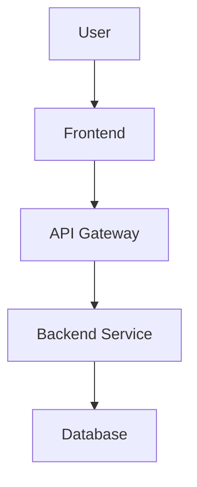

# Documentation Execution Framework

## 🎯 Goal
Execute documentation creation/improvement tasks based on the analysis and improvement plan. This prompt works iteratively to create high-quality documentation piece by piece.

## 📋 Input Requirements

### 1. Analysis Results
From `doc-analyze.md`:
- Current coverage assessment
- Gap analysis results
- Prioritized task list
- Project type and framework

### 2. Current Task
Specify which documentation task to execute:
- **Task Type**: Create/Update/Restructure
- **Target**: Specific file or section
- **Priority**: High/Medium/Low
- **Estimated Time**: X hours
- **Dependencies**: Completed prerequisites

## 📋 Execution Process

### Phase 1: Pre-Execution Analysis
Before creating documentation, analyze:

#### Project Context
- **Project Type**: Frontend/Backend/Full-Stack/AI-ML
- **Tech Stack**: Primary technologies used
- **Target Audience**: Developers/End-Users/Both
- **Complexity Level**: Beginner/Intermediate/Advanced

#### Content Requirements
- **Scope**: What specific content is needed
- **Format**: Markdown/Wiki/Interactive/Video
- **Length**: Brief/Detailed/Comprehensive
- **Examples**: Code samples, screenshots, diagrams needed

### Phase 2: Content Creation Strategy

#### Structure Planning
```markdown
# [Document Title]

## Overview
Brief description and purpose

## Prerequisites
What users need before starting

## Step-by-Step Guide
Detailed instructions with examples

## Troubleshooting
Common issues and solutions

## Next Steps
What to do after completing this guide
```

#### Quality Checklist
- [ ] **Clarity**: Easy to understand for target audience
- [ ] **Completeness**: Covers all necessary information
- [ ] **Accuracy**: Technically correct and tested
- [ ] **Consistency**: Matches project style and terminology
- [ ] **Examples**: Includes relevant code samples/screenshots
- [ ] **Navigation**: Clear structure with proper headings
- [ ] **Links**: Internal and external links work correctly

### Phase 3: Framework-Specific Templates

#### For Getting Started Documentation
```markdown
# Getting Started with [Project Name]

## What is [Project Name]?
Brief project description and main purpose

## Prerequisites
- Node.js version X.X+
- [Other requirements]

## Quick Start
### 1. Installation
```bash
npm install [project-name]
```

### 2. Basic Usage
```javascript
// Simple example
const project = require('[project-name]');
project.init();
```

### 3. Your First [Feature]
Step-by-step tutorial for core functionality

## Next Steps
- [Link to detailed guides]
- [Link to API reference]
- [Link to examples]
```

#### For API Documentation
```markdown
# API Reference

## Base URL
`https://api.example.com/v1`

## Authentication
Description of authentication method

## Endpoints

### GET /endpoint
Description of what this endpoint does

#### Parameters
| Parameter | Type | Required | Description |
|-----------|------|----------|-------------|
| param1 | string | Yes | Description |

#### Example Request
```bash
curl -X GET "https://api.example.com/v1/endpoint" \
  -H "Authorization: Bearer YOUR_TOKEN"
```

#### Example Response
```json
{
  "status": "success",
  "data": {
    "result": "example"
  }
}
```

#### Error Codes
| Code | Description |
|------|-------------|
| 400 | Bad Request |
| 401 | Unauthorized |
```

#### For Architecture Documentation
```markdown
# System Architecture

## Overview
High-level description of system architecture

## Components
### Frontend
- Technology: React/Vue/Angular
- Responsibilities: User interface, client-side logic
- Communication: REST API calls to backend

### Backend
- Technology: Node.js/Python/Java
- Responsibilities: Business logic, data processing
- Communication: Database queries, external API calls

### Database
- Technology: PostgreSQL/MongoDB/Redis
- Responsibilities: Data storage and retrieval
- Schema: [Link to schema documentation]

## Data Flow


## Security
- Authentication: JWT tokens
- Authorization: Role-based access control
- Data encryption: TLS 1.3 in transit, AES-256 at rest
```

### Phase 4: Interactive Elements

#### For Frontend Projects
- **Component Examples**: Live code examples with interactive demos
- **Styling Guides**: Visual examples of design system components
- **State Management**: Flow diagrams showing data flow

#### For Backend Projects  
- **API Testing**: Postman collections or curl examples
- **Database Schemas**: Visual database diagrams
- **Error Handling**: Complete error response examples

#### For Full-Stack Projects
- **Integration Flows**: End-to-end request/response cycles
- **Deployment Guides**: Step-by-step deployment instructions
- **Monitoring**: How to set up and use monitoring tools

## 📋 Quality Assurance

### Content Review Checklist
- [ ] **Technical Accuracy**: All code examples tested and working
- [ ] **Language Quality**: Clear, concise, grammatically correct
- [ ] **Formatting**: Consistent markdown formatting
- [ ] **Links**: All internal and external links functional
- [ ] **Images**: All images load correctly and are relevant
- [ ] **Code Blocks**: Proper syntax highlighting and formatting

### User Testing
- [ ] **New User Test**: Can a new user follow the documentation successfully?
- [ ] **Expert Review**: Has a subject matter expert reviewed for accuracy?
- [ ] **Accessibility**: Is the documentation accessible to users with disabilities?

## 📋 Output Format

### Documentation Task Completion Report
```markdown
# Documentation Task: [Task Name] - COMPLETED

## Summary
- **Type**: Create/Update/Restructure
- **Target**: [Specific file/section]
- **Time Spent**: X hours
- **Status**: Complete/Needs Review/Blocked

## Files Created/Modified
- [ ] `docs/[section]/[filename].md` - [Description]
- [ ] `assets/[filename]` - [Description]

## Content Added
- [Brief description of content created]
- [Key sections covered]
- [Examples/diagrams included]

## Quality Checklist
- [x] Technical accuracy verified
- [x] Examples tested
- [x] Links verified
- [x] Formatting consistent
- [x] Ready for review

## Next Steps
- [ ] [Next task in sequence]
- [ ] [Dependencies that are now unblocked]
- [ ] [Review and feedback needed]
```

## 🎯 Usage Instructions

### For New Documentation
1. **Analyze Requirements**: Use analysis results to understand what's needed
2. **Select Template**: Choose appropriate template based on content type
3. **Create Content**: Follow structure and quality guidelines
4. **Test Examples**: Verify all code examples and procedures work
5. **Review Quality**: Complete quality checklist
6. **Update Index**: Add new documentation to navigation/index

### For Updating Existing Documentation
1. **Review Current Content**: Identify what needs updating
2. **Preserve Good Content**: Keep sections that are accurate and well-written
3. **Update Outdated Information**: Fix deprecated information
4. **Improve Structure**: Reorganize if needed for better flow
5. **Add Missing Elements**: Include examples, diagrams, or sections that are missing
6. **Quality Check**: Ensure updates maintain consistency

### For Documentation Restructuring
1. **Plan New Structure**: Design improved organization
2. **Create Migration Plan**: Minimize broken links during transition
3. **Update Content**: Adapt content to new structure
4. **Update Navigation**: Ensure all content is discoverable
5. **Redirect Old Links**: Set up redirects for moved content
6. **Announce Changes**: Communicate restructuring to users

This framework ensures systematic, high-quality documentation creation that serves both technical and non-technical stakeholders effectively. 