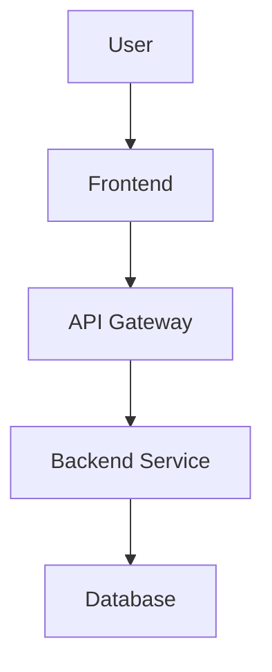

# Documentation Execution Framework

## 🎯 Goal
Execute documentation creation/improvement tasks based on the analysis and improvement plan. This prompt works iteratively to create high-quality documentation piece by piece using the **PIDEA Standard Documentation Structure**.

## 📁 MANDATORY: PIDEA Documentation Structure
**ALWAYS use this exact structure for ALL projects:**

```
docs/
├── 01_getting-started/
│   ├── installation.md
│   ├── quick-start.md
│   └── screenshots/
├── 02_architecture/
│   ├── diagrams/
│   ├── overview.md
│   └── components.md
├── 03_features/
│   ├── overview.md
│   ├── [feature-name].md
│   └── screenshots/
├── 04_api-reference/
│   ├── endpoints.md
│   ├── authentication.md
│   └── examples.md
├── 05_development/
│   ├── environment.md
│   ├── setup.md
│   └── git-workflow.md
├── 06_deployment/
│   ├── docker.md
│   ├── production.md
│   └── monitoring.md
├── 07_testing/
│   ├── unit-tests.md
│   ├── integration-tests.md
│   └── e2e-tests.md
├── 08_reference/
│   ├── config.md
│   ├── cli.md
│   └── troubleshooting.md
├── 09_roadmap/
│   ├── features/
│   │   ├── [category]/
│   │   │   ├── [task-name]/
│   │   │   │   ├── [name]-implementation.md
│   │   │   │   ├── [name]-analysis.md
│   │   │   │   └── [name]-phase-[number].md
│   │   │   └── [another-task]/
│   │   └── [another-category]/
│   └── overview.md
├── 10_maintenance/
│   ├── updates.md
│   └── support.md
├── assets/
│   ├── diagrams/
│   ├── screenshots/
│   └── icons/
└── README.md
```

**Note**: The docs/09_roadmap/tasks/ section now uses hierarchical organization: Category → Task Name → Implementation files

**FIRST STEP: Always create this folder structure before writing any documentation!**

## 📋 Input Requirements

### 1. Analysis Results
From `doc-analyze.md`:
- Current coverage assessment
- Gap analysis results
- Prioritized task list
- Project type and framework

### 2. Current Task
Specify which documentation task to execute:
- **Task Type**: Create/Update/Restructure
- **Target**: Specific file or section
- **Priority**: High/Medium/Low
- **Estimated Time**: X hours
- **Dependencies**: Completed prerequisites

## 📋 Execution Process

### Phase 1: MANDATORY Structure Creation
**BEFORE writing any documentation, ALWAYS execute these commands:**

```bash
# Create the PIDEA standard documentation structure
mkdir -p docs/01_getting-started/screenshots
mkdir -p docs/02_architecture/diagrams
mkdir -p docs/03_features/screenshots
mkdir -p docs/04_api-reference
mkdir -p docs/05_development
mkdir -p docs/06_deployment
mkdir -p docs/07_testing
mkdir -p docs/08_reference
mkdir -p docs/09_roadmap/features
# Note: Category and task-specific folders will be created automatically when tasks are created
mkdir -p docs/10_maintenance
mkdir -p docs/assets/diagrams
mkdir -p docs/assets/screenshots
mkdir -p docs/assets/icons

# Create index files for each section
touch docs/01_getting-started/installation.md
touch docs/01_getting-started/quick-start.md
touch docs/02_architecture/overview.md
touch docs/02_architecture/components.md
touch docs/03_features/overview.md
touch docs/04_api-reference/endpoints.md
touch docs/04_api-reference/authentication.md
touch docs/04_api-reference/examples.md
touch docs/05_development/environment.md
touch docs/05_development/setup.md
touch docs/05_development/git-workflow.md
touch docs/06_deployment/docker.md
touch docs/06_deployment/production.md
touch docs/06_deployment/monitoring.md
touch docs/07_testing/unit-tests.md
touch docs/07_testing/integration-tests.md
touch docs/07_testing/e2e-tests.md
touch docs/08_reference/config.md
touch docs/08_reference/cli.md
touch docs/08_reference/troubleshooting.md
touch docs/09_roadmap/overview.md
touch docs/10_maintenance/updates.md
touch docs/10_maintenance/support.md
touch docs/README.md
```

### Phase 2: Pre-Execution Analysis
Before creating documentation, analyze:

#### Project Context
- **Project Type**: Frontend/Backend/Full-Stack/AI-ML
- **Tech Stack**: Primary technologies used
- **Target Audience**: Developers/End-Users/Both
- **Complexity Level**: Beginner/Intermediate/Advanced

#### Content Requirements
- **Scope**: What specific content is needed
- **Format**: Markdown/Wiki/Interactive/Video
- **Length**: Brief/Detailed/Comprehensive
- **Examples**: Code samples, screenshots, diagrams needed

### Phase 3: Main README Creation
**Create the main `docs/README.md` with this EXACT structure:**

```markdown
# [Project Name] Documentation

Welcome to the complete documentation for [Project Name]. This documentation follows the PIDEA standard structure for consistency and ease of navigation.

## 📚 Documentation Structure

### 🚀 [01. Getting Started](./01_getting-started/)
- [Installation Guide](./01_getting-started/installation.md)
- [Quick Start](./01_getting-started/quick-start.md)
- [Screenshots](./01_getting-started/screenshots/)

### 🏗️ [02. Architecture](./02_architecture/)
- [System Overview](./02_architecture/overview.md)
- [Component Architecture](./02_architecture/components.md)
- [Diagrams](./02_architecture/diagrams/)

### ⚡ [03. Features](./03_features/)
- [Feature Overview](./03_features/overview.md)
- [Screenshots](./03_features/screenshots/)

### 🔌 [04. API Reference](./04_api-reference/)
- [API Endpoints](./04_api-reference/endpoints.md)
- [Authentication](./04_api-reference/authentication.md)
- [Examples](./04_api-reference/examples.md)

### 💻 [05. Development](./05_development/)
- [Environment Setup](./05_development/environment.md)
- [Development Setup](./05_development/setup.md)
- [Git Workflow](./05_development/git-workflow.md)

### 🚀 [06. Deployment](./06_deployment/)
- [Docker Deployment](./06_deployment/docker.md)
- [Production Setup](./06_deployment/production.md)
- [Monitoring](./06_deployment/monitoring.md)

### 🧪 [07. Testing](./07_testing/)
- [Unit Tests](./07_testing/unit-tests.md)
- [Integration Tests](./07_testing/integration-tests.md)
- [End-to-End Tests](./07_testing/e2e-tests.md)

### 📖 [08. Reference](./08_reference/)
- [Configuration](./08_reference/config.md)
- [CLI Reference](./08_reference/cli.md)
- [Troubleshooting](./08_reference/troubleshooting.md)

### 🗺️ [09. Roadmap](./09_roadmap/)
- [Roadmap Overview](./09_roadmap/overview.md)
- [Future Features](./09_roadmap/tasks/)

### 🔧 [10. Maintenance](./10_maintenance/)
- [Updates](./10_maintenance/updates.md)
- [Support](./10_maintenance/support.md)

---

## 🎯 Quick Navigation

- **New to [Project Name]?** → Start with [Getting Started](./01_getting-started/)
- **Need API docs?** → Check [API Reference](./04_api-reference/)
- **Want to contribute?** → See [Development](./05_development/)
- **Deployment help?** → Visit [Deployment](./06_deployment/)
- **Having issues?** → Check [Troubleshooting](./08_reference/troubleshooting.md)

---

*This documentation follows the PIDEA standard structure for consistent, high-quality project documentation.*
```

### Phase 4: Content Creation Strategy

#### Structure Planning
```markdown
# [Document Title]

## Overview
Brief description and purpose

## Prerequisites
What users need before starting

## Step-by-Step Guide
Detailed instructions with examples

## Troubleshooting
Common issues and solutions

## Next Steps
What to do after completing this guide
```

#### Quality Checklist
- [ ] **Clarity**: Easy to understand for target audience
- [ ] **Completeness**: Covers all necessary information
- [ ] **Accuracy**: Technically correct and tested
- [ ] **Consistency**: Matches project style and terminology
- [ ] **Examples**: Includes relevant code samples/screenshots
- [ ] **Navigation**: Clear structure with proper headings
- [ ] **Links**: Internal and external links work correctly

### Phase 3: Framework-Specific Templates

#### For Getting Started Documentation
```markdown
# Getting Started with [Project Name]

## What is [Project Name]?
Brief project description and main purpose

## Prerequisites
- Node.js version X.X+
- [Other requirements]

## Quick Start
### 1. Installation
```bash
npm install [project-name]
```

### 2. Basic Usage
```javascript
// Simple example
const project = require('[project-name]');
project.init();
```

### 3. Your First [Feature]
Step-by-step tutorial for core functionality

## Next Steps
- [Link to detailed guides]
- [Link to API reference]
- [Link to examples]
```

#### For API Documentation
```markdown
# API Reference

## Base URL
`https://api.example.com/v1`

## Authentication
Description of authentication method

## Endpoints

### GET /endpoint
Description of what this endpoint does

#### Parameters
| Parameter | Type | Required | Description |
|-----------|------|----------|-------------|
| param1 | string | Yes | Description |

#### Example Request
```bash
curl -X GET "https://api.example.com/v1/endpoint" \
  -H "Authorization: Bearer YOUR_TOKEN"
```

#### Example Response
```json
{
  "status": "success",
  "data": {
    "result": "example"
  }
}
```

#### Error Codes
| Code | Description |
|------|-------------|
| 400 | Bad Request |
| 401 | Unauthorized |
```

#### For Architecture Documentation
```markdown
# System Architecture

## Overview
High-level description of system architecture

## Components
### Frontend
- Technology: React/Vue/Angular
- Responsibilities: User interface, client-side logic
- Communication: REST API calls to backend

### Backend
- Technology: Node.js/Python/Java
- Responsibilities: Business logic, data processing
- Communication: Database queries, external API calls

### Database
- Technology: PostgreSQL/MongoDB/Redis
- Responsibilities: Data storage and retrieval
- Schema: [Link to schema documentation]

## Data Flow


## Security
- Authentication: JWT tokens
- Authorization: Role-based access control
- Data encryption: TLS 1.3 in transit, AES-256 at rest
```

### Phase 4: Interactive Elements

#### For Frontend Projects
- **Component Examples**: Live code examples with interactive demos
- **Styling Guides**: Visual examples of design system components
- **State Management**: Flow diagrams showing data flow

#### For Backend Projects  
- **API Testing**: Postman collections or curl examples
- **Database Schemas**: Visual database diagrams
- **Error Handling**: Complete error response examples

#### For Full-Stack Projects
- **Integration Flows**: End-to-end request/response cycles
- **Deployment Guides**: Step-by-step deployment instructions
- **Monitoring**: How to set up and use monitoring tools

## 📋 Quality Assurance

### Content Review Checklist
- [ ] **Technical Accuracy**: All code examples tested and working
- [ ] **Language Quality**: Clear, concise, grammatically correct
- [ ] **Formatting**: Consistent markdown formatting
- [ ] **Links**: All internal and external links functional
- [ ] **Images**: All images load correctly and are relevant
- [ ] **Code Blocks**: Proper syntax highlighting and formatting

### User Testing
- [ ] **New User Test**: Can a new user follow the documentation successfully?
- [ ] **Expert Review**: Has a subject matter expert reviewed for accuracy?
- [ ] **Accessibility**: Is the documentation accessible to users with disabilities?

## 📋 Output Format

### Documentation Task Completion Report
```markdown
# Documentation Task: [Task Name] - COMPLETED

## Summary
- **Type**: Create/Update/Restructure
- **Target**: [Specific file/section]
- **Time Spent**: X hours
- **Status**: Complete/Needs Review/Blocked

## Files Created/Modified
- [ ] `docs/[section]/[filename].md` - [Description]
- [ ] `assets/[filename]` - [Description]

## Content Added
- [Brief description of content created]
- [Key sections covered]
- [Examples/diagrams included]

## Quality Checklist
- [x] Technical accuracy verified
- [x] Examples tested
- [x] Links verified
- [x] Formatting consistent
- [x] Ready for review

## Next Steps
- [ ] [Next task in sequence]
- [ ] [Dependencies that are now unblocked]
- [ ] [Review and feedback needed]
```

## 🎯 Usage Instructions

### For New Documentation
1. **Create PIDEA Structure**: ALWAYS start by creating the standard folder structure
2. **Create Main README**: Use the exact template provided above
3. **Analyze Requirements**: Use analysis results to understand what's needed
4. **Place Content Correctly**: Map content to the appropriate PIDEA sections:
   - **Installation/Setup** → `01_getting-started/`
   - **System Design** → `02_architecture/`
   - **Feature Descriptions** → `03_features/`
   - **API Docs** → `04_api-reference/`
   - **Development Info** → `05_development/`
   - **Deployment** → `06_deployment/`
   - **Testing** → `07_testing/`
   - **Configuration** → `08_reference/`
   - **Future Plans** → `09_roadmap/`
   - **Maintenance** → `10_maintenance/`
5. **Follow Structure Guidelines**: Keep content organized within the correct sections
6. **Test Examples**: Verify all code examples and procedures work
7. **Review Quality**: Complete quality checklist
8. **Update Links**: Ensure all cross-references work correctly

### For Updating Existing Documentation
1. **Review Current Content**: Identify what needs updating
2. **Preserve Good Content**: Keep sections that are accurate and well-written
3. **Update Outdated Information**: Fix deprecated information
4. **Improve Structure**: Reorganize if needed for better flow
5. **Add Missing Elements**: Include examples, diagrams, or sections that are missing
6. **Quality Check**: Ensure updates maintain consistency

### For Documentation Restructuring
1. **Plan New Structure**: Design improved organization
2. **Create Migration Plan**: Minimize broken links during transition
3. **Update Content**: Adapt content to new structure
4. **Update Navigation**: Ensure all content is discoverable
5. **Redirect Old Links**: Set up redirects for moved content
6. **Announce Changes**: Communicate restructuring to users

This framework ensures systematic, high-quality documentation creation that serves both technical and non-technical stakeholders effectively.

## ⚠️ CRITICAL RULES

### 🚫 NEVER DO THIS:
- **Don't create your own folder structure** - Always use the PIDEA standard
- **Don't skip folder creation** - Every project needs the complete structure
- **Don't rename numbered folders** - Keep the 01_, 02_, etc. prefixes
- **Don't mix content types** - Place content in the correct sections
- **Don't create a flat structure** - Use the hierarchical organization

### ✅ ALWAYS DO THIS:
- **Create the full PIDEA structure first** - Even if some folders remain empty
- **Use the exact folder names** - `01_getting-started`, not `getting-started`
- **Create the main README** - With the complete navigation structure
- **Follow the content mapping** - Put content in the right sections
- **Maintain consistency** - Every project should look the same

### 🎯 QUALITY GOAL:
**Every project should have identical documentation structure, making it easy for developers to navigate any project instantly.** 