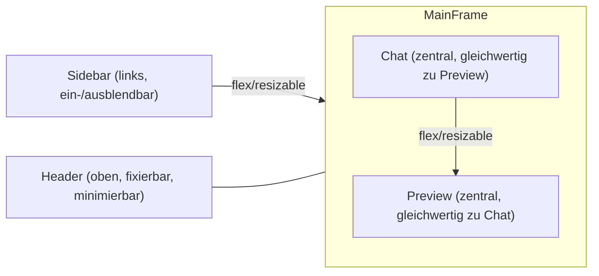

# Chat Web Frontend – UX/UI Patterns & Features

## Core Features
- Chat-Panel mit Markdown/Code/Attachments
- Input-Box mit Multiline, File-Upload, Shortcuts
- Sidebar für Sessions/Threads
- User-Status & Settings
- **Preview-Bereich (zentral, gleichwertig zu Chat)**

## Advanced Features
- Preview-Modal (zentral, 2/3 Mainframe, resizable)
- Split-View (Chat + Preview nebeneinander, beide gleichwertig)
- Collapsible Sidebars
- Floating Actions im Preview
- History/Timeline
- Multi-Tab/Session Support

## Layout-Patterns
- Overlay-Modal (zentriert, resizable, close/minimize)
- Split-View (Chat & Preview als gleichwertige Panels, resizable)
- Full-Page-Preview (kompletter Mainframe, zurück zum Chat)
- Dynamischer Wechsel: Chat und Preview können einzeln oder gemeinsam im Mainframe angezeigt werden

## Dynamik & Responsiveness
- CSS Grid/Flexbox für Layout
- State-Management für UI-Zustände
- Animierte Transitions
- Accessibility (Keyboard, ARIA)

## Inspiration
- [bolt.new](https://bolt.new)
- [replit.com](https://replit.com)
- [codesandbox.io](https://codesandbox.io)

## Komponenten- und Dateistruktur (Frontend)

- **assets/css/**: Styles für alle UI-Bereiche (Chat, Preview, Sidebar, etc.)
- **assets/js/application/**: Services, Commands, Queries für Business-Logik und API
- **assets/js/domain/**: Entities, Repositories, Value-Objects (Domain-Driven)
- **assets/js/infrastructure/**: Events, API-Repositories, Infrastruktur
- **assets/js/presentation/components/**: UI-Komponenten (Chat, Preview, Sidebar, etc.)
- **assets/js/presentation/controllers/**: AppController für globale UI-Logik
- **pages/**: Einzelne HTML-Views (chat, code, ide-mirror, tree)

**Vorteile:**  
- Klare Trennung von Logik, UI und Infrastruktur  
- Leicht erweiterbar für neue Panels/Features  
- Perfekt für dynamische/responsive Layouts wie in der UI/UX-Doku beschrieben

## Feature/Pattern → Komponenten/Dateien Mapping

| Feature/Pattern                | Komponente/Datei(en)                                                                 |
|-------------------------------|-------------------------------------------------------------------------------------|
| Chat-Panel                     | `web/assets/js/presentation/components/ChatComponent.js`                            |
| Input-Box (Multiline, Upload)  | `ChatComponent.js` (Input-Logik), ggf. Erweiterung                                  |
| Sidebar (Sessions/Threads)     | `ChatSidebarComponent.js`, `SidebarComponent.js`                                    |
| **Preview (zentral)**          | `RightPanelComponent.js`, `ChatRightPanelComponent.js`, ggf. neues `PreviewComponent.js` |
| Split-View (Chat + Preview)    | `RightPanelComponent.js`, `ChatComponent.js`, State-Management in `AppController.js`|
| Collapsible Sidebars           | `SidebarComponent.js`, `RightPanelComponent.js` (State/Visibility-Logik)            |
| Overlay-/Full-Page-Preview     | `PreviewComponent.js` (Modal/Overlay), State-Management in `AppController.js`       |
| Floating Actions im Preview    | `RightPanelComponent.js`, ggf. eigene Action-Komponenten                            |
| Multi-Tab/Session Support      | `ChatSidebarComponent.js`, State-Management in `AppController.js`                   |
| History/Timeline               | (Feature-Logik: `ChatComponent.js`, evtl. eigene Komponente)                        |
| State-Management (UI)          | `AppController.js`                                                                  |
| CSS/Responsiveness             | `web/assets/css/*.css` (insb. `main.css`, `sidebar.css`, `rightpanel.css`)          |
| Domain-Logik (Chat, Sessions)  | `domain/entities/ChatMessage.js`, `ChatSession.js`, `domain/repositories/ChatRepository.js` |
| API/Backend-Kommunikation      | `application/services/ChatService.js`, `infrastructure/repositories/APIChatRepository.js` |
| Events/Kommunikation           | `infrastructure/events/EventBus.js`                                                 |
| Seiten/Views                   | `web/pages/chat.html`, `code.html`, `ide-mirror.html`, `tree.html`                  |

**Hinweis:**
- Chat und Preview sind gleichwertige, zentrale Bestandteile des Mainframes und können flexibel angezeigt, kombiniert oder einzeln maximiert werden.
- Die meisten Features sind modular, d.h. du kannst Komponenten leicht erweitern oder neue hinzufügen.
- Für Preview-Modal ggf. ein neues Component anlegen und in `AppController.js`/`PreviewComponent.js` einbinden.