# AI Chat Interaction Workflow

## Overview
This diagram shows the complete AI chat interaction workflow in PIDEA, including interfaces for external LLMs, response analysis, and automation systems.

## Workflow Diagram

```mermaid
graph TB
    %% User Interface Layer
    subgraph UI["🎨 User Interface Layer"]
        ChatUI[("💬 Chat Interface<br/>✅ IMPLEMENTED")]
        FrameworkUI[("📋 Framework Panel<br/>✅ IMPLEMENTED")]
        TaskUI[("📝 Task Management<br/>🟡 PARTIAL")]
        DebugUI[("🐛 Debug Panel<br/>❌ PLANNED")]
    end

    %% Frontend Services
    subgraph Frontend["⚛️ Frontend Services"]
        ChatService[("ChatService<br/>✅ IMPLEMENTED")]
        EventBus[("EventBus<br/>✅ IMPLEMENTED")]
        APIRepo[("APIChatRepository<br/>✅ IMPLEMENTED")]
    end

    %% API Gateway
    subgraph API["🌐 API Gateway"]
        WebChatController[("WebChatController<br/>✅ IMPLEMENTED")]
        TaskController[("TaskController<br/>🟡 PARTIAL")]
        DebugController[("DebugController<br/>❌ PLANNED")]
        WebSocket[("WebSocket Server<br/>✅ IMPLEMENTED")]
    end

    %% Backend Services
    subgraph Backend["🔧 Backend Services"]
        SendMessageHandler[("SendMessageHandler<br/>✅ IMPLEMENTED")]
        ChatMessageHandler[("ChatMessageHandler<br/>✅ IMPLEMENTED")]
        WorkflowOrchestrator[("WorkflowOrchestrator<br/>🟡 PARTIAL")]
        AutoFinishSystem[("AutoFinishSystem<br/>✅ IMPLEMENTED")]
    end

    %% IDE Integration
    subgraph IDE["💻 IDE Integration"]
        CursorIDEService[("CursorIDEService<br/>✅ IMPLEMENTED")]
        BrowserManager[("BrowserManager<br/>✅ IMPLEMENTED")]
        IDEManager[("IDEManager<br/>✅ IMPLEMENTED")]
    end

    %% AI Processing
    subgraph AI["🤖 AI Processing Layer"]
        AIService[("AIService<br/>✅ IMPLEMENTED")]
        PromptManager[("PromptManager<br/>🟡 PARTIAL")]
        ContextBuilder[("ContextBuilder<br/>❌ PLANNED")]
    end

    %% External LLM Interfaces
    subgraph ExternalLLMs["🔗 External LLM Interfaces"]
        OpenAI[("OpenAI API<br/>✅ IMPLEMENTED")]
        Anthropic[("Anthropic Claude<br/>❌ PLANNED")]
        LocalLLM[("Local LLM<br/>❌ PLANNED")]
        CustomLLM[("Custom LLM<br/>❌ PLANNED")]
    end

    %% Response Analysis
    subgraph Analysis["📊 Response Analysis"]
        ResponseAnalyzer[("ResponseAnalyzer<br/>🟡 PARTIAL")]
        QualityChecker[("QualityChecker<br/>❌ PLANNED")]
        IntentDetector[("IntentDetector<br/>❌ PLANNED")]
        CompletionDetector[("CompletionDetector<br/>✅ IMPLEMENTED")]
    end

    %% Workflow Automation
    subgraph Automation["⚡ Workflow Automation"]
        DocumentationWorkflow[("📚 Documentation<br/>✅ IMPLEMENTED")]
        RefactorWorkflow[("🔧 Auto-Refactor<br/>✅ IMPLEMENTED")]
        DebugWorkflow[("🐛 Debug Workflow<br/>❌ PLANNED")]
        TestWorkflow[("🧪 Test Generation<br/>❌ PLANNED")]
    end

    %% Database Layer
    subgraph Database["💾 Database Layer"]
        ChatRepo[("ChatRepository<br/>✅ IMPLEMENTED")]
        TaskRepo[("TaskRepository<br/>✅ IMPLEMENTED")]
        DebugRepo[("DebuggerRepository<br/>❌ PLANNED")]
        AnalysisRepo[("AnalysisRepository<br/>❌ PLANNED")]
    end

    %% Real-time Communication
    subgraph RealTime["⚡ Real-time Communication"]
        WebSocketClient[("WebSocket Client<br/>✅ IMPLEMENTED")]
        PollingService[("Smart Polling<br/>✅ IMPLEMENTED")]
        EventEmitter[("Event Emitter<br/>✅ IMPLEMENTED")]
    end

    %% Styling with Status Colors
    classDef implemented fill:#c8e6c9,stroke:#2e7d32,stroke-width:3px
    classDef partial fill:#fff9c4,stroke:#f57f17,stroke-width:2px
    classDef planned fill:#ffcdd2,stroke:#c62828,stroke-width:2px
    classDef userInterface fill:#e1f5fe,stroke:#01579b,stroke-width:2px
    classDef frontend fill:#f3e5f5,stroke:#4a148c,stroke-width:2px
    classDef api fill:#e8f5e8,stroke:#1b5e20,stroke-width:2px
    classDef backend fill:#fff3e0,stroke:#e65100,stroke-width:2px
    classDef ide fill:#fce4ec,stroke:#880e4f,stroke-width:2px
    classDef ai fill:#e0f2f1,stroke:#004d40,stroke-width:2px
    classDef external fill:#f1f8e9,stroke:#33691e,stroke-width:2px
    classDef analysis fill:#fafafa,stroke:#424242,stroke-width:2px
    classDef automation fill:#fff8e1,stroke:#f57f17,stroke-width:2px
    classDef database fill:#e8eaf6,stroke:#1a237e,stroke-width:2px
    classDef realtime fill:#fce4ec,stroke:#ad1457,stroke-width:2px

    %% Apply styling with status
    class ChatUI,FrameworkUI,ChatService,EventBus,APIRepo,WebChatController,WebSocket,SendMessageHandler,ChatMessageHandler,AutoFinishSystem,CursorIDEService,BrowserManager,IDEManager,AIService,OpenAI,CompletionDetector,DocumentationWorkflow,RefactorWorkflow,ChatRepo,TaskRepo,WebSocketClient,PollingService,EventEmitter implemented
    class TaskUI,TaskController,WorkflowOrchestrator,PromptManager,ResponseAnalyzer partial
    class DebugUI,DebugController,ContextBuilder,Anthropic,LocalLLM,CustomLLM,QualityChecker,IntentDetector,DebugWorkflow,TestWorkflow,DebugRepo,AnalysisRepo planned

    %% User Interaction Flow
    ChatUI --> ChatService
    FrameworkUI --> ChatService
    TaskUI --> ChatService
    DebugUI -.-> ChatService
    
    ChatService --> EventBus
    ChatService --> APIRepo
    
    %% API Communication
    APIRepo --> WebChatController
    APIRepo --> TaskController
    APIRepo -.-> DebugController
    
    %% Backend Processing
    WebChatController --> SendMessageHandler
    TaskController --> WorkflowOrchestrator
    DebugController -.-> WorkflowOrchestrator
    
    SendMessageHandler --> ChatMessageHandler
    ChatMessageHandler --> AIService
    
    %% AI Processing
    AIService --> PromptManager
    AIService -.-> ContextBuilder
    
    %% External LLM Integration
    AIService --> OpenAI
    AIService -.-> Anthropic
    AIService -.-> LocalLLM
    AIService -.-> CustomLLM
    
    %% Response Analysis
    AIService --> ResponseAnalyzer
    ResponseAnalyzer -.-> QualityChecker
    ResponseAnalyzer -.-> IntentDetector
    ResponseAnalyzer --> CompletionDetector
    
    %% Workflow Automation
    WorkflowOrchestrator --> DocumentationWorkflow
    WorkflowOrchestrator --> RefactorWorkflow
    WorkflowOrchestrator -.-> DebugWorkflow
    WorkflowOrchestrator -.-> TestWorkflow
    
    %% IDE Integration
    ChatMessageHandler --> CursorIDEService
    CursorIDEService --> BrowserManager
    CursorIDEService --> IDEManager
    
    %% Auto-Finish System
    AutoFinishSystem --> WorkflowOrchestrator
    AutoFinishSystem --> CompletionDetector
    
    %% Database Persistence
    ChatMessageHandler --> ChatRepo
    WorkflowOrchestrator --> TaskRepo
    DebugWorkflow -.-> DebugRepo
    ResponseAnalyzer -.-> AnalysisRepo
    
    %% Real-time Updates
    WebSocket --> WebSocketClient
    ChatMessageHandler --> PollingService
    EventBus --> EventEmitter
    
    %% Feedback Loops
    ResponseAnalyzer -.-> AIService
    CompletionDetector --> AutoFinishSystem
    QualityChecker -.-> WorkflowOrchestrator
    
    %% External Interfaces
    subgraph ExternalInterfaces["🔌 External Interfaces"]
        WebhookAPI[("Webhook API<br/>❌ PLANNED")]
        RESTAPI[("REST API<br/>🟡 PARTIAL")]
        GraphQLAPI[("GraphQL API<br/>❌ PLANNED")]
        PluginAPI[("Plugin API<br/>❌ PLANNED")]
    end
    
    class WebhookAPI,GraphQLAPI,PluginAPI planned
    class RESTAPI partial
    
    WorkflowOrchestrator -.-> WebhookAPI
    ResponseAnalyzer --> RESTAPI
    AIService -.-> GraphQLAPI
    ChatMessageHandler -.-> PluginAPI

    %% Legend
    subgraph Legend["📊 Implementation Status"]
        L1[("✅ IMPLEMENTED<br/>Fully working")]
        L2[("🟡 PARTIAL<br/>Basic implementation")]
        L3[("❌ PLANNED<br/>Not yet implemented")]
    end
    
    class L1 implemented
    class L2 partial
    class L3 planned
```

## Implementation Status Overview

### ✅ **IMPLEMENTED (Fully Working)**
- **Chat Interface**: Complete chat functionality
- **Framework Panel**: Context and prompt management
- **ChatService**: Frontend chat logic
- **EventBus**: Event-driven communication
- **APIChatRepository**: API communication
- **WebChatController**: Message handling
- **WebSocket Server**: Real-time communication
- **SendMessageHandler**: Message processing
- **ChatMessageHandler**: IDE chat integration
- **AutoFinishSystem**: Task completion automation
- **CursorIDEService**: IDE integration
- **BrowserManager**: Browser automation
- **IDEManager**: IDE management
- **AIService**: Core AI logic
- **OpenAI API**: GPT integration
- **CompletionDetector**: Task completion detection
- **DocumentationWorkflow**: Auto-documentation
- **RefactorWorkflow**: Auto-refactoring
- **ChatRepository**: Chat data persistence
- **TaskRepository**: Task data persistence
- **WebSocket Client**: Real-time updates
- **Smart Polling**: State monitoring
- **Event Emitter**: Event broadcasting

### 🟡 **PARTIAL (Basic Implementation)**
- **Task Management**: Basic task creation
- **TaskController**: Basic task handling
- **WorkflowOrchestrator**: Basic workflow management
- **PromptManager**: Basic prompt handling
- **ResponseAnalyzer**: Basic response processing
- **REST API**: Basic API endpoints

### ❌ **PLANNED (Not Yet Implemented)**
- **Debug Panel**: Debug workflow control
- **DebugController**: Debug API endpoints
- **ContextBuilder**: Advanced context assembly
- **Anthropic Claude**: Claude integration
- **Local LLM**: Local model support
- **Custom LLM**: Custom integrations
- **QualityChecker**: Response quality assessment
- **IntentDetector**: Intent recognition
- **DebugWorkflow**: Debug automation
- **TestWorkflow**: Test generation
- **DebuggerRepository**: Debug data persistence
- **AnalysisRepository**: Analysis data persistence
- **Webhook API**: External integrations
- **GraphQL API**: Flexible queries
- **Plugin API**: Extensibility system

## Next Steps & Possibilities

### 🚀 **Immediate Possibilities**
1. **Add Anthropic Claude**: Easy integration with existing AIService
2. **Implement Debug Panel**: Build on existing debug infrastructure
3. **Add QualityChecker**: Enhance response analysis
4. **Implement TestWorkflow**: Extend automation system

### 🔮 **Future Possibilities**
1. **Local LLM Integration**: Run models locally
2. **Custom LLM Support**: Plugin-based LLM integration
3. **Advanced ContextBuilder**: AI-powered context assembly
4. **Plugin System**: Extensible architecture
5. **GraphQL API**: Advanced querying capabilities
6. **Webhook System**: External system integration

### 📈 **Scaling Possibilities**
1. **Multi-LLM Orchestration**: Route requests to best LLM
2. **Response Comparison**: Compare responses from different LLMs
3. **Advanced Analytics**: Deep response analysis
4. **Custom Workflows**: User-defined automation
5. **Enterprise Features**: Team collaboration, permissions

## Key Components

### 🎨 User Interface Layer
- **Chat Interface**: Main chat interaction
- **Framework Panel**: Context and prompts
- **Task Management**: Task creation and tracking
- **Debug Panel**: Debug workflow control

### ⚛️ Frontend Services
- **ChatService**: Frontend chat logic
- **EventBus**: Event-driven communication
- **APIChatRepository**: API communication

### 🌐 API Gateway
- **Controllers**: Handle HTTP requests
- **WebSocket Server**: Real-time communication

### 🔧 Backend Services
- **SendMessageHandler**: Message processing
- **ChatMessageHandler**: IDE chat integration
- **WorkflowOrchestrator**: Workflow automation
- **AutoFinishSystem**: Task completion

### 🤖 AI Processing Layer
- **AIService**: Core AI logic
- **PromptManager**: Prompt management
- **ContextBuilder**: Context assembly

### 🔗 External LLM Interfaces
- **OpenAI**: GPT models
- **Anthropic**: Claude models
- **Local LLM**: Local models
- **Custom LLM**: Custom integrations

### 📊 Response Analysis
- **ResponseAnalyzer**: Response processing
- **QualityChecker**: Quality assessment
- **IntentDetector**: Intent recognition
- **CompletionDetector**: Completion detection

### ⚡ Workflow Automation
- **Documentation**: Auto-documentation
- **Refactor**: Auto-refactoring
- **Debug**: Debug automation
- **Test**: Test generation

## Data Flow

1. **User Input** → Frontend Services
2. **API Gateway** → Backend Processing
3. **AI Processing** → External LLMs
4. **Response Analysis** → Quality Assessment
5. **Workflow Automation** → IDE Integration
6. **Database Persistence** → State Management
7. **Real-time Updates** → User Feedback

## External Interfaces

### 🔌 Webhook API
- **Purpose**: External system integration
- **Use Cases**: CI/CD, monitoring, notifications

### 🔌 REST API
- **Purpose**: Standard API access
- **Use Cases**: Third-party integrations, mobile apps

### 🔌 GraphQL API
- **Purpose**: Flexible data querying
- **Use Cases**: Complex queries, real-time data

### 🔌 Plugin API
- **Purpose**: Extensibility
- **Use Cases**: Custom workflows, integrations

## Benefits

- ✅ **Modular Architecture**: Easy to extend and modify
- ✅ **Multiple LLM Support**: Not tied to single provider
- ✅ **Real-time Communication**: WebSocket for live updates
- ✅ **Quality Assurance**: Response analysis and validation
- ✅ **Workflow Automation**: Automated task execution
- ✅ **External Integration**: Webhook and API support
- ✅ **Extensibility**: Plugin system for custom features
