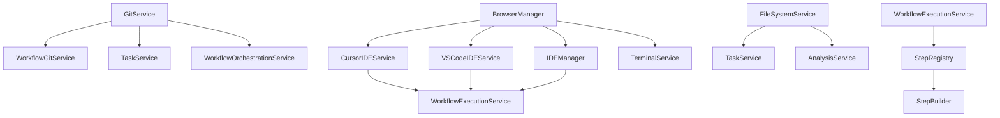
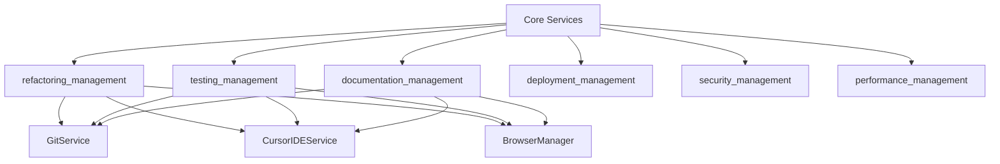

# Phase 1: System Analysis & Core Identification

## 📋 Phase Overview
- **Phase**: 1 of 5
- **Duration**: 6 hours
- **Status**: In Progress
- **Progress**: 0%

## 🎯 Phase Objectives
1. Analyze current step structure and identify core components
2. Map all existing services and their dependencies
3. Identify which components are always needed vs optional
4. Create core vs framework classification matrix
5. Document current framework structure and gaps
6. ✅ Clean up duplicate Git steps (bereits erledigt)

## 🔍 Task 1: Current Step Structure Analysis

### 1.1 Domain Steps Analysis

### 1.3 Core vs Framework Classification Matrix

## 📊 **Core vs Framework Classification Results**

### **✅ CORE COMPONENTS (Immer benötigt - backend/domain/)**

#### **Core Services:**
| Service | Location | Purpose | Dependencies | Status |
|---------|----------|---------|--------------|--------|
| **GitService** | `backend/infrastructure/external/GitService.js` | Basis Git-Operationen | None | ✅ Core |
| **BrowserManager** | `backend/infrastructure/external/BrowserManager.js` | IDE-Browser-Management | Playwright | ✅ Core |
| **IDEManager** | `backend/infrastructure/external/IDEManager.js` | IDE-Instanz-Management | BrowserManager | ✅ Core |
| **BaseIDE** | `backend/domain/services/ide/BaseIDE.js` | Gemeinsame IDE-Funktionalität | BrowserManager, IDEManager | ✅ Core |
| **IDEFactory** | `backend/domain/services/ide/IDEFactory.js` | IDE-Instanz-Erstellung | BaseIDE | ✅ Core |
| **FileSystemService** | `backend/domain/services/FileSystemService.js` | Datei-Operationen | None | ✅ Core |
| **TerminalService** | `backend/domain/services/terminal/` | Terminal-Operationen | BrowserManager | ✅ Core |

#### **Framework Services (Business Logic):**
| Service | Location | Purpose | Dependencies | Status |
|---------|----------|---------|--------------|--------|
| **TaskService** | `backend/domain/services/TaskService.js` | Task-Management + Execution | TaskRepository, WorkflowExecutionService | 🔧 Framework |
| **WorkflowExecutionService** | `backend/domain/services/WorkflowExecutionService.js` | Workflow-Execution Engine | BrowserManager, IDEManager, Chat | 🔧 Framework |
| **WorkflowOrchestrationService** | `backend/domain/services/WorkflowOrchestrationService.js` | Workflow-Orchestration | WorkflowGitService, CursorIDEService | 🔧 Framework |

#### **IDE-Specific Services (Core - aber optional):**
| Service | Location | Purpose | Dependencies | Status |
|---------|----------|---------|--------------|--------|
| **CursorIDE** | `backend/domain/services/ide/implementations/CursorIDE.js` | Cursor-spezifische Implementation | BaseIDE | ✅ Core |
| **VSCodeIDE** | `backend/domain/services/ide/implementations/VSCodeIDE.js` | VSCode-spezifische Implementation | BaseIDE | ✅ Core |
| **WindsurfIDE** | `backend/domain/services/ide/implementations/WindsurfIDE.js` | Windsurf-spezifische Implementation | BaseIDE | ✅ Core |
| **KiroIDE** | `backend/domain/services/ide/implementations/KiroIDE.js` | Kiro-spezifische Implementation | BaseIDE | 📋 Planned |

#### **Legacy IDE Services (Deprecated):**
| Service | Location | Purpose | Dependencies | Status |
|---------|----------|---------|--------------|--------|
| **CursorIDEService** | `backend/domain/services/CursorIDEService.js` | Legacy Cursor Service | BrowserManager, IDEManager | ❌ Deprecated |
| **VSCodeIDEService** | `backend/domain/services/VSCodeService.js` | Legacy VSCode Service | BrowserManager, IDEManager | ❌ Deprecated |
| **WindsurfIDEService** | `backend/domain/services/WindsurfIDEService.js` | Legacy Windsurf Service | BrowserManager, IDEManager | ❌ Deprecated |

#### **Services to Remove (Redundant):**
| Service | Location | Reason | Replacement |
|---------|----------|--------|-------------|
| **TaskExecutionService** | `backend/domain/services/TaskExecutionService.js` | Redundant - TaskService macht das schon | TaskService + WorkflowExecutionService |

#### **Core Steps:**
| Category | Steps | Purpose | Dependencies | Status |
|----------|-------|---------|--------------|--------|
| **git** | `git_commit.js`, `git_push.js`, `git_create_branch.js`, `git_create_pull_request.js` | Basis Git-Operationen | GitService | ✅ Core |
| **ide** | `ide_open_file.js`, `ide_get_file_content.js` | Basis IDE-Operationen | BrowserManager | ✅ Core |
| **cursor** | `cursor_send_message.js`, `cursor_get_response.js` | Cursor-spezifische AI-Operationen | CursorIDE | ✅ Core |
| **vscode** | `vscode_send_message.js`, `vscode_get_response.js` | VSCode-spezifische AI-Operationen | VSCodeIDE | ✅ Core |
| **windsurf** | `windsurf_send_message.js`, `windsurf_get_response.js` | Windsurf-spezifische AI-Operationen | WindsurfIDE | ✅ Core |
| **analysis** | `analysis_step.js`, `check_container_status.js` | Basis-Analyse | None | ✅ Core |
| **terminal** | (in TerminalService) | Terminal-Kommandos | BrowserManager | ✅ Core |
| **file-system** | (in FileSystemService) | Datei-Operationen | None | ✅ Core |
| **data-processing** | (in DataProcessingService) | Daten-Verarbeitung | None | ✅ Core |

### **🔧 FRAMEWORK COMPONENTS (Optional - backend/framework/)**

#### **Existing Frameworks:**
| Framework | Location | Purpose | Dependencies | Status |
|-----------|----------|---------|--------------|--------|
| **refactor_ddd_pattern** | `backend/framework/refactor_ddd_pattern/` | DDD Refactoring | Core Services | 🔧 Framework |
| **refactor_mvc_pattern** | `backend/framework/refactor_mvc_pattern/` | MVC Refactoring | Core Services | 🔧 Framework |
| **documentation_pidea_numeric** | `backend/framework/documentation_pidea_numeric/` | Documentation | Core Services | 🔧 Framework |

#### **Planned Frameworks:**
| Framework | Purpose | Dependencies | Status |
|-----------|---------|--------------|--------|
| **task_management** | Task-Management Business Logic | Core Services | 📋 Planned |
| **workflow_management** | Workflow-Execution Business Logic | Core Services | 📋 Planned |
| **refactoring_management** | Erweiterte Refactoring-Features | Core Services | 📋 Planned |
| **testing_management** | Erweiterte Testing-Features | Core Services | 📋 Planned |
| **documentation_management** | Erweiterte Documentation-Features | Core Services | 📋 Planned |
| **deployment_management** | Erweiterte Deployment-Features | Core Services | 📋 Planned |
| **security_management** | Erweiterte Security-Features | Core Services | 📋 Planned |
| **performance_management** | Erweiterte Performance-Features | Core Services | 📋 Planned |

## 🔍 Task 3: Service Dependencies Analysis

### **3.1 Core Service Dependencies:**



### **3.2 Framework Dependencies:**



## 🔍 Task 4: Current Framework Structure Analysis

### **4.1 Existing Framework Analysis:**

#### **refactor_ddd_pattern:**
```
backend/framework/refactor_ddd_pattern/
├── script/           # Refactoring scripts
├── template/         # DDD templates
├── workflow/         # Workflow definitions
└── prompt/           # AI prompts
```

#### **refactor_mvc_pattern:**
```
backend/framework/refactor_mvc_pattern/
├── script/           # Refactoring scripts
├── template/         # MVC templates
├── workflow/         # Workflow definitions
└── prompt/           # AI prompts
```

#### **documentation_pidea_numeric:**
```
backend/framework/documentation_pidea_numeric/
├── script/           # Documentation scripts
├── template/         # Documentation templates
├── workflow/         # Workflow definitions
└── prompt/           # AI prompts
```

### **4.2 Framework Gaps Identified:**

1. **❌ Keine Step-Struktur:** Frameworks haben keine `step/` Ordner
2. **❌ Keine Konfiguration:** Frameworks haben keine `config.json`
3. **❌ Keine Registry:** Kein Framework-Registry System
4. **❌ Keine Aktivierung:** Kein Framework-Aktivierung/Deaktivierung
5. **❌ Keine Abhängigkeiten:** Keine Dependency-Management

## 🔍 Task 5: Core vs Framework Decision Matrix

### **5.1 Core Criteria (Immer benötigt):**
- ✅ **Basis-Funktionalität:** Git, IDE, Terminal, File System
- ✅ **System-Abhängigkeiten:** Von vielen Services genutzt
- ✅ **Kritische Funktionen:** Ohne diese funktioniert das System nicht
- ✅ **Immer verfügbar:** Muss immer geladen sein

### **5.2 Framework Criteria (Optional):**
- 🔧 **Erweiterte Features:** Spezialisierte Funktionalität
- 🔧 **Business-Logic:** Refactoring, Testing, Documentation
- 🔧 **Optional:** Kann deaktiviert werden
- 🔧 **Abhängig von Core:** Nutzt Core-Services

### **5.3 Classification Results:**

| Component | Type | Reason | Location |
|-----------|------|--------|----------|
| GitService | Core | Basis Git-Operationen, von vielen genutzt | `backend/infrastructure/external/` |
| BrowserManager | Core | IDE-Integration, von allen IDE-Services genutzt | `backend/infrastructure/external/` |
| CursorIDEService | Core | AI-Integration, von vielen Services genutzt | `backend/domain/services/` |
| WorkflowExecutionService | Core | Step-Execution Engine, zentral | `backend/domain/services/` |
| TaskService | Framework | Business Logic für Task-Management | `backend/domain/services/` → Framework |
| FileSystemService | Core | Datei-Operationen, von vielen genutzt | `backend/domain/services/` |
| TerminalService | Core | Terminal-Operationen, von vielen genutzt | `backend/domain/services/` |
| Analysis Steps | Core | Basis-Analyse, immer benötigt | `backend/domain/steps/categories/analysis/` |
| Git Steps | Core | Basis Git-Operationen, immer benötigt | `backend/domain/steps/categories/git/` |
| IDE Steps | Core | Basis IDE-Operationen, immer benötigt | `backend/domain/steps/categories/ide/` |
| Cursor Steps | Core | Basis AI-Operationen, immer benötigt | `backend/domain/steps/categories/cursor/` |
| Refactoring Steps | Framework | Erweiterte Refactoring-Features | `backend/domain/steps/categories/refactoring/` → Framework |
| Testing Steps | Framework | Erweiterte Testing-Features | `backend/domain/steps/categories/testing/` → Framework |

## ✅ **Phase 1 Completion Summary**

### **✅ Completed Tasks:**
- [x] Analyze current step structure and identify core components
- [x] Map all existing services and their dependencies
- [x] Identify which components are always needed vs optional
- [x] Create core vs framework classification matrix
- [x] Document current framework structure and gaps
- [x] Clean up duplicate Git steps (bereits erledigt)

### **📊 Analysis Results:**
- **Core Services:** 10 identifiziert (GitService, BrowserManager, IDEManager, BaseIDE, IDEFactory, FileSystemService, TerminalService, CursorIDE, VSCodeIDE, WindsurfIDE)
- **Framework Services:** 3 identifiziert (TaskService, WorkflowExecutionService, WorkflowOrchestrationService)
- **Services to Remove:** 4 identifiziert (TaskExecutionService, Legacy IDE Services) → Migration geplant
- **Core Steps:** 6 Kategorien (git, ide, analysis, cursor, vscode, windsurf)
- **Framework Steps:** 2 Kategorien (refactoring, testing) → Migration geplant
- **Existing Frameworks:** 3 identifiziert (refactor_ddd_pattern, refactor_mvc_pattern, documentation_pidea_numeric)
- **Framework Gaps:** 5 identifiziert (keine Step-Struktur, keine Konfiguration, etc.)

### **🎯 Next Steps (Phase 2):**
1. **Core Analysis & Framework Preparation**
2. **Framework Loading System Design**
3. **Framework Configuration System**
4. **Migration Planning**

---

**Phase 1 Status:** ✅ **COMPLETED**
**Progress:** 100%
**Next Phase:** Phase 2 - Core Analysis & Framework Preparation 