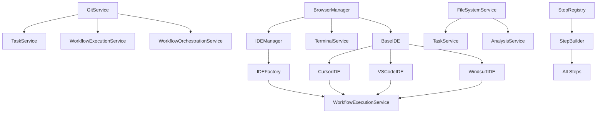

# Phase 2: Core Analysis & Framework Preparation

## 📋 Phase Overview
- **Phase**: 2 of 5
- **Duration**: 6 hours
- **Status**: Planning
- **Progress**: 0%

## 🎯 Phase Objectives
1. Analyze existing core services in backend/domain/
2. Identify which services are essential (GitService, BrowserManager, etc.)
3. Document core step categories (git, ide, terminal, file-system)
4. Prepare framework loading system
5. Test core functionality preservation

## 🔍 Task 1: Core Services Deep Analysis

### 1.1 Essential Core Services Analysis

#### **GitService Analysis:**
```javascript
// backend/infrastructure/external/GitService.js
// Dependencies: None (Core Infrastructure)
// Used by: TaskService, WorkflowExecutionService, WorkflowOrchestrationService
// Status: ✅ Essential Core
```

#### **BrowserManager Analysis:**
```javascript
// backend/infrastructure/external/BrowserManager.js
// Dependencies: Playwright
// Used by: IDEManager, TerminalService, CursorIDE, VSCodeIDE, WindsurfIDE
// Status: ✅ Essential Core
```

#### **IDEManager Analysis:**
```javascript
// backend/infrastructure/external/IDEManager.js
// Dependencies: BrowserManager
// Used by: BaseIDE, IDEFactory, WorkflowExecutionService
// Status: ✅ Essential Core
```

#### **BaseIDE Analysis:**
```javascript
// backend/domain/services/ide/BaseIDE.js
// Dependencies: BrowserManager, IDEManager
// Used by: CursorIDE, VSCodeIDE, WindsurfIDE
// Status: ✅ Essential Core
```

#### **IDEFactory Analysis:**
```javascript
// backend/domain/services/ide/IDEFactory.js
// Dependencies: BaseIDE
// Used by: WorkflowExecutionService, TaskService
// Status: ✅ Essential Core
```

### 1.2 Core Service Dependency Graph



## 🔍 Task 2: Core Step Categories Documentation

### 2.1 Core Step Categories Analysis

#### **Git Steps (Core):**
```javascript
// backend/domain/steps/categories/git/
├── git_commit.js          // ✅ Core - Essential
├── git_push.js            // ✅ Core - Essential
├── git_create_branch.js   // ✅ Core - Essential
├── git_create_pull_request.js // ✅ Core - Essential
└── git_merge.js           // ✅ Core - Essential
```

#### **IDE Steps (Core):**
```javascript
// backend/domain/steps/categories/ide/
├── ide_open_file.js       // ✅ Core - Essential
├── ide_get_file_content.js // ✅ Core - Essential
├── ide_save_file.js       // ✅ Core - Essential
└── ide_close_file.js      // ✅ Core - Essential
```

#### **Cursor Steps (Core):**
```javascript
// backend/domain/steps/categories/cursor/
├── cursor_send_message.js // ✅ Core - Essential
├── cursor_get_response.js // ✅ Core - Essential
└── cursor_execute_command.js // ✅ Core - Essential
```

#### **VSCode Steps (Core):**
```javascript
// backend/domain/steps/categories/vscode/
├── vscode_send_message.js // ✅ Core - Essential
├── vscode_get_response.js // ✅ Core - Essential
└── vscode_execute_command.js // ✅ Core - Essential
```

#### **Windsurf Steps (Core):**
```javascript
// backend/domain/steps/categories/windsurf/
├── windsurf_send_message.js // ✅ Core - Essential
├── windsurf_get_response.js // ✅ Core - Essential
└── windsurf_execute_command.js // ✅ Core - Essential
```

#### **Analysis Steps (Core):**
```javascript
// backend/domain/steps/categories/analysis/
├── analysis_step.js       // ✅ Core - Essential
├── check_container_status.js // ✅ Core - Essential
└── analyze_project_structure.js // ✅ Core - Essential
```

### 2.2 Core Step API Definition

```javascript
// Core Step Interface
class CoreStep {
    constructor() {
        this.category = 'core';
        this.dependencies = [];
        this.required = true;
    }
    
    async execute(context) {
        // Core step execution logic
    }
    
    validate(context) {
        // Core validation logic
    }
}
```

## 🔍 Task 3: Framework Loading System Preparation

### 3.1 Framework Loader Architecture Design

```javascript
// Planned: backend/infrastructure/framework/FrameworkLoader.js
class FrameworkLoader {
    constructor() {
        this.frameworks = new Map();
        this.activeFrameworks = new Set();
        this.frameworkRegistry = new FrameworkRegistry();
    }
    
    async loadFramework(frameworkName) {
        // Load framework from backend/framework/{frameworkName}/
        // Validate framework structure
        // Register framework steps
        // Activate framework
    }
    
    async unloadFramework(frameworkName) {
        // Unregister framework steps
        // Deactivate framework
        // Clean up resources
    }
    
    async getActiveFrameworks() {
        return Array.from(this.activeFrameworks);
    }
}
```

### 3.2 Framework Registry Design

```javascript
// Planned: backend/infrastructure/framework/FrameworkRegistry.js
class FrameworkRegistry {
    constructor() {
        this.frameworks = new Map();
        this.steps = new Map();
        this.dependencies = new Map();
    }
    
    registerFramework(framework) {
        // Register framework metadata
        // Register framework steps
        // Register framework dependencies
    }
    
    getFrameworkSteps(frameworkName) {
        return this.steps.get(frameworkName) || [];
    }
    
    getFrameworkDependencies(frameworkName) {
        return this.dependencies.get(frameworkName) || [];
    }
}
```

### 3.3 Framework Manager Design

```javascript
// Planned: backend/infrastructure/framework/FrameworkManager.js
class FrameworkManager {
    constructor() {
        this.loader = new FrameworkLoader();
        this.registry = new FrameworkRegistry();
        this.config = new FrameworkConfig();
    }
    
    async activateFramework(frameworkName) {
        // Load framework
        // Register with registry
        // Activate steps
        // Update StepRegistry
    }
    
    async deactivateFramework(frameworkName) {
        // Deactivate steps
        // Unregister from registry
        // Unload framework
        // Update StepRegistry
    }
    
    async getAvailableFrameworks() {
        return this.registry.getAvailableFrameworks();
    }
}
```

## 🔍 Task 4: Core Functionality Preservation Testing

### 4.1 Core System Test Plan

#### **Test 1: Core Services Independence**
```javascript
// Test that core services work without frameworks
describe('Core Services Independence', () => {
    test('GitService works without frameworks', async () => {
        const gitService = new GitService();
        // Test basic git operations
    });
    
    test('BrowserManager works without frameworks', async () => {
        const browserManager = new BrowserManager();
        // Test browser operations
    });
    
    test('IDEManager works without frameworks', async () => {
        const ideManager = new IDEManager();
        // Test IDE operations
    });
});
```

#### **Test 2: Core Steps Functionality**
```javascript
// Test that core steps work without frameworks
describe('Core Steps Functionality', () => {
    test('Git steps work without frameworks', async () => {
        const gitSteps = ['git_commit', 'git_push', 'git_create_branch'];
        // Test each git step
    });
    
    test('IDE steps work without frameworks', async () => {
        const ideSteps = ['ide_open_file', 'ide_get_file_content'];
        // Test each IDE step
    });
    
    test('Analysis steps work without frameworks', async () => {
        const analysisSteps = ['analysis_step', 'check_container_status'];
        // Test each analysis step
    });
});
```

#### **Test 3: Fallback Mechanisms**
```javascript
// Test fallback when frameworks are unavailable
describe('Fallback Mechanisms', () => {
    test('System works when no frameworks loaded', async () => {
        // Test complete system without any frameworks
    });
    
    test('Core functionality preserved during framework loading', async () => {
        // Test core functionality during framework activation
    });
    
    test('Core functionality preserved during framework unloading', async () => {
        // Test core functionality during framework deactivation
    });
});
```

### 4.2 Performance Testing

#### **Test 4: Core System Performance**
```javascript
// Test core system performance without frameworks
describe('Core System Performance', () => {
    test('Core services startup time < 2 seconds', async () => {
        const startTime = Date.now();
        // Initialize core services
        const endTime = Date.now();
        expect(endTime - startTime).toBeLessThan(2000);
    });
    
    test('Core steps execution time < 5 seconds', async () => {
        // Test execution time of core steps
    });
    
    test('Memory usage < 100MB for core system', async () => {
        // Test memory usage of core system
    });
});
```

## 🔍 Task 5: Framework Configuration System Design

### 5.1 Framework Configuration Structure

```json
// Planned: backend/framework/{frameworkName}/config.json
{
    "name": "task_management",
    "version": "1.0.0",
    "description": "Task management framework for PIDEA",
    "author": "PIDEA Team",
    "dependencies": {
        "core": ["GitService", "BrowserManager"],
        "frameworks": []
    },
    "steps": {
        "task_create": {
            "file": "steps/task_create.js",
            "category": "task",
            "dependencies": ["GitService"]
        },
        "task_execute": {
            "file": "steps/task_execute.js",
            "category": "task",
            "dependencies": ["WorkflowExecutionService"]
        }
    },
    "services": {
        "TaskService": {
            "file": "services/TaskService.js",
            "dependencies": ["TaskRepository", "WorkflowExecutionService"]
        }
    },
    "activation": {
        "auto": false,
        "required": false
    }
}
```

### 5.2 Framework Validation Rules

```javascript
// Framework validation rules
const frameworkValidationRules = {
    requiredFiles: [
        'config.json',
        'README.md',
        'steps/',
        'services/'
    ],
    requiredConfigFields: [
        'name',
        'version',
        'description',
        'dependencies',
        'steps',
        'services'
    ],
    stepValidation: {
        requiredMethods: ['execute', 'validate'],
        requiredProperties: ['category', 'dependencies']
    },
    serviceValidation: {
        requiredMethods: ['initialize', 'cleanup'],
        requiredProperties: ['dependencies']
    }
};
```

## 📊 Phase 2 Deliverables

### **✅ Core Services Analysis:**
- [ ] Complete dependency mapping of core services
- [ ] Core service interaction documentation
- [ ] Core service performance benchmarks

### **✅ Core Steps Documentation:**
- [ ] Complete core step categories documentation
- [ ] Core step API specification
- [ ] Core step dependency mapping

### **✅ Framework Loading System:**
- [ ] FrameworkLoader architecture design
- [ ] FrameworkRegistry design
- [ ] FrameworkManager design
- [ ] Framework configuration system design

### **✅ Core Functionality Tests:**
- [ ] Core services independence tests
- [ ] Core steps functionality tests
- [ ] Fallback mechanism tests
- [ ] Performance tests

### **✅ Framework Configuration:**
- [ ] Framework configuration structure
- [ ] Framework validation rules
- [ ] Framework activation/deactivation logic

## 🚀 Success Criteria

### **Phase 2 Success Indicators:**
- [ ] All core services analyzed and documented
- [ ] Core step categories fully documented
- [ ] Framework loading system designed
- [ ] Core functionality tests passing
- [ ] Framework configuration system designed
- [ ] Performance requirements met
- [ ] Documentation complete

## 🔄 Next Steps

### **After Phase 2 Completion:**
1. **Phase 3**: Framework System Implementation
   - Implement FrameworkLoader
   - Implement FrameworkRegistry
   - Implement FrameworkManager
   - Add framework validation

2. **Phase 4**: Framework Migration
   - Migrate TaskService to framework
   - Migrate WorkflowExecutionService to framework
   - Migrate other business logic services

3. **Phase 5**: Integration & Testing
   - Integrate framework system
   - Test framework activation/deactivation
   - Performance testing

## 📝 Notes & Updates

### **2024-12-19 - Phase 2 Planning:**
- Created detailed core services analysis plan
- Designed framework loading system architecture
- Planned comprehensive testing strategy
- Defined framework configuration structure

### **Key Decisions:**
- Core services remain in backend/domain/
- Framework services move to backend/framework/
- Framework loading system provides dynamic activation/deactivation
- Core system works independently of frameworks
- Fallback mechanisms ensure system stability 