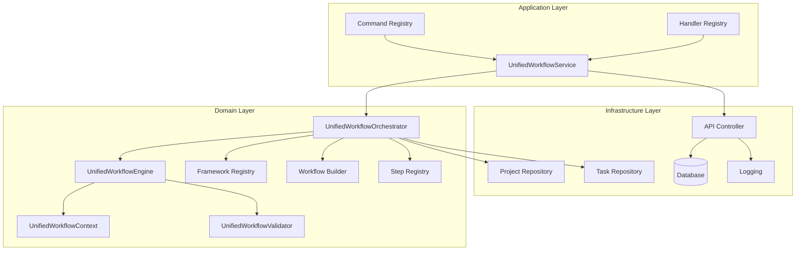
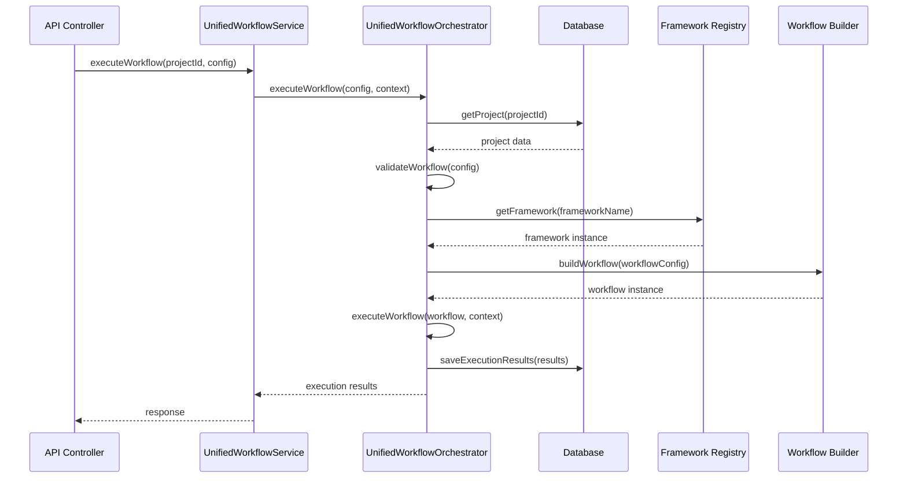

# Unified Workflow System - Complete Implementation

## 1. Project Overview
- **Feature/Component Name**: Unified Workflow System
- **Priority**: High
- **Category**: backend
- **Estimated Time**: 24 hours
- **Dependencies**: Existing Framework, Workflow, Command, Handler, Step systems, Database Project System
- **Related Issues**: Integration of all workflow components into unified orchestrator, database-driven project paths

## 2. Technical Requirements
- **Tech Stack**: Node.js, JavaScript, Jest, ESLint, SQLite/PostgreSQL
- **Architecture Pattern**: Database-Driven Unified Architecture with Registry/Builder Pattern
- **Database Changes**: Use existing project and task tables
- **API Changes**: Add unified workflow execution endpoints with database integration
- **Frontend Changes**: Add unified workflow management UI
- **Backend Changes**: Create database-driven unified workflow orchestrator

## 3. File Impact Analysis

### Files to Create:
- [ ] `backend/domain/workflows/unified/UnifiedWorkflowOrchestrator.js` - Database-driven orchestrator
- [ ] `backend/domain/workflows/unified/UnifiedWorkflowEngine.js` - Database-aware execution engine
- [ ] `backend/domain/workflows/unified/UnifiedWorkflowContext.js` - Database context management
- [ ] `backend/domain/workflows/unified/UnifiedWorkflowValidator.js` - Database validation system
- [ ] `backend/domain/workflows/unified/index.js` - Export
- [ ] `backend/application/services/UnifiedWorkflowService.js` - Database-driven service
- [ ] `backend/presentation/api/UnifiedWorkflowController.js` - Database API controller
- [ ] `backend/presentation/api/routes/unified-workflow.js` - Database API routes

### Files to Modify:
- [ ] `backend/domain/frameworks/index.js` - Add database integration
- [ ] `backend/domain/workflows/index.js` - Add database exports
- [ ] `backend/application/commands/index.js` - Add database command support
- [ ] `backend/application/handlers/index.js` - Add database handler support

## 4. Implementation Phases

### Phase 1: Database-Driven Core System (8 hours)
- [ ] Create `UnifiedWorkflowOrchestrator.js` - Database-driven orchestrator
- [ ] Create `UnifiedWorkflowEngine.js` - Database-aware execution engine
- [ ] Create `UnifiedWorkflowContext.js` - Database context management
- [ ] Create `UnifiedWorkflowValidator.js` - Database validation system
- [ ] Create database-driven exports and integration

### Phase 2: Database Application Layer Integration (8 hours)
- [ ] Create `UnifiedWorkflowService.js` - Database-driven application service
- [ ] Integrate with existing database project system
- [ ] Add database-driven workflow commands and handlers
- [ ] Create database workflow composition utilities

### Phase 3: Database API Layer (4 hours)
- [ ] Create `UnifiedWorkflowController.js` - Database API controller
- [ ] Create database API routes for workflow management
- [ ] Add database workflow execution endpoints
- [ ] Add database workflow monitoring endpoints

### Phase 4: Testing & Documentation (4 hours)
- [ ] Write comprehensive database integration tests
- [ ] Write integration tests with real database
- [ ] Create database usage documentation
- [ ] Create database examples and tutorials

## 5. Code Standards & Patterns
- **Coding Style**: ESLint with existing project rules, Prettier formatting
- **Naming Conventions**: camelCase for variables/functions, PascalCase for classes
- **Error Handling**: Try-catch with specific error types, proper error logging
- **Logging**: Winston logger with structured logging
- **Testing**: Jest framework, 90% coverage requirement
- **Documentation**: JSDoc for all public methods
- **Database**: Use existing project and task tables, no hardcoded paths

## 6. Security Considerations
- [ ] Input validation and sanitization
- [ ] User authentication and authorization
- [ ] Database workflow execution permissions
- [ ] Rate limiting for workflow execution
- [ ] Audit logging for all database operations

## 7. Performance Requirements
- **Response Time**: < 500ms for workflow execution
- **Throughput**: 100 workflows per minute
- **Memory Usage**: < 512MB per workflow execution
- **Database Queries**: Optimized with proper indexing
- **Caching Strategy**: Cache framework and workflow configurations

## 8. Testing Strategy

#### Unit Tests:
- [ ] Test file: `tests/unit/UnifiedWorkflowOrchestrator.test.js`
- [ ] Test cases: Database integration, registry method calls, error handling
- [ ] Mock requirements: Database connections, registry systems

#### Integration Tests:
- [ ] Test file: `tests/integration/UnifiedWorkflowSystem.test.js`
- [ ] Test scenarios: End-to-end workflow execution with database
- [ ] Test data: Real project and task data from database

#### E2E Tests:
- [ ] Test file: `tests/e2e/UnifiedWorkflowAPI.test.js`
- [ ] User flows: Complete workflow execution via API
- [ ] Browser compatibility: API testing with Postman/curl

## 9. Documentation Requirements

#### Code Documentation:
- [ ] JSDoc comments for all functions and classes
- [ ] README updates with unified workflow functionality
- [ ] API documentation for new endpoints
- [ ] Architecture diagrams for unified system

#### User Documentation:
- [ ] User guide for unified workflow system
- [ ] Database integration documentation
- [ ] Troubleshooting guide for common issues
- [ ] Migration guide from existing systems

## 10. Deployment Checklist

#### Pre-deployment:
- [ ] All tests passing (unit, integration, e2e)
- [ ] Code review completed and approved
- [ ] Documentation updated and reviewed
- [ ] Security scan passed
- [ ] Performance benchmarks met

#### Deployment:
- [ ] Database migrations (if applicable)
- [ ] Environment variables configured
- [ ] Configuration updates applied
- [ ] Service restarts if needed
- [ ] Health checks configured

#### Post-deployment:
- [ ] Monitor logs for errors
- [ ] Verify functionality in production
- [ ] Performance monitoring active
- [ ] User feedback collection enabled

## 11. Rollback Plan
- [ ] Database rollback script prepared
- [ ] Configuration rollback procedure
- [ ] Service rollback procedure documented
- [ ] Communication plan for stakeholders

## 12. Success Criteria
- [ ] Unified workflow system integrates all existing components
- [ ] Database-driven project paths work correctly
- [ ] All tests pass (unit, integration, e2e)
- [ ] Performance requirements met
- [ ] Security requirements satisfied
- [ ] Documentation complete and accurate
- [ ] User acceptance testing passed

## 13. Risk Assessment

#### High Risk:
- [ ] Registry method mismatches - Mitigation: Use correct registry methods from codebase analysis
- [ ] Database integration complexity - Mitigation: Leverage existing project/task tables

#### Medium Risk:
- [ ] Performance bottlenecks - Mitigation: Implement caching and optimization
- [ ] Integration issues - Mitigation: Comprehensive testing and gradual rollout

#### Low Risk:
- [ ] Documentation gaps - Mitigation: Automated documentation generation
- [ ] Minor API changes - Mitigation: Backward compatibility layer

## 14. AI Auto-Implementation Instructions

#### Task Database Fields:
- **source_type**: 'markdown_doc'
- **source_path**: 'docs/09_roadmap/features/backend/unified-workflow-system/unified-workflow-system-implementation.md'
- **category**: 'backend'
- **automation_level**: 'semi_auto'
- **confirmation_required**: true
- **max_attempts**: 3
- **git_branch_required**: true
- **new_chat_required**: true

#### AI Execution Context:
```json
{
  "requires_new_chat": true,
  "git_branch_name": "feature/unified-workflow-system",
  "confirmation_keywords": ["fertig", "done", "complete"],
  "fallback_detection": true,
  "max_confirmation_attempts": 3,
  "timeout_seconds": 600
}
```

#### Success Indicators:
- [ ] All checkboxes in phases completed
- [ ] Tests pass
- [ ] No build errors
- [ ] Code follows standards
- [ ] Documentation updated

## 15. References & Resources
- **Technical Documentation**: Existing Framework, Workflow, Command, Handler systems
- **Database Documentation**: Existing project and task tables
- **API References**: Existing database API documentation
- **Design Patterns**: Registry/Builder pattern, Database-Driven Architecture
- **Best Practices**: Domain-Driven Design, Clean Architecture, Database-First Design

---

## Database-Driven Unified Architecture Design

### Core Architecture



### Database Integration Flow



### Registry Integration Pattern

```javascript
// CORRECT Registry Method Usage (based on actual codebase)

// Framework Registry
const framework = this.frameworkRegistry.getFramework(frameworkName);

// Step Registry  
const step = this.stepRegistry.getStep(stepName);

// Command Registry
const command = this.commandRegistry.buildFromCategory(category, commandName, params);

// Handler Registry
const handler = this.handlerRegistry.buildFromCategory(category, handlerName, dependencies);

// Workflow Builder (no registry, use builder)
const workflow = new WorkflowBuilder()
  .setMetadata(metadata)
  .addStep(step)
  .build();
```

### Database-Driven Project Context

```javascript
// Database project integration
async getProjectFromDatabase(projectId) {
  const project = await this.projectRepository.findById(projectId);
  if (!project) {
    throw new Error(`Project not found: ${projectId}`);
  }
  
  return {
    id: project.id,
    name: project.name,
    workspace_path: project.workspace_path, // Database-driven path
    type: project.type,
    metadata: project.metadata
  };
}
```

### Unified Workflow Execution Flow

```javascript
// Complete execution flow
async executeWorkflow(workflowConfig, context = {}) {
  // 1. Get project from database
  const project = await this.getProjectFromDatabase(context.projectId);
  
  // 2. Validate workflow configuration
  await this.validator.validateWorkflow(workflowConfig);
  
  // 3. Create execution context with database project
  const executionContext = this.context.createContext(workflowConfig, {
    ...context,
    projectId: project.id,
    projectPath: project.workspace_path, // Database-driven
    projectName: project.name
  });
  
  // 4. Load framework if specified
  if (workflowConfig.framework) {
    const framework = this.frameworkRegistry.getFramework(workflowConfig.framework);
    executionContext.framework = framework;
  }
  
  // 5. Build workflow if specified
  if (workflowConfig.workflow) {
    const workflow = new WorkflowBuilder()
      .setMetadata(workflowConfig.workflow)
      .build();
    executionContext.workflow = workflow;
  }
  
  // 6. Execute workflow
  const results = await this.engine.execute(executionContext);
  
  // 7. Save results to database
  await this.saveExecutionResults(executionContext, results);
  
  return results;
}
```

### Usage Examples

#### Example 1: Execute Framework with Database Project
```javascript
// Execute documentation framework for specific project
const result = await unifiedWorkflowService.executeWorkflow({
  projectId: 'project-123',
  framework: 'DocumentationFramework',
  options: {
    generateDocs: true,
    includeAPI: true
  }
});
```

#### Example 2: Execute Custom Workflow with Database Project
```javascript
// Execute custom workflow for specific project
const result = await unifiedWorkflowService.executeWorkflow({
  projectId: 'project-456',
  workflow: {
    name: 'Custom Analysis',
    steps: [
      { type: 'analysis', options: { comprehensive: true } },
      { type: 'documentation', options: { generateReport: true } }
    ]
  }
});
```

#### Example 3: Execute Command with Database Project
```javascript
// Execute command for specific project
const result = await unifiedWorkflowService.executeCommand({
  projectId: 'project-789',
  category: 'analysis',
  command: 'AnalyzeArchitectureCommand',
  params: { includeMetrics: true }
});
```

### Integration with Existing Systems

#### Framework Integration
```javascript
// Integrate with existing framework system
const framework = await this.frameworkRegistry.getFramework('DocumentationFramework');
const frameworkInstance = await this.frameworkBuilder.buildFramework('DocumentationFramework', {
  projectPath: project.workspace_path, // Database-driven
  settings: workflowConfig.options
});
```

#### Workflow Integration
```javascript
// Integrate with existing workflow system
const workflow = new WorkflowBuilder()
  .setMetadata({
    name: workflowConfig.name,
    projectId: project.id,
    projectPath: project.workspace_path // Database-driven
  })
  .addStep(WorkflowStepBuilder.analysis(workflowConfig.steps[0].options).build())
  .build();
```

#### Command Integration
```javascript
// Integrate with existing command system
const command = this.commandRegistry.buildFromCategory(
  commandConfig.category,
  commandConfig.command,
  {
    ...commandConfig.params,
    projectPath: project.workspace_path // Database-driven
  }
);
```

This implementation provides a complete, database-driven unified workflow system that integrates all existing components while maintaining the correct registry method usage patterns identified in the codebase analysis. 