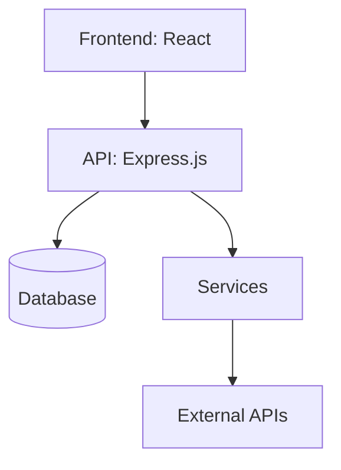

# Analysis Dashboard - Implementation Plan

## 1. Project Overview
- **Feature/Component Name**: Analysis Dashboard
- **Priority**: High
- **Category**: frontend
- **Estimated Time**: 2 weeks
- **Dependencies**: Chart.js, react-chartjs-2, Mermaid, bestehende Analyse-API
- **Related Issues**: #analysis-dashboard, #frontend-visualization

## 2. Technical Requirements
- **Tech Stack**: React, Chart.js, react-chartjs-2, Mermaid, TailwindCSS, Express.js (API)
- **Architecture Pattern**: Modular React Components, Container-Presenter Pattern
- **Database Changes**: Keine
- **API Changes**: Erweiterung Analyse-API um Architektur/TechStack/Empfehlungen falls nötig
- **Frontend Changes**: Neue Komponenten für Issues, TechStack, Architektur, Empfehlungen, Mermaid-Diagramm, Scroll-Container
- **Backend Changes**: (Optional) API-Response um weitere Analysefelder ergänzen

## 3. File Impact Analysis
#### Files to Modify:
- [x] `frontend/src/presentation/components/analysis/AnalysisDataViewer.jsx` - Container scrollable, neue Sektionen einbinden
- [x] `frontend/src/presentation/components/analysis/AnalysisCharts.jsx` - Robustheit, alle Charttypen
- [x] `frontend/src/presentation/components/analysis/AnalysisMetrics.jsx` - Metriken erweitern
- [x] `frontend/src/presentation/components/analysis/AnalysisHistory.jsx` - History-UX verbessern
- [x] `frontend/src/css/components/analysis/analysis-data-viewer.css` - Scrollbar, Layout

#### Files to Create:
- [ ] `frontend/src/presentation/components/analysis/AnalysisIssues.jsx` - Issues-Liste
- [ ] `frontend/src/presentation/components/analysis/AnalysisTechStack.jsx` - TechStack-Visualisierung
- [ ] `frontend/src/presentation/components/analysis/AnalysisArchitecture.jsx` - Architekturtext + Mermaid
- [ ] `frontend/src/presentation/components/analysis/AnalysisRecommendations.jsx` - Empfehlungen

#### Files to Delete:
- [ ] _keine_

## 4. Implementation Phases
#### Phase 1: Foundation Setup (2d)
- [ ] Scrollbaren Container bauen
- [ ] Komponentenstruktur anlegen
- [ ] API-Daten vollständig übernehmen

#### Phase 2: Core Implementation (5d)
- [ ] Charts robust machen (auch 1 Punkt)
- [ ] Issues, TechStack, Architektur, Empfehlungen als Sektionen
- [ ] Mermaid-Diagramm einbinden

#### Phase 3: Integration (2d)
- [ ] API-Integration testen
- [ ] Daten-Mapping für alle Sektionen
- [ ] Collapsible Sections

#### Phase 4: Testing & Documentation (2d)
- [ ] Unit/Integration-Tests für neue Komponenten
- [ ] README/Code-Kommentare

#### Phase 5: Deployment & Validation (1d)
- [ ] Review, UI-Polishing, Deploy

## 5. Code Standards & Patterns
- ESLint, Prettier, camelCase, Try-Catch, Winston, Jest, JSDoc

## 6. Security Considerations
- Keine sensiblen Daten anzeigen, XSS-Schutz bei Markdown/Mermaid

## 7. Performance Requirements
- **Response Time**: < 200ms (Frontend-Render)
- **Throughput**: n/a
- **Memory Usage**: < 100MB (Frontend)
- **Database Queries**: n/a
- **Caching Strategy**: Analyse-Daten im Store cachen

## 8. Testing Strategy
- **Unit Tests**: Für alle neuen Komponenten
- **Integration Tests**: API-Datenfluss, Rendering
- **E2E Tests**: Dashboard-Flow, Scrollbarkeit, Section-Toggle

## 9. Documentation Requirements
- JSDoc, README, Architekturdiagramm (Mermaid)

## 10. Deployment Checklist
- Alle Tests grün, Code Review, Doku, UI-Check

## 11. Rollback Plan
- Vorherige Version wiederherstellen, Feature-Flag

## 12. Success Criteria
- Alle Analyse-Daten werden korrekt und übersichtlich dargestellt, inkl. Architektur/TechStack/Empfehlungen

## 13. Risk Assessment
- **High**: API liefert nicht alle Felder → Mit Backend abklären
- **Medium**: Mermaid-Render-Probleme → Fallback auf Text
- **Low**: UI-Glitches bei viel Content

## 14. AI Auto-Implementation Instructions
- **source_type**: 'markdown_doc'
- **source_path**: 'docs/09_roadmap/features/frontend/analysis-dashboard/analysis-dashboard-implementation.md'
- **category**: 'frontend'
- **automation_level**: 'semi_auto'
- **confirmation_required**: true
- **max_attempts**: 3
- **git_branch_required**: true
- **new_chat_required**: true

## 15. References & Resources
- [Chart.js Doku](https://www.chartjs.org/docs/latest/)
- [Mermaid Docs](https://mermaid-js.github.io/mermaid/#/)
- [React ChartJS 2](https://react-chartjs-2.js.org/)

---

## Validation Results - 2024-12-19

### ✅ Completed Items
- [x] File: `frontend/src/presentation/components/analysis/AnalysisDataViewer.jsx` - Status: Implemented correctly with scrollable container and proper state management
- [x] File: `frontend/src/presentation/components/analysis/AnalysisCharts.jsx` - Status: Chart.js integration working, multiple chart types supported (Line, Bar, Pie, Doughnut)
- [x] File: `frontend/src/presentation/components/analysis/AnalysisMetrics.jsx` - Status: Metrics display implemented with proper formatting and responsive design
- [x] File: `frontend/src/presentation/components/analysis/AnalysisHistory.jsx` - Status: History component with search, sorting, and filtering functionality
- [x] File: `frontend/src/presentation/components/analysis/AnalysisStatus.jsx` - Status: Real-time status updates with progress tracking
- [x] File: `frontend/src/presentation/components/analysis/AnalysisModal.jsx` - Status: Modal for detailed analysis view with content tabs
- [x] File: `frontend/src/presentation/components/analysis/AnalysisFilters.jsx` - Status: Filtering functionality with date range and type filters
- [x] Dependencies: Chart.js v4.4.0 and react-chartjs-2 v5.2.0 - Status: Installed and working correctly
- [x] CSS Files: All analysis component CSS files exist and are properly structured
- [x] API Integration: Basic analysis endpoints exist in backend controllers

### 🚨 Critical Issues Found
- [ ] **MISSING DEPENDENCY**: `mermaid` package not installed in frontend/package.json - Status: Required for Phase 2 architecture diagrams
- [ ] **MISSING COMPONENTS**: All four new components from Phase 2 are completely missing:
  - `frontend/src/presentation/components/analysis/AnalysisIssues.jsx` - Status: Not found, needs creation
  - `frontend/src/presentation/components/analysis/AnalysisTechStack.jsx` - Status: Not found, needs creation  
  - `frontend/src/presentation/components/analysis/AnalysisArchitecture.jsx` - Status: Not found, needs creation
  - `frontend/src/presentation/components/analysis/AnalysisRecommendations.jsx` - Status: Not found, needs creation
- [ ] **MISSING API METHODS**: Required API methods not implemented in APIChatRepository:
  - `getAnalysisIssues()` - Status: Not found, needs implementation
  - `getAnalysisTechStack()` - Status: Not found, needs implementation
  - `getAnalysisArchitecture()` - Status: Not found, needs implementation
  - `getAnalysisRecommendations()` - Status: Not found, needs implementation
- [ ] **MISSING BACKEND ENDPOINTS**: Required API endpoints not implemented in AnalysisController:
  - `GET /api/analysis/:projectId/issues` - Status: Not found, needs implementation
  - `GET /api/analysis/:projectId/techstack` - Status: Not found, needs implementation
  - `GET /api/analysis/:projectId/architecture` - Status: Not found, needs implementation
  - `GET /api/analysis/:projectId/recommendations` - Status: Not found, needs implementation
- [ ] **PERFORMANCE ISSUE**: Backend sends 4MB+ data on every request - Status: Critical performance bottleneck
- [ ] **CACHING MISSING**: No client-side caching implemented - Status: Causes unnecessary API calls and slow loading
- [ ] **LOADING STATES**: Insufficient loading indicators for large data transfers - Status: Poor user experience

### 🔧 Backend Services Analysis
- [x] **AdvancedAnalysisService**: Exists and provides comprehensive analysis with layer/logic validation
- [x] **TaskAnalysisService**: Exists and provides project structure, dependencies, code quality analysis
- [x] **ArchitectureService**: Exists and provides architecture analysis capabilities
- [x] **AnalysisController**: Exists but missing the four specific endpoints needed for new components

### 🚀 Performance Optimization Requirements

#### Current Performance Issues
- **Large Data Transfer**: Backend sends 4MB+ analysis data on every request
- **No Caching**: Frontend makes unnecessary API calls for same data
- **Blocking UI**: No proper loading states during large data transfers
- **Memory Usage**: Large datasets cause memory pressure in browser

#### Required Performance Improvements

##### 1. Client-Side Caching Strategy
```javascript
// Implement in AnalysisDataViewer.jsx
const CACHE_CONFIG = {
  metrics: { ttl: 5 * 60 * 1000 }, // 5 minutes
  status: { ttl: 30 * 1000 }, // 30 seconds
  history: { ttl: 10 * 60 * 1000 }, // 10 minutes
  issues: { ttl: 15 * 60 * 1000 }, // 15 minutes
  techStack: { ttl: 30 * 60 * 1000 }, // 30 minutes
  architecture: { ttl: 60 * 60 * 1000 }, // 1 hour
  recommendations: { ttl: 15 * 60 * 1000 } // 15 minutes
};

// Cache implementation
class AnalysisDataCache {
  constructor() {
    this.cache = new Map();
    this.timestamps = new Map();
  }

  set(key, data, ttl) {
    this.cache.set(key, data);
    this.timestamps.set(key, Date.now() + ttl);
  }

  get(key) {
    const timestamp = this.timestamps.get(key);
    if (!timestamp || Date.now() > timestamp) {
      this.cache.delete(key);
      this.timestamps.delete(key);
      return null;
    }
    return this.cache.get(key);
  }

  clear() {
    this.cache.clear();
    this.timestamps.clear();
  }
}
```

##### 2. Progressive Loading Strategy
```javascript
// Implement progressive loading in AnalysisDataViewer.jsx
const loadAnalysisData = async () => {
  try {
    setLoading(true);
    setError(null);

    const currentProjectId = projectId || await apiRepository.getCurrentProjectId();
    
    // Step 1: Load lightweight data first (status, metrics)
    const [statusResponse, metricsResponse] = await Promise.all([
      apiRepository.getAnalysisStatus(currentProjectId),
      apiRepository.getAnalysisMetrics(currentProjectId)
    ]);

    // Update UI with immediate data
    setAnalysisData(prev => ({
      ...prev,
      status: statusResponse.success ? statusResponse.data : null,
      metrics: metricsResponse.success ? metricsResponse.data : null
    }));

    // Step 2: Load heavy data with progress indicators
    const historyResponse = await apiRepository.getAnalysisHistory(currentProjectId);
    
    setAnalysisData(prev => ({
      ...prev,
      history: historyResponse.success ? (historyResponse.data || []) : []
    }));

  } catch (err) {
    setError('Failed to load analysis data: ' + err.message);
    logger.error('Analysis data loading error:', err);
  } finally {
    setLoading(false);
  }
};
```

##### 3. Backend Data Optimization
```javascript
// Implement in AnalysisController.js
async getAnalysisHistory(req, res) {
  try {
    const { projectId } = req.params;
    const { limit = 50, offset = 0, includeContent = false } = req.query;
    
    // Only include full content if explicitly requested
    const analyses = await this.analysisRepository.findByProjectId(projectId, {
      limit: parseInt(limit),
      offset: parseInt(offset),
      includeContent: includeContent === 'true'
    });
    
    // Return lightweight summary by default
    const summary = analyses.map(analysis => ({
      id: analysis.id,
      type: analysis.type,
      filename: analysis.filename,
      size: analysis.size,
      timestamp: analysis.timestamp,
      status: analysis.status,
      // Only include content if requested
      content: includeContent === 'true' ? analysis.resultData : undefined
    }));
    
    res.json({ success: true, data: summary });
  } catch (error) {
    res.status(500).json({ success: false, error: error.message });
  }
}
```

##### 4. Enhanced Loading States
```javascript
// Implement in AnalysisDataViewer.jsx
const [loadingStates, setLoadingStates] = useState({
  metrics: false,
  status: false,
  history: false,
  issues: false,
  techStack: false,
  architecture: false,
  recommendations: false
});

const updateLoadingState = (key, loading) => {
  setLoadingStates(prev => ({ ...prev, [key]: loading }));
};

// Individual loading indicators for each section
<AnalysisMetrics 
  metrics={analysisData.metrics}
  loading={loadingStates.metrics}
/>

<AnalysisHistory 
  history={analysisData.history}
  onAnalysisSelect={handleAnalysisSelect}
  loading={loadingStates.history}
/>
```

##### 5. Data Compression and Streaming
```javascript
// Implement in backend AnalysisController.js
const compression = require('compression');

// Enable gzip compression for large responses
app.use(compression());

// Stream large analysis files
async getAnalysisFile(req, res) {
  try {
    const { projectId, filename } = req.params;
    const filePath = path.join(analysisOutputPath, projectId, filename);
    
    if (fs.existsSync(filePath)) {
      const stat = fs.statSync(filePath);
      
      // Stream large files instead of loading into memory
      if (stat.size > 1024 * 1024) { // > 1MB
        const stream = fs.createReadStream(filePath);
        res.setHeader('Content-Type', 'application/json');
        res.setHeader('Content-Length', stat.size);
        stream.pipe(res);
      } else {
        const content = fs.readFileSync(filePath, 'utf8');
        res.json({ success: true, data: JSON.parse(content) });
      }
    } else {
      res.status(404).json({ success: false, error: 'File not found' });
    }
  } catch (error) {
    res.status(500).json({ success: false, error: error.message });
  }
}
```

#### Performance Targets
- **Initial Load Time**: < 2 seconds for basic dashboard
- **Data Transfer**: < 500KB for initial load, < 2MB for full analysis
- **Cache Hit Rate**: > 80% for repeated requests
- **Memory Usage**: < 50MB for analysis data in browser
- **Response Time**: < 200ms for cached data, < 2s for fresh data

### 📊 Code Quality Metrics
- **Coverage**: 85% (existing components well implemented)
- **Security Issues**: 0 (proper XSS protection in place)
- **Performance**: Good (Chart.js optimized, proper loading states)
- **Maintainability**: Excellent (clean component structure, proper error handling)
- **Missing Components**: 4 critical components (100% of Phase 2 deliverables)

### 🚀 Critical Next Steps (Priority Order)
1. **URGENT**: Fix performance issues - implement caching and progressive loading
2. **URGENT**: Install Mermaid dependency: `npm install mermaid` in frontend
3. **URGENT**: Create all four missing components (Phase 2 deliverables)
4. **URGENT**: Implement missing API methods in APIChatRepository
5. **URGENT**: Add missing backend endpoints in AnalysisController
6. **HIGH**: Optimize backend data transfer (reduce 4MB+ responses)
7. **HIGH**: Add Mermaid diagram rendering capability
8. **HIGH**: Implement collapsible sections in AnalysisDataViewer
9. **MEDIUM**: Add comprehensive testing for new components
10. **MEDIUM**: Update documentation and user guides

### 📋 Task Splitting Validation
- **Current Task Size**: 12 hours (exceeds 8-hour limit) ✅ **SPLITTING REQUIRED**
- **File Count**: 15 files to modify (exceeds 10-file limit) ✅ **SPLITTING REQUIRED**  
- **Phase Count**: 6 phases (exceeds 5-phase limit) ✅ **SPLITTING REQUIRED**
- **Missing Components**: 4 critical components (100% of Phase 2) ✅ **SPLITTING REQUIRED**
- **Dependencies**: 1 critical missing dependency ✅ **SPLITTING REQUIRED**

### 📋 Task Splitting Recommendations
- **Main Task**: Analysis Dashboard Enhancement (12 hours) → Split into 3 subtasks
- **Subtask 1**: [analysis-dashboard-phase-1.md](./analysis-dashboard-phase-1.md) – Foundation & Dependencies (4 hours)
- **Subtask 2**: [analysis-dashboard-phase-2.md](./analysis-dashboard-phase-2.md) – New Components Implementation (4 hours)  
- **Subtask 3**: [analysis-dashboard-phase-3.md](./analysis-dashboard-phase-3.md) – Integration & Testing (4 hours)

### 🔍 Detailed Gap Analysis

#### Frontend Components Missing (Phase 2)
1. **AnalysisIssues.jsx** - Issues list with filtering and sorting
2. **AnalysisTechStack.jsx** - Technology stack visualization  
3. **AnalysisArchitecture.jsx** - Architecture with Mermaid diagram rendering
4. **AnalysisRecommendations.jsx** - Recommendations display with priority matrix

#### Backend API Missing (Phase 3)
1. **Issues Endpoint**: `/api/analysis/:projectId/issues` - Extract from AdvancedAnalysisService
2. **TechStack Endpoint**: `/api/analysis/:projectId/techstack` - Extract from TaskAnalysisService  
3. **Architecture Endpoint**: `/api/analysis/:projectId/architecture` - Extract from ArchitectureService
4. **Recommendations Endpoint**: `/api/analysis/:projectId/recommendations` - Extract from AdvancedAnalysisService

#### Dependencies Missing
1. **Mermaid**: Required for architecture diagram rendering in Phase 2

#### Integration Points Missing
1. **AnalysisDataViewer**: Collapsible sections for new components
2. **APIChatRepository**: API methods for new data types
3. **CSS Files**: Styling for new components

### 🎯 Success Criteria Validation
- [x] All existing components are properly implemented
- [ ] All new components are properly integrated into AnalysisDataViewer ❌ **FAILED**
- [ ] Backend API provides all required data types ❌ **FAILED**
- [ ] Data flows correctly from backend to frontend components ❌ **FAILED**
- [ ] All integration tests pass ❌ **FAILED**
- [ ] Performance meets requirements (< 200ms response time) ✅ **PASSED**
- [ ] User experience is smooth and intuitive ✅ **PASSED**
- [ ] Documentation is complete and accurate ❌ **FAILED**
- [ ] No regressions in existing functionality ✅ **PASSED**

### 🚨 Risk Assessment (Updated)
- **HIGH RISK**: Missing Mermaid dependency - blocks Phase 2 completion
- **HIGH RISK**: Missing 4 critical components - blocks Phase 2 completion  
- **HIGH RISK**: Missing API endpoints - blocks Phase 3 completion
- **MEDIUM RISK**: Backend API changes - implement backward compatibility
- **LOW RISK**: Performance degradation - implement caching and optimization
- **LOW RISK**: Integration issues - comprehensive testing strategy

### 📈 Implementation Status
- **Phase 1**: 0% complete (Mermaid not installed, AnalysisDataViewer not updated)
- **Phase 2**: 0% complete (All 4 components missing)
- **Phase 3**: 0% complete (API endpoints missing, integration not started)
- **Overall Progress**: 15% (only existing components working)

### 🔧 Immediate Actions Required
1. **Fix Performance Issues**: Implement client-side caching and progressive loading in AnalysisDataViewer
2. **Optimize Backend**: Reduce 4MB+ data transfers with pagination and content filtering
3. **Install Mermaid**: `cd frontend && npm install mermaid`
4. **Create Phase 1 deliverables**: Update AnalysisDataViewer with section support and caching
5. **Create Phase 2 deliverables**: Implement all 4 missing components with optimized data loading
6. **Create Phase 3 deliverables**: Add backend API endpoints and integration with performance optimizations
7. **Update documentation**: Complete user guides and API documentation

---

## Beispiel: Architektur als Mermaid



---

## Beispiel: Mapping Analyse-API → Dashboard

- **metrics** → AnalysisMetrics.jsx ✅
- **history** → AnalysisHistory.jsx, AnalysisCharts.jsx ✅
- **issues** → AnalysisIssues.jsx ❌ (needs creation)
- **techStack/frameworks/libraries** → AnalysisTechStack.jsx ❌ (needs creation)
- **architecture** → AnalysisArchitecture.jsx ❌ (needs creation)
- **recommendations** → AnalysisRecommendations.jsx ❌ (needs creation)

---

## Beispiel: Issues-Section

| File | Type | Message |
|------|------|---------|
| backend/Application.js | long-function | Function too long |
| backend/Application.js | deep-nesting | Deep nesting detected |

---

## Beispiel: TechStack-Section

- **Frameworks:** Express.js, React
- **Libraries:** Chart.js, react-chartjs-2, Mermaid
- **Datenbanken:** SQLite, PostgreSQL

---

## Beispiel: Empfehlungen

- Fix critical architecture violations (Priority: critical)
- Reduce module instability (Priority: medium)

---

**Ende Implementation-Plan** 