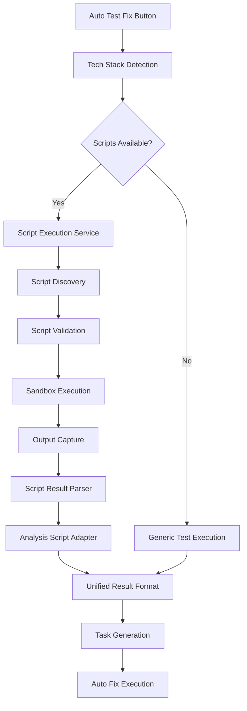

# Scripts Integration Implementation Plan

## 1. Project Overview
- **Feature/Component Name**: Scripts Integration for Generic Test Analysis
- **Priority**: High
- **Estimated Time**: 25 hours
- **Dependencies**: Existing scripts in scripts/, GenericTestAnalyzer, AutoTestFixSystem
- **Related Issues**: Integration of existing analysis tools into backend

## 2. Technical Requirements
- **Tech Stack**: Node.js, JavaScript, Child Process execution, File System operations
- **Architecture Pattern**: Adapter Pattern for script integration, Strategy Pattern for different analysis types
- **Database Changes**: New table for script execution results, analysis metadata
- **API Changes**: New endpoints for script-based analysis, execution status tracking
- **Frontend Changes**: Enhanced analysis panel with script execution options
- **Backend Changes**: ScriptExecutionService, ScriptResultParser, AnalysisScriptAdapter

## 3. File Impact Analysis

#### Files to Modify:
- [ ] `backend/domain/services/auto-test/AutoTestFixSystem.js` - Add script execution support
- [ ] `backend/domain/services/TestReportParser.js` - Add script result parsing
- [ ] `backend/presentation/api/controllers/AutoTestFixController.js` - Add script endpoints
- [ ] `frontend/src/presentation/components/chat/sidebar-right/AutoPanelComponent.jsx` - Add script options

#### Files to Create:
- [ ] `backend/domain/services/ScriptExecutionService.js` - Execute scripts safely
- [ ] `backend/domain/services/ScriptResultParser.js` - Parse script outputs
- [ ] `backend/domain/services/AnalysisScriptAdapter.js` - Convert script results to unified format
- [ ] `backend/domain/services/script-adapters/` - Script-specific adapters
- [ ] `backend/domain/services/script-adapters/WorkflowAnalyzerAdapter.js` - Workflow analysis adapter
- [ ] `backend/domain/services/script-adapters/CoverageValidatorAdapter.js` - Coverage validation adapter
- [ ] `backend/domain/services/script-adapters/TestAdvancedAnalysisAdapter.js` - Test analysis adapter
- [ ] `backend/domain/services/script-adapters/DOMAnalyzerAdapter.js` - DOM analysis adapter
- [ ] `backend/infrastructure/database/migrations/` - Script execution tracking

## 4. Implementation Phases

#### Phase 1: Script Execution Service (8 hours)
- [ ] Create ScriptExecutionService with sandbox execution
- [ ] Implement script discovery and validation
- [ ] Add timeout and resource limits
- [ ] Create execution result tracking
- [ ] Add error handling and recovery
- [ ] Implement script output capture

#### Phase 2: Script Result Parsing (6 hours)
- [ ] Create ScriptResultParser for different output formats
- [ ] Implement JSON, Markdown, and text parsing
- [ ] Add result validation and error detection
- [ ] Create unified result schema
- [ ] Add result caching and persistence

#### Phase 3: Script Adapters (8 hours)
- [ ] Create base ScriptAdapter interface
- [ ] Implement WorkflowAnalyzerAdapter
- [ ] Implement CoverageValidatorAdapter
- [ ] Implement TestAdvancedAnalysisAdapter
- [ ] Implement DOMAnalyzerAdapter
- [ ] Add adapter configuration and options

#### Phase 4: Integration & Testing (3 hours)
- [ ] Integrate with AutoTestFixSystem
- [ ] Update API endpoints for script execution
- [ ] Add frontend script selection
- [ ] Create comprehensive test suite
- [ ] Update documentation

## 5. Code Standards & Patterns
- **Coding Style**: ESLint with existing project rules, Prettier formatting
- **Naming Conventions**: camelCase for variables/functions, PascalCase for classes, kebab-case for files
- **Error Handling**: Try-catch with specific error types, proper error logging
- **Logging**: Winston logger with structured logging, different levels for operations
- **Testing**: Jest framework, 90% coverage requirement
- **Documentation**: JSDoc for all public methods, README updates

## 6. Security Considerations
- [ ] Sandbox script execution environment
- [ ] Validate script paths and permissions
- [ ] Limit script execution time and resources
- [ ] Sanitize script outputs
- [ ] Prevent command injection in script execution
- [ ] Audit logging for all script executions

## 7. Performance Requirements
- **Response Time**: < 60 seconds for script execution
- **Throughput**: Support 5 concurrent script executions
- **Memory Usage**: < 1GB per script execution
- **Database Queries**: Optimized script result storage
- **Caching Strategy**: Cache script results for 2 hours

## 8. Testing Strategy

#### Unit Tests:
- [ ] Test file: `tests/unit/ScriptExecutionService.test.js`
- [ ] Test file: `tests/unit/ScriptResultParser.test.js`
- [ ] Test file: `tests/unit/AnalysisScriptAdapter.test.js`
- [ ] Test cases: Script execution, result parsing, adapter conversion
- [ ] Mock requirements: File system, process execution, external scripts

#### Integration Tests:
- [ ] Test file: `tests/integration/ScriptIntegration.test.js`
- [ ] Test scenarios: End-to-end script execution and analysis
- [ ] Test data: Sample script outputs for each adapter

#### E2E Tests:
- [ ] Test file: `tests/e2e/ScriptExecution.test.js`
- [ ] User flows: Complete script execution workflow from frontend
- [ ] Browser compatibility: Chrome, Firefox compatibility

## 9. Documentation Requirements

#### Code Documentation:
- [ ] JSDoc comments for all script adapter classes
- [ ] README updates with new script integration features
- [ ] API documentation for new endpoints
- [ ] Architecture diagrams for script integration

#### User Documentation:
- [ ] User guide for script-based analysis
- [ ] Script configuration documentation
- [ ] Troubleshooting guide for script execution issues
- [ ] Migration guide from manual to automated script execution

## 10. Deployment Checklist

#### Pre-deployment:
- [ ] All tests passing (unit, integration, e2e)
- [ ] Code review completed and approved
- [ ] Documentation updated and reviewed
- [ ] Security scan passed
- [ ] Performance benchmarks met

#### Deployment:
- [ ] Database migrations for script execution tracking
- [ ] Environment variables for script execution limits
- [ ] Configuration updates for new services
- [ ] Service restarts for updated components
- [ ] Health checks for new endpoints

#### Post-deployment:
- [ ] Monitor script execution logs
- [ ] Verify script integration functionality
- [ ] Performance monitoring for script execution
- [ ] User feedback collection for new features

## 11. Rollback Plan
- [ ] Database rollback script for script execution table
- [ ] Configuration rollback procedure
- [ ] Service rollback procedure documented
- [ ] Communication plan for stakeholders

## 12. Success Criteria
- [ ] All existing scripts integrated into backend
- [ ] Script execution works for all supported analysis types
- [ ] Results are properly parsed and unified
- [ ] All tests pass (unit, integration, e2e)
- [ ] Performance requirements met
- [ ] Security requirements satisfied
- [ ] Documentation complete and accurate
- [ ] User acceptance testing passed

## 13. Risk Assessment

#### High Risk:
- [ ] Script execution security vulnerabilities - Mitigation: Sandbox environment, path validation
- [ ] Performance issues with large script outputs - Mitigation: Output limits, streaming processing

#### Medium Risk:
- [ ] Script compatibility issues - Mitigation: Adapter pattern, fallback execution
- [ ] Result parsing errors - Mitigation: Robust parsing, error recovery

#### Low Risk:
- [ ] New script support - Mitigation: Extensible adapter pattern
- [ ] Documentation updates - Mitigation: Automated documentation generation

## 14. AI Auto-Implementation Instructions

#### Task Database Fields:
- **source_type**: 'markdown_doc'
- **source_path**: 'docs/09_roadmap/features/scripts-integration-implementation.md'
- **automation_level**: 'semi_auto'
- **confirmation_required**: true
- **max_attempts**: 3
- **git_branch_required**: true
- **new_chat_required**: true

#### AI Execution Context:
```json
{
  "requires_new_chat": true,
  "git_branch_name": "feature/scripts-integration",
  "confirmation_keywords": ["fertig", "done", "complete"],
  "fallback_detection": true,
  "max_confirmation_attempts": 3,
  "timeout_seconds": 300
}
```

#### Success Indicators:
- [ ] All checkboxes in phases completed
- [ ] Scripts execute successfully
- [ ] No build errors
- [ ] Code follows standards
- [ ] Documentation updated

## 15. References & Resources
- **Technical Documentation**: Existing scripts in scripts/, AutoTestFixSystem
- **API References**: Child Process, File System, Process execution
- **Design Patterns**: Adapter Pattern, Strategy Pattern, Factory Pattern
- **Best Practices**: Script execution security, output parsing
- **Similar Implementations**: Existing test analysis in AutoTestFixSystem

## 16. Script Integration Matrix

| Script | Location | Purpose | Adapter | Output Format | Integration Priority |
|--------|----------|---------|---------|---------------|---------------------|
| workflow-analyzer.js | scripts/ | Architecture analysis | WorkflowAnalyzerAdapter | JSON/HTML | High |
| coverage-validator.js | scripts/cursor/ | Coverage validation | CoverageValidatorAdapter | JSON | High |
| test-advanced-analysis.js | scripts/ | Test analysis | TestAdvancedAnalysisAdapter | JSON | High |
| dom-analyzer.js | scripts/cursor/ | DOM analysis | DOMAnalyzerAdapter | JSON | Medium |
| enhanced-dom-collector.js | scripts/cursor/ | DOM collection | DOMCollectorAdapter | JSON | Medium |
| bulk-dom-analyzer.js | scripts/cursor/ | Bulk DOM analysis | BulkDOMAnalyzerAdapter | JSON | Low |

## 17. Script Execution Flow



## 18. Script Configuration Schema

```json
{
  "scripts": {
    "workflow-analyzer": {
      "path": "scripts/workflow-analyzer.js",
      "type": "architecture",
      "timeout": 300000,
      "outputFormat": "json",
      "dependencies": ["node"],
      "arguments": ["--project-path", "{projectPath}"],
      "adapter": "WorkflowAnalyzerAdapter"
    },
    "coverage-validator": {
      "path": "scripts/cursor/coverage-validator.js",
      "type": "coverage",
      "timeout": 120000,
      "outputFormat": "json",
      "dependencies": ["node"],
      "arguments": ["--validate"],
      "adapter": "CoverageValidatorAdapter"
    },
    "test-advanced-analysis": {
      "path": "scripts/test-advanced-analysis.js",
      "type": "testing",
      "timeout": 180000,
      "outputFormat": "json",
      "dependencies": ["node"],
      "arguments": ["--project", "{projectPath}"],
      "adapter": "TestAdvancedAnalysisAdapter"
    }
  }
}
```

## 19. Unified Script Result Format

```json
{
  "scriptInfo": {
    "name": "workflow-analyzer",
    "version": "1.0.0",
    "executionTime": "2024-01-01T00:00:00Z",
    "duration": 45000,
    "status": "success"
  },
  "analysisResults": {
    "type": "architecture",
    "score": 85.5,
    "issues": [
      {
        "type": "missing_handler",
        "severity": "medium",
        "description": "Missing handler for AdvancedAnalysisCommand",
        "file": "backend/application/handlers/analyze/AdvancedAnalysisHandler.js",
        "suggestions": ["Create handler", "Update command"]
      }
    ],
    "recommendations": [
      "Add missing handlers for all commands",
      "Improve error handling in services"
    ],
    "metrics": {
      "totalCommands": 25,
      "totalHandlers": 23,
      "coverage": 92.0
    }
  },
  "rawOutput": {
    "stdout": "...",
    "stderr": "...",
    "exitCode": 0
  }
}
```

---

**Note**: This implementation plan provides a comprehensive approach to integrating existing analysis scripts into the backend system while maintaining security, performance, and extensibility. 