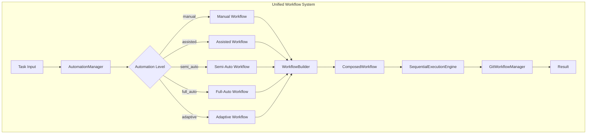
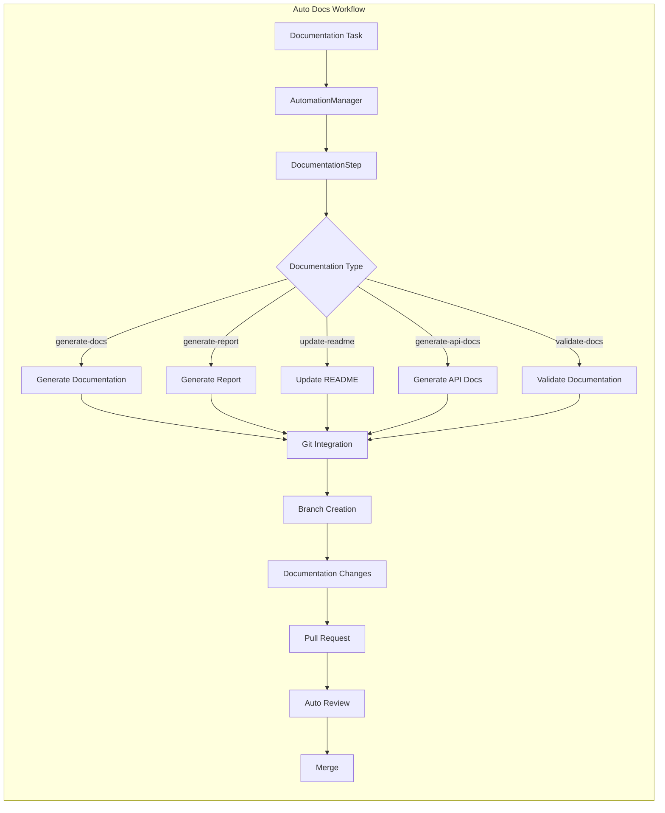
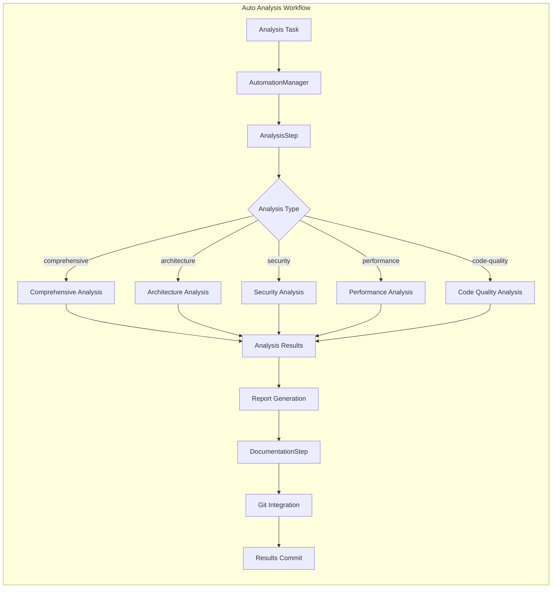
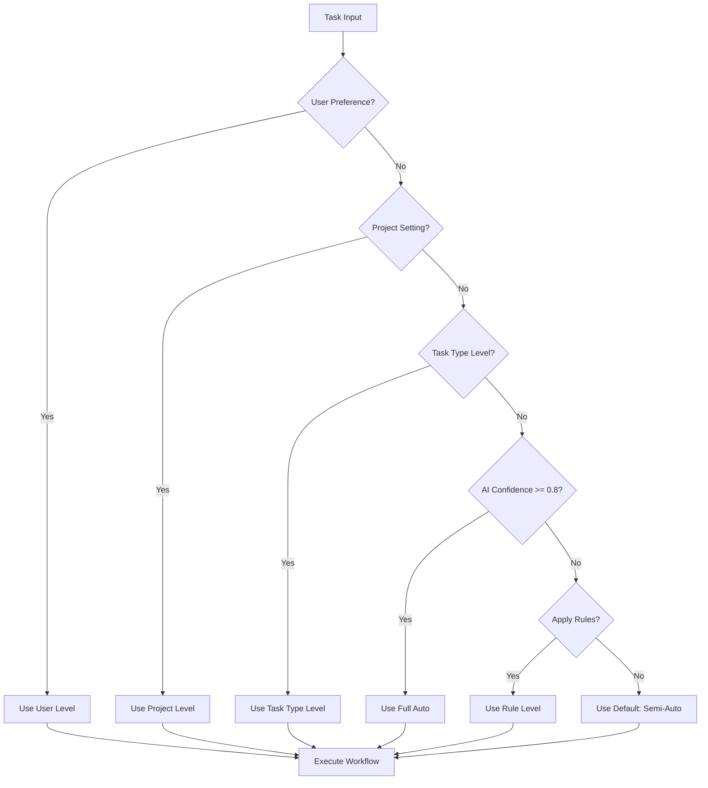

Ich schaue mir das Unified Workflow System an und erkläre dir, wie es funktioniert.

Ran tool
Ran tool
Ran tool
Basierend auf meiner Analyse des Unified Workflow Systems kann ich dir eine kurze und knappe Erklärung geben:

## Unified Workflow System - Kurze Erklärung

Das **Unified Workflow System** ist eine umfassende Workflow-Engine für PIDEA, die verschiedene Automatisierungslevel und Workflow-Typen unterstützt.

### Kernkomponenten:

1. **Automation Level System** (5 Level):
   - `manual` - Vollständige manuelle Kontrolle
   - `assisted` - AI-Assistenz mit Bestätigung
   - `semi_auto` - AI-Ausführung mit Überwachung
   - `full_auto` - Vollständige Automatisierung
   - `adaptive` - Dynamische Level basierend auf Kontext

2. **Workflow Steps** für verschiedene Tasks:
   - `AnalysisStep` - Code-Analyse
   - `RefactoringStep` - Code-Refactoring
   - `DocumentationStep` - Dokumentation
   - `TestingStep` - Tests
   - `ValidationStep` - Validierung
   - `DeploymentStep` - Deployment

3. **Git Integration** mit automatischen:
   - Branch-Strategien
   - Pull Request Management
   - Auto-Review
   - Merge-Strategien

4. **Execution Engine** mit:
   - Optimierung
   - Resource Management
   - Caching
   - Monitoring

## Mermaid Diagramme

### 1. Gesamtarchitektur



### 2. Auto Refactor Workflow

```mermaid
graph LR
    subgraph "Auto Refactor Workflow"
        A[Refactor Task] --> B[AutomationManager]
        B --> C[RefactoringStep]
        
        C --> D{Refactoring Type}
        D -->|| E[ Refactoring]
        D -->|code-generation| F[Code Generation]
        D -->|feature-implementation| G[Feature Implementation]
        D -->|bug-fix| H[Bug Fix]
        D -->|optimization| I[Optimization]
        
        E --> J[Git Integration]
        F --> J
        G --> J
        H --> J
        I --> J
        
        J --> K[Branch Creation]
        K --> L[Code Changes]
        L --> M[Pull Request]
        M --> N[Auto Review]
        N --> O[Merge]
    end
```

### 3. Auto Docs Workflow



### 4. Auto Analysis Workflow



### 5. Automation Level Decision Flow



Das System ist sehr flexibel und kann automatisch zwischen verschiedenen Automatisierungsleveln wechseln, basierend auf Task-Typ, Benutzerpräferenzen, Projekt-Einstellungen und AI-Konfidenz.