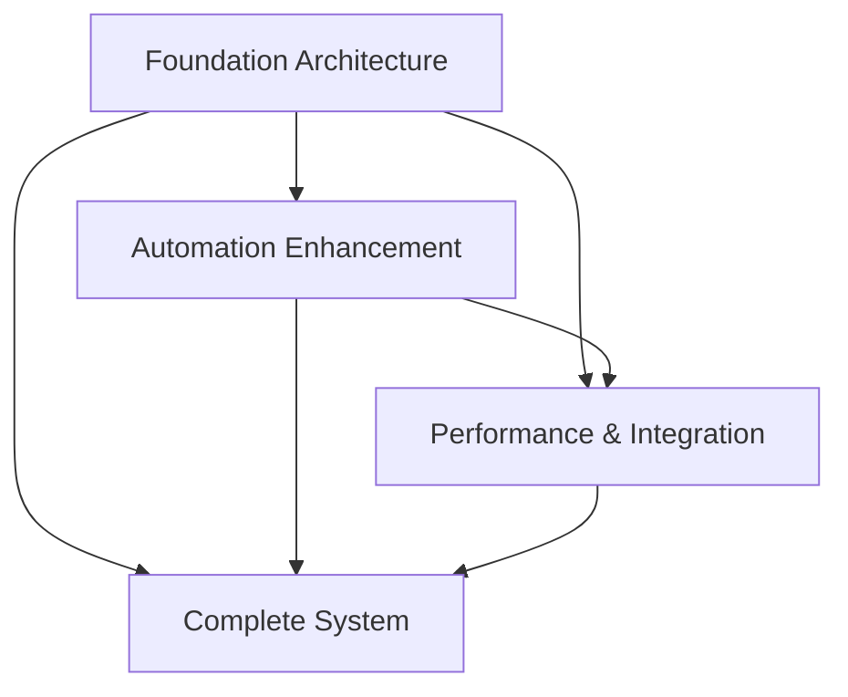
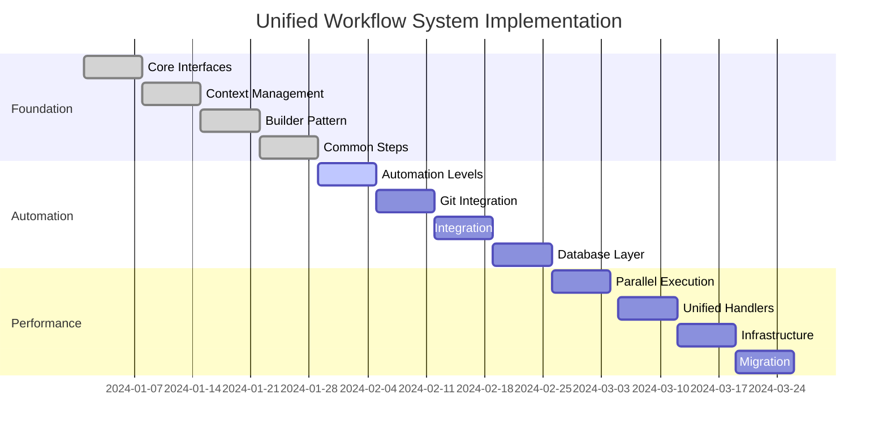

# Unified Workflow System - Master Implementation Plan

## 1. Project Overview
- **Feature/Component Name**: Unified Workflow System
- **Priority**: High
- **Estimated Time**: 12 weeks (480 hours total)
- **Dependencies**: None (foundation system)
- **Related Issues**: Workflow fragmentation, code duplication, inconsistent patterns, limited scalability

## 2. Technical Requirements
- **Tech Stack**: Node.js, JavaScript ES6+, Domain-Driven Design, Parallel execution, Git integration
- **Architecture Pattern**: DDD with unified workflow pattern
- **Database Changes**: Add automation preferences and workflow execution tables
- **API Changes**: New unified workflow endpoints and automation management
- **Frontend Changes**: None (backend system)
- **Backend Changes**: Complete workflow system overhaul with parallel execution

## 3. Subtask Breakdown

### Subtask 1: Foundation Architecture (4 weeks, 160 hours)
- **Status**: Pending
- **Dependencies**: None
- **Files**: 15 new files, 3 modified files
- **Focus**: Core interfaces, context management, builder pattern
- **Implementation**: `docs/09_roadmap/features/unified-workflow-foundation-implementation.md`

### Subtask 2: Automation Enhancement (4 weeks, 160 hours)
- **Status**: Pending
- **Dependencies**: Subtask 1
- **Files**: 15 new files, 5 modified files
- **Focus**: Automation levels, git workflows, confidence scoring
- **Implementation**: `docs/09_roadmap/features/unified-workflow-automation-implementation.md`

### Subtask 3: Performance & Integration (4 weeks, 160 hours)
- **Status**: Pending
- **Dependencies**: Subtask 1, Subtask 2
- **Files**: 15 new files, 7 modified files
- **Focus**: Parallel execution, unified handlers, migration
- **Implementation**: `docs/09_roadmap/features/unified-workflow-performance-implementation.md`

## 4. Implementation Phases

#### Phase 1: Foundation (Weeks 1-4) - Subtask 1
- [ ] Core workflow interfaces (IWorkflow, IWorkflowStep)
- [ ] Context management (WorkflowContext, WorkflowState)
- [ ] Builder pattern (WorkflowBuilder, ComposedWorkflow)
- [ ] Common workflow steps (Analysis, Refactoring, Testing, Documentation)
- [ ] Validation system (WorkflowValidator, ValidationResult)

#### Phase 2: Automation (Weeks 5-8) - Subtask 2
- [ ] Automation level system (5 levels: manual to adaptive)
- [ ] Enhanced git integration (branch strategies, merge strategies)
- [ ] Confidence-based automation (AI confidence scoring)
- [ ] User preference management (automation preferences)
- [ ] Database layer (automation preferences table)

#### Phase 3: Performance (Weeks 9-12) - Subtask 3
- [ ] Parallel execution engine (concurrent task execution)
- [ ] Unified handler system (migration from fragmented handlers)
- [ ] Resource management (allocation, monitoring, optimization)
- [ ] Infrastructure layer (repositories, caching, events)
- [ ] Migration utilities (backward compatibility)

## 5. File Impact Analysis

#### Total Files to Create: 45 files
- **Foundation**: 15 files (interfaces, context, builder, steps)
- **Automation**: 15 files (automation levels, git workflows, database)
- **Performance**: 15 files (execution engine, handlers, infrastructure)

#### Total Files to Modify: 15 files
- **Foundation**: 3 files (Task, TaskExecution, TaskType)
- **Automation**: 5 files (AutoFinishSystem, WorkflowOrchestrationService, etc.)
- **Performance**: 7 files (existing handlers, entities, services)

## 6. Code Standards & Patterns
- **Coding Style**: ESLint with existing project rules, Prettier formatting
- **Naming Conventions**: camelCase for variables/functions, PascalCase for classes, kebab-case for files
- **Error Handling**: Try-catch with specific error types, proper error logging
- **Logging**: Winston logger with structured logging, different levels for operations
- **Testing**: Jest framework, 95% coverage requirement
- **Documentation**: JSDoc for all public methods, README updates

## 7. Security Considerations
- [ ] Workflow execution isolation and security
- [ ] Automation level access control
- [ ] Git operation security and authentication
- [ ] Resource allocation limits and controls
- [ ] Input validation and sanitization
- [ ] Audit logging for all workflow operations

## 8. Performance Requirements
- **Response Time**: < 500ms for workflow execution start
- **Throughput**: 2000+ parallel workflows per minute
- **Memory Usage**: < 200MB for parallel execution engine
- **Database Queries**: Optimized with caching and indexing
- **Caching Strategy**: Multi-level caching (metadata, results, preferences)

## 9. Testing Strategy

#### Unit Tests: 45 test files (1 per implementation file)
- **Foundation**: 15 test files for interfaces, context, builder, steps
- **Automation**: 15 test files for automation levels, git workflows
- **Performance**: 15 test files for execution engine, handlers

#### Integration Tests: 6 test files
- **Foundation**: Workflow integration tests
- **Automation**: Automation integration tests
- **Performance**: Parallel execution integration tests

#### Performance Tests: 3 test files
- **Parallel Execution**: High load testing
- **Resource Management**: Resource utilization testing
- **End-to-End**: Complete workflow performance testing

## 10. Documentation Requirements

#### Code Documentation:
- [ ] JSDoc comments for all 45 new classes
- [ ] README updates with unified workflow architecture
- [ ] API documentation for all new endpoints
- [ ] Architecture diagrams for complete system

#### User Documentation:
- [ ] Unified workflow creation guide
- [ ] Automation level configuration guide
- [ ] Performance optimization guide
- [ ] Migration guide for existing workflows

## 11. Deployment Strategy

#### Phase-by-Phase Deployment:
- **Phase 1**: Deploy foundation (no breaking changes)
- **Phase 2**: Deploy automation (with database migration)
- **Phase 3**: Deploy performance (with handler migration)

#### Rollback Strategy:
- [ ] Database rollback scripts for each phase
- [ ] Configuration rollback procedures
- [ ] Service rollback procedures
- [ ] Communication plans for stakeholders

## 12. Success Criteria

#### Technical Metrics:
- [ ] 40% reduction in code duplication
- [ ] 60% improvement in execution speed
- [ ] 95% test coverage for new components
- [ ] Zero breaking changes to existing APIs

#### User Experience Metrics:
- [ ] 80% of workflows use unified pattern
- [ ] 60% reduction in workflow configuration time
- [ ] 90% user satisfaction with new system
- [ ] 70% fewer workflow errors

#### Business Metrics:
- [ ] 3x increase in workflow creation speed
- [ ] 50% reduction in workflow maintenance time
- [ ] 40% improvement in development velocity
- [ ] 100% backward compatibility maintained

## 13. Risk Assessment

#### High Risk:
- [ ] Complex parallel execution - Mitigation: Comprehensive testing and gradual rollout
- [ ] Handler migration breaking changes - Mitigation: Adapter pattern and backward compatibility
- [ ] Performance bottlenecks - Mitigation: Performance testing and optimization

#### Medium Risk:
- [ ] Git integration complexity - Mitigation: Comprehensive testing with real repositories
- [ ] Automation level conflicts - Mitigation: Clear precedence rules and validation
- [ ] Resource management issues - Mitigation: Resource limits and monitoring

#### Low Risk:
- [ ] Interface design changes - Mitigation: Early stakeholder review
- [ ] Documentation completeness - Mitigation: Automated documentation generation
- [ ] API endpoint changes - Mitigation: Versioned APIs

## 14. AI Auto-Implementation Instructions

#### Master Task Database Fields:
- **source_type**: 'markdown_doc'
- **source_path**: 'docs/09_roadmap/features/unified-workflow-system-implementation.md'
- **automation_level**: 'semi_auto'
- **confirmation_required**: true
- **max_attempts**: 3
- **git_branch_required**: true
- **new_chat_required**: true

#### Subtask Execution Context:
```json
{
  "subtasks": [
    {
      "name": "Foundation Architecture",
      "file": "unified-workflow-foundation-implementation.md",
      "branch": "feature/unified-workflow-foundation",
      "dependencies": []
    },
    {
      "name": "Automation Enhancement",
      "file": "unified-workflow-automation-implementation.md",
      "branch": "feature/unified-workflow-automation",
      "dependencies": ["Foundation Architecture"]
    },
    {
      "name": "Performance & Integration",
      "file": "unified-workflow-performance-implementation.md",
      "branch": "feature/unified-workflow-performance",
      "dependencies": ["Foundation Architecture", "Automation Enhancement"]
    }
  ],
  "confirmation_keywords": ["fertig", "done", "complete", "unified workflow system ready"],
  "fallback_detection": true,
  "max_confirmation_attempts": 3,
  "timeout_seconds": 1800
}
```

#### Success Indicators:
- [ ] All three subtasks completed successfully
- [ ] All 45 new files created with proper JSDoc
- [ ] All 15 existing files modified correctly
- [ ] Database migrations executed successfully
- [ ] Handler migration completed
- [ ] All tests passing (unit, integration, performance)
- [ ] No build errors
- [ ] Code follows standards
- [ ] Documentation updated
- [ ] Backward compatibility maintained

## 15. References & Resources
- **Technical Documentation**: Domain-Driven Design, Parallel execution patterns, Git workflows
- **API References**: Existing handler patterns in PIDEA
- **Design Patterns**: Command pattern, Strategy pattern, Builder pattern, Observer pattern
- **Best Practices**: SOLID principles, Clean Architecture, Performance optimization
- **Similar Implementations**: Existing WorkflowOrchestrationService, TaskExecutionEngine, AutoFinishSystem

---

## Database Task Creation Instructions

This master implementation will be parsed into a database task with the following mapping:

```sql
INSERT INTO tasks (
  id, project_id, title, description, type, category, priority, status,
  source_type, source_path, source_content, metadata, estimated_hours
) VALUES (
  uuid(), -- Generated
  'pidea-backend', -- From context
  'Unified Workflow System', -- From section 1
  '[Full markdown content]', -- Complete description
  'feature', -- Derived from Technical Requirements
  'backend', -- Derived from context
  'high', -- From section 1
  'pending', -- Initial status
  'markdown_doc', -- Source type
  'docs/09_roadmap/features/unified-workflow-system-implementation.md', -- Source path
  '[Full markdown content]', -- For reference
  '[JSON with all metadata]', -- All technical details
  480 -- From section 1 (total hours)
);
```

## Subtask Dependencies



## Implementation Timeline

