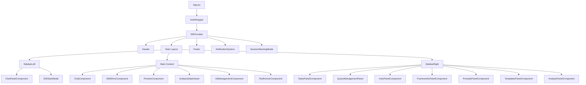
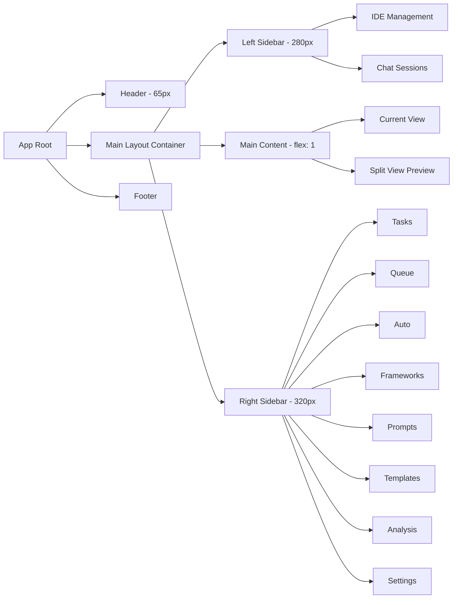
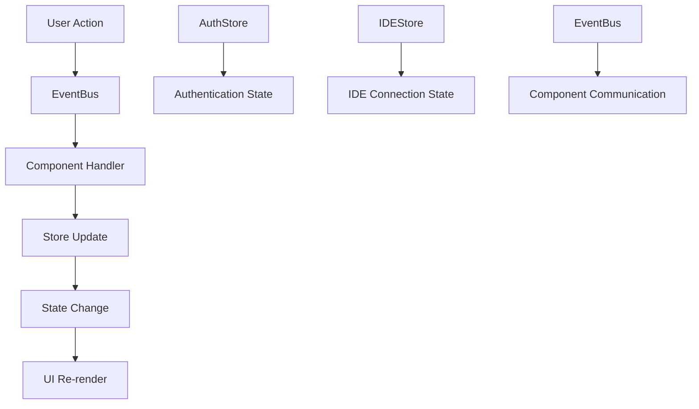
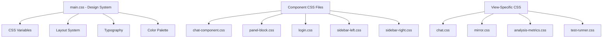
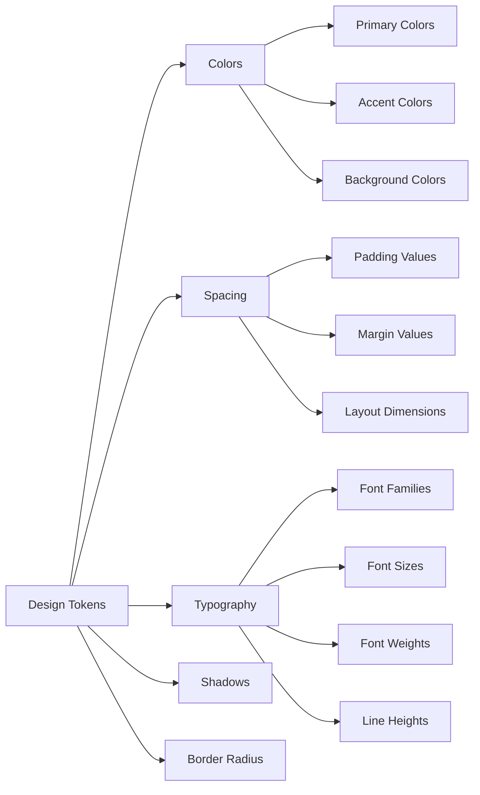
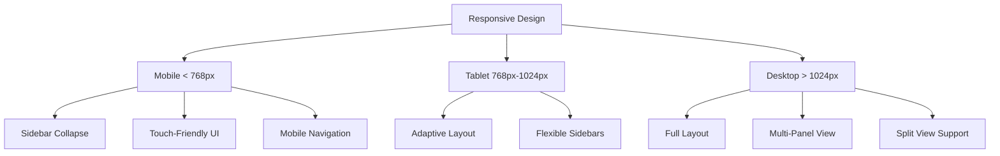

# Frontend Architecture Diagram

## Component Hierarchy Diagram

## Layout Structure Diagram

## State Management Flow

## CSS Architecture Diagram

## Design Token System

## Responsive Design Strategy

