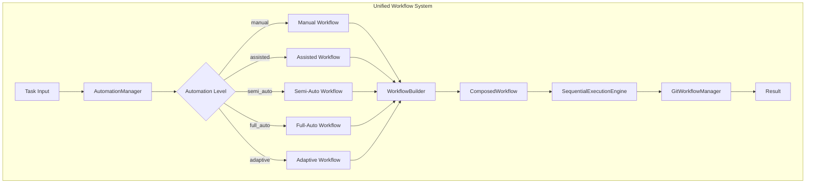
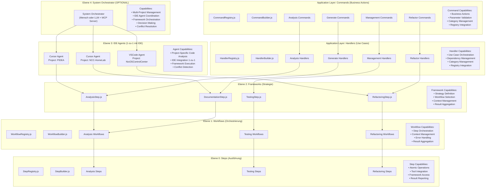
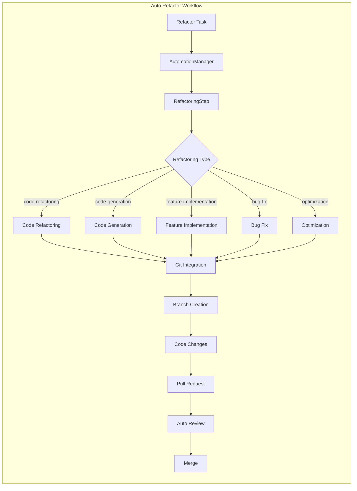
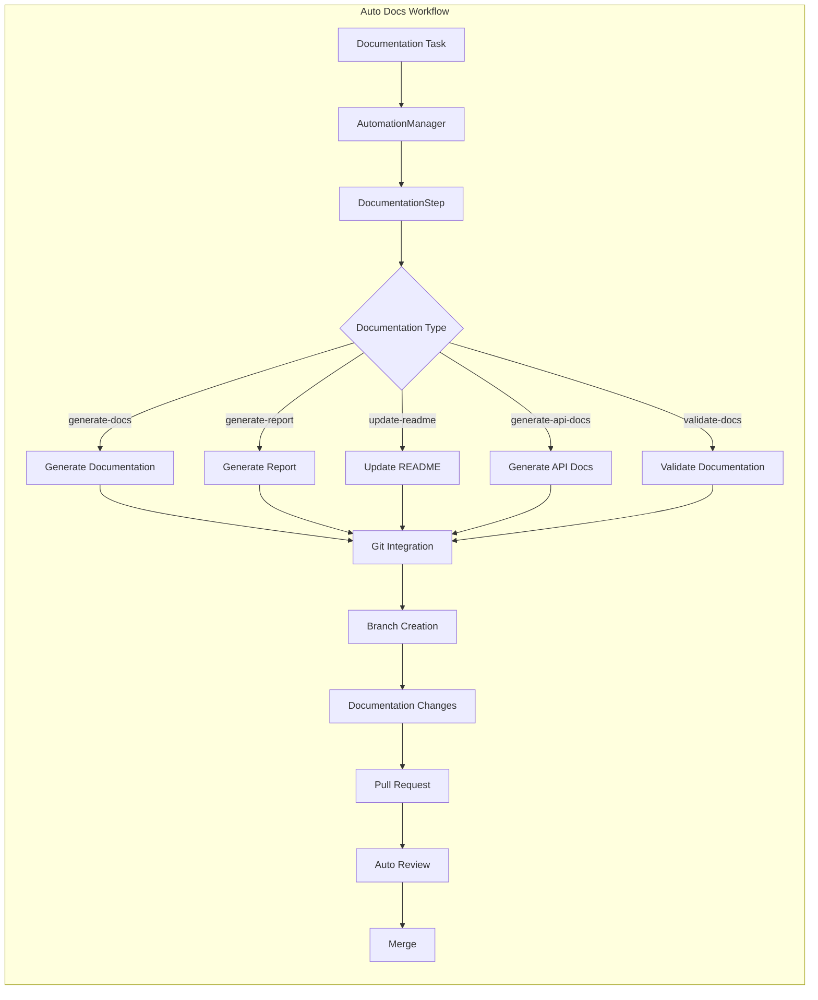
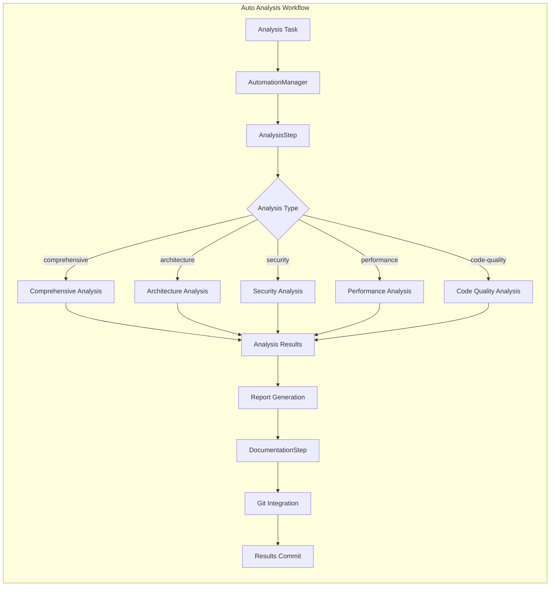
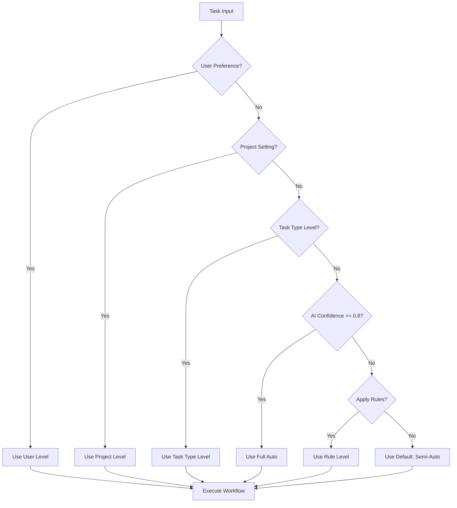
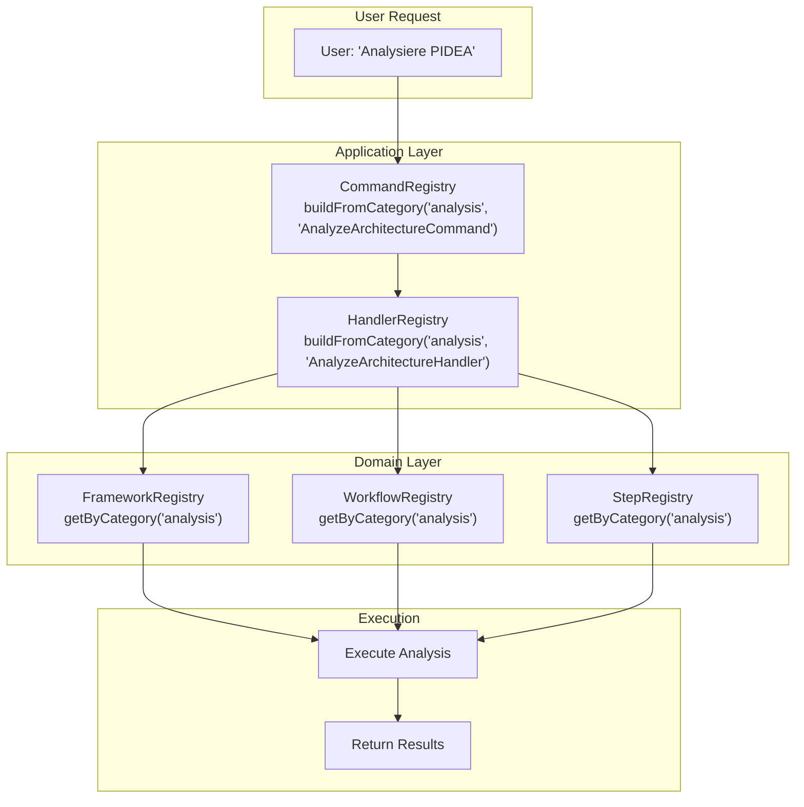

Ich schaue mir das Unified Workflow System an und erkläre dir, wie es funktioniert.

Ran tool
Ran tool
Ran tool
Basierend auf meiner Analyse des Unified Workflow Systems kann ich dir eine kurze und knappe Erklärung geben:

## Unified Workflow System - Kurze Erklärung

Das **Unified Workflow System** ist eine umfassende Workflow-Engine für PIDEA, die verschiedene Automatisierungslevel und Workflow-Typen unterstützt.

**WICHTIG:** Das System funktioniert bereits! Du kannst sofort mit deinen Frameworks, Workflows, Steps, Commands und Handlers arbeiten!

### Kernkomponenten:

1. **Automation Level System** (5 Level):
   - `manual` - Vollständige manuelle Kontrolle
   - `assisted` - AI-Assistenz mit Bestätigung
   - `semi_auto` - AI-Ausführung mit Überwachung
   - `full_auto` - Vollständige Automatisierung
   - `adaptive` - Dynamische Level basierend auf Kontext

2. **Meta-Ebenen Architektur** (5 Ebenen):
   - **Ebene 4**: System Orchestrator (OPTIONAL - Mensch oder LLM + MCP Server)
   - **Ebene 3**: IDE Agents (1-zu-1 mit IDE)
   - **Ebene 2**: Frameworks (Strategie-Definition)
   - **Ebene 1**: Workflows (Step-Orchestrierung)
   - **Ebene 0**: Steps (Atomare Ausführung)
   - **Application Layer**: Commands & Handlers (Business Actions & Use Cases)

3. **Modulare Komponenten** mit Registry, Builder, Categories:
   - **Commands**: CommandRegistry, CommandBuilder, Categories (analysis, generate, refactor, management)
   - **Handlers**: HandlerRegistry, HandlerBuilder, Categories (analysis, generate, refactor, management)
   - **Steps**: StepRegistry, StepBuilder, Categories (analysis, testing, refactoring)
   - **Workflows**: WorkflowRegistry, WorkflowBuilder, Categories (analysis, testing, refactoring)
   - **Frameworks**: FrameworkRegistry, FrameworkBuilder, Categories (analysis, testing, refactoring, deployment)

4. **Git Integration** mit automatischen:
   - Branch-Strategien
   - Pull Request Management
   - Auto-Review
   - Merge-Strategien

5. **Execution Engine** mit:
   - Optimierung
   - Resource Management
   - Caching
   - Monitoring

## Mermaid Diagramme

### 1. Gesamtarchitektur

### 2. Meta-Ebenen Architektur

### 3. Auto Refactor Workflow

### 4. Auto Docs Workflow

### 5. Auto Analysis Workflow

### 6. Automation Level Decision Flow

### 7. Modular Architecture Flow

Das System ist sehr flexibel und kann automatisch zwischen verschiedenen Automatisierungsleveln wechseln, basierend auf Task-Typ, Benutzerpräferenzen, Projekt-Einstellungen und AI-Konfidenz.

**🎯 Fazit:** Du hast bereits eine vollständige Workflow-Engine mit modularer Architektur! Du kannst sofort mit deinen Frameworks, Workflows, Steps, Commands und Handlers arbeiten. Ein System Orchestrator ist optional und nur für Multi-Device Management nötig.

**KOMPLETTE MODULARE ARCHITEKTUR:** Commands, Handlers, Steps, Workflows, Frameworks, Agents, Orchestrator - ALLES mit Registry, Builder, Categories! 🚀