Ich schaue mir das Unified Workflow System an und erkläre dir, wie es funktioniert.

Ran tool
Ran tool
Ran tool
Basierend auf meiner Analyse des Unified Workflow Systems kann ich dir eine kurze und knappe Erklärung geben:

## Unified Workflow System - Kurze Erklärung

Das **Unified Workflow System** ist eine umfassende Workflow-Engine für PIDEA, die verschiedene Automatisierungslevel und Workflow-Typen unterstützt.

**WICHTIG:** Das System funktioniert bereits! Du kannst sofort mit deinen Frameworks, Workflows, Steps, Commands und Handlers arbeiten!

### Kernkomponenten:

1. **Automation Level System** (5 Level):
   - `manual` - Vollständige manuelle Kontrolle
   - `assisted` - AI-Assistenz mit Bestätigung
   - `semi_auto` - AI-Ausführung mit Überwachung
   - `full_auto` - Vollständige Automatisierung
   - `adaptive` - Dynamische Level basierend auf Kontext

2. **Meta-Ebenen Architektur** (5 Ebenen):
   - **Ebene 4**: System Orchestrator (OPTIONAL - Mensch oder LLM + MCP Server)
   - **Ebene 3**: IDE Agents (1-zu-1 mit IDE)
   - **Ebene 2**: Frameworks (Strategie-Definition)
   - **Ebene 1**: Workflows (Step-Orchestrierung)
   - **Ebene 0**: Steps (Atomare Ausführung)
   - **Application Layer**: Commands & Handlers (Business Actions & Use Cases)

3. **Modulare Komponenten** mit Registry, Builder, Categories:
   - **Commands**: CommandRegistry, CommandBuilder, Categories (analysis, generate, refactor, management)
   - **Handlers**: HandlerRegistry, HandlerBuilder, Categories (analysis, generate, refactor, management)
   - **Steps**: StepRegistry, StepBuilder, Categories (analysis, testing, refactoring)
   - **Workflows**: WorkflowRegistry, WorkflowBuilder, Categories (analysis, testing, refactoring)
   - **Frameworks**: FrameworkRegistry, FrameworkBuilder, Categories (analysis, testing, refactoring, deployment)

4. **Git Integration** mit automatischen:
   - Branch-Strategien
   - Pull Request Management
   - Auto-Review
   - Merge-Strategien

5. **Execution Engine** mit:
   - Optimierung
   - Resource Management
   - Caching
   - Monitoring

## Mermaid Diagramme

### 1. Gesamtarchitektur

### 2. Meta-Ebenen Architektur

```mermaid
graph TB
    subgraph "Ebene 4: System Orchestrator (OPTIONAL)"
        SO["System Orchestrator<br/>(Mensch oder LLM + MCP Server)"]
        SO_CAP["Capabilities:<br/>• Multi-Project Management<br/>• IDE Agent Coordination<br/>• Framework Orchestration<br/>• Decision Making<br/>• Conflict Resolution"]
    end
    
    subgraph "Ebene 3: IDE Agents (1-zu-1 mit IDE)"
        PA1["Cursor Agent<br/>Project: PIDEA"]
        PA2["VSCode Agent<br/>Project: NixOSControlCenter"]
        PA3["Cursor Agent<br/>Project: NCC-HomeLab"]
        
        PA_CAP["Agent Capabilities:<br/>• Project-Specific Code Analysis<br/>• IDE Integration 1-zu-1<br/>• Framework Execution<br/>• Conflict Detection"]
    end
    
    subgraph "Ebene 2: Frameworks (Strategie)"
        F1["AnalysisStep.js"]
        F2["RefactoringStep.js"]
        F3["TestingStep.js"]
        F4["DocumentationStep.js"]
        
        FW_CAP["Framework Capabilities:<br/>• Strategy Definition<br/>• Workflow Selection<br/>• Context Management<br/>• Result Aggregation"]
    end
    
    subgraph "Ebene 1: Workflows (Orchestrierung)"
        W1["WorkflowRegistry.js"]
        W2["WorkflowBuilder.js"]
        W3["Analysis Workflows"]
        W4["Testing Workflows"]
        W5["Refactoring Workflows"]
        
        WF_CAP["Workflow Capabilities:<br/>• Step Orchestration<br/>• Context Management<br/>• Error Handling<br/>• Result Aggregation"]
    end
    
    subgraph "Ebene 0: Steps (Ausführung)"
        S1["StepRegistry.js"]
        S2["StepBuilder.js"]
        S3["Analysis Steps"]
        S4["Testing Steps"]
        S5["Refactoring Steps"]
        
        STEP_CAP["Step Capabilities:<br/>• Atomic Operations<br/>• Tool Integration<br/>• Framework Access<br/>• Result Reporting"]
    end
    
    subgraph "Application Layer: Commands (Business Actions)"
        C1["CommandRegistry.js"]
        C2["CommandBuilder.js"]
        C3["Analysis Commands"]
        C4["Generate Commands"]
        C5["Refactor Commands"]
        C6["Management Commands"]
        
        CMD_CAP["Command Capabilities:<br/>• Business Actions<br/>• Parameter Validation<br/>• Category Management<br/>• Registry Integration"]
    end
    
    subgraph "Application Layer: Handlers (Use Cases)"
        H1["HandlerRegistry.js"]
        H2["HandlerBuilder.js"]
        H3["Analysis Handlers"]
        H4["Generate Handlers"]
        H5["Refactor Handlers"]
        H6["Management Handlers"]
        
        HND_CAP["Handler Capabilities:<br/>• Use Case Orchestration<br/>• Dependency Management<br/>• Category Management<br/>• Registry Integration"]
    end
    
    %% Komplette Verbindungen
    SO --> PA1
    SO --> PA2
    SO --> PA3
    
    PA1 --> F1
    PA2 --> F2
    PA3 --> F4
    
    F1 --> W3
    F2 --> W5
    F4 --> W3
    F3 --> W4
    
    W3 --> S3
    W4 --> S4
    W5 --> S5
    
    C3 --> H3
    C4 --> H4
    C5 --> H5
    C6 --> H6
    
    H3 --> F1
    H4 --> F4
    H5 --> F2
    H6 --> F3
```

### 3. Auto Refactor Workflow

### 4. Auto Docs Workflow

### 5. Auto Analysis Workflow

### 6. Automation Level Decision Flow

### 7. Modular Architecture Flow

Das System ist sehr flexibel und kann automatisch zwischen verschiedenen Automatisierungsleveln wechseln, basierend auf Task-Typ, Benutzerpräferenzen, Projekt-Einstellungen und AI-Konfidenz.

**🎯 Fazit:** Du hast bereits eine vollständige Workflow-Engine mit modularer Architektur! Du kannst sofort mit deinen Frameworks, Workflows, Steps, Commands und Handlers arbeiten. Ein System Orchestrator ist optional und nur für Multi-Device Management nötig.

**KOMPLETTE MODULARE ARCHITEKTUR:** Commands, Handlers, Steps, Workflows, Frameworks, Agents, Orchestrator - ALLES mit Registry, Builder, Categories! 🚀