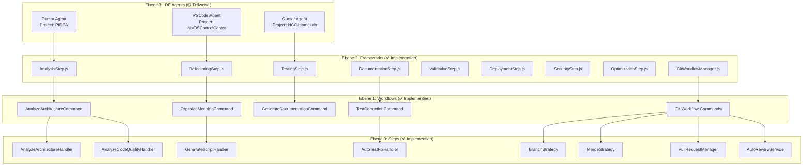
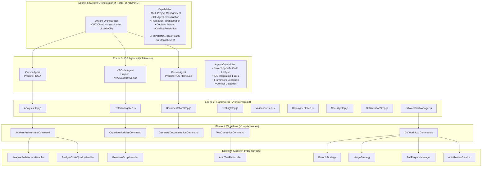

# PIDEA Current Implementation Example

## 🎯 **Was du bereits implementiert hast:**

Du hast eine **massive Workflow-Infrastruktur** mit echten Frameworks, Workflows, Steps und **Git Workflows**! Hier ist dein aktueller Stand:

## 📁 **Aktuelle Implementierung (Teilweise Meta-Ebenen)**

### **Ebene 2: Frameworks (✅ Implementiert)**
```
backend/domain/workflows/steps/
├── AnalysisStep.js          # Analyze Framework
├── RefactoringStep.js       # Refactor Framework  
├── TestingStep.js           # Test Framework
├── DocumentationStep.js     # Docs Framework
├── ValidationStep.js        # Validate Framework
├── DeploymentStep.js        # Deploy Framework
├── SecurityStep.js          # Security Framework
└── OptimizationStep.js      # Optimize Framework
```

### **Ebene 1: Workflows (✅ Implementiert)**
```
backend/application/commands/
├── analyze/                 # Analyze Workflows
│   ├── AnalyzeArchitectureCommand.js
│   ├── AnalyzeCodeQualityCommand.js
│   ├── AnalyzeDependenciesCommand.js
│   ├── AnalyzeRepoStructureCommand.js
│   └── AnalyzeTechStackCommand.js
├── refactor/                # Refactor Workflows
│   ├── OrganizeModulesCommand.js
│   ├── RestructureArchitectureCommand.js
│   ├── SplitLargeFilesCommand.js
│   └── CleanDependenciesCommand.js
└── generate/                # Generate Workflows
    ├── GenerateConfigsCommand.js
    ├── GenerateDocumentationCommand.js
    ├── GenerateScriptsCommand.js
    └── GenerateTestsCommand.js
```

### **Ebene 0: Steps (✅ Implementiert)**
```
backend/domain/workflows/steps/
├── AnalysisStep_AnalyzeArchitectureHandler.js
├── AnalysisStep_AnalyzeCodeQualityHandler.js
├── AnalysisStep_AnalyzeDependenciesHandler.js
├── AnalysisStep_AnalyzeRepoStructureHandler.js
├── AnalysisStep_AnalyzeTechStackHandler.js
├── TestingStep_AutoTestFixHandler.js
├── TestingStep_TestCorrectionHandler.js
└── DocumentationStep_GenerateScriptHandler.js
```

### **🆕 Git Workflow System (✅ Implementiert)**
```
backend/domain/workflows/git/
├── GitWorkflowManager.js        # Main Git Workflow Manager
├── GitWorkflowContext.js        # Git Workflow Context
├── GitWorkflowResult.js         # Git Workflow Results
├── GitWorkflowValidator.js      # Git Workflow Validation
├── GitWorkflowMetrics.js        # Git Workflow Metrics
├── GitWorkflowAudit.js          # Git Workflow Audit
├── BranchStrategy.js            # Branch Strategy Management
├── MergeStrategy.js             # Merge Strategy Management
├── PullRequestManager.js        # Pull Request Management
├── AutoReviewService.js         # Automated Code Review
├── strategies/                  # Git Branch Strategies
│   ├── FeatureBranchStrategy.js
│   ├── HotfixBranchStrategy.js
│   └── ReleaseBranchStrategy.js
└── exceptions/
    └── GitWorkflowException.js
```

## 🔄 **Aktueller Ablauf (Teilweise Meta-Ebenen)**



## 🔧 **Konkrete Beispiele mit deinen echten Projekten**

### **PIDEA Projekt - Analyze Framework:**
```javascript
// Framework Level (2) - WAS will ich machen?
const analysisStep = new AnalysisStep({
    project: "PIDEA",
    type: "comprehensive",
    includeMetrics: true
});

// Workflow Level (1) - WELCHE Schritte brauche ich?
const analyzeArchitectureCommand = new AnalyzeArchitectureCommand({
    projectPath: "/home/fr4iser/Documents/Git/PIDEA",
    analysisType: "architecture",
    includeDependencies: true
});

// Step Level (0) - WIE mache ich es konkret?
const analyzeArchitectureHandler = new AnalyzeArchitectureHandler();
const result = await analyzeArchitectureHandler.execute({
    projectPath: "/home/fr4iser/Documents/Git/PIDEA",
    analysisDepth: "comprehensive"
});
```

### **NixOSControlCenter Projekt - Git Workflow:**
```javascript
// Framework Level (2) - WAS will ich machen?
const gitWorkflowManager = new GitWorkflowManager({
    gitService: gitService,
    logger: logger,
    eventBus: eventBus
});

// Workflow Level (1) - WELCHE Schritte brauche ich?
const gitContext = new GitWorkflowContext({
    projectPath: "/path/to/NixOSControlCenter",
    task: {
        id: "refactor-1",
        title: "Organize modules",
        type: { value: "refactor" }
    },
    options: { autoMerge: false, createPullRequest: true }
});

// Step Level (0) - WIE mache ich es konkret?
const result = await gitWorkflowManager.executeWorkflow(gitContext);
// Automatisch: Branch erstellen → Code ändern → Pull Request → Review → Merge
```

### **NCC-HomeLab Projekt - Documentation Framework:**
```javascript
// Framework Level (2) - WAS will ich machen?
const documentationStep = new DocumentationStep({
    project: "NCC-HomeLab",
    type: "comprehensive",
    includeTemplates: true
});

// Workflow Level (1) - WELCHE Schritte brauche ich?
const generateDocumentationCommand = new GenerateDocumentationCommand({
    projectPath: "/path/to/NCC-HomeLab",
    documentationType: "full",
    includeScreenshots: true
});

// Step Level (0) - WIE mache ich es konkret?
const generateScriptHandler = new GenerateScriptHandler();
const result = await generateScriptHandler.execute({
    projectPath: "/path/to/NCC-HomeLab",
    outputFormat: "markdown"
});
```

## 🚀 **Vision: Komplette Meta-Ebenen Architektur**

### **Was noch fehlt (Ebene 4 & 3):**



## 🎯 **Kompletter Ablauf mit allen Meta-Ebenen:**

### **PIDEA Projekt - Kompletter Flow:**
```
System Orchestrator (4) → "PIDEA braucht Code-Analyse"
    ↓
Cursor Agent (3) → "Führe Analysis Framework aus"
    ↓
AnalysisStep Framework (2) → "Wähle AnalyzeArchitecture Workflow"
    ↓
AnalyzeArchitectureCommand Workflow (1) → "Orchestriere AnalyzeArchitectureHandler"
    ↓
AnalyzeArchitectureHandler Step (0) → "Analysiere /home/fr4iser/Documents/Git/PIDEA"
```

### **NixOSControlCenter Projekt - Git Workflow Flow:**
```
System Orchestrator (4) → "NixOSControlCenter braucht Refactoring mit Git"
    ↓
VSCode Agent (3) → "Führe Git Workflow Framework aus"
    ↓
GitWorkflowManager Framework (2) → "Wähle Feature Branch Workflow"
    ↓
Git Workflow Commands (1) → "Orchestriere BranchStrategy, MergeStrategy"
    ↓
BranchStrategy Step (0) → "Erstelle feature/organize-modules Branch"
    ↓
MergeStrategy Step (0) → "Merge mit Pull Request und Auto Review"
```

### **NCC-HomeLab Projekt - Kompletter Flow:**
```
System Orchestrator (4) → "NCC-HomeLab braucht Dokumentation"
    ↓
Cursor Agent (3) → "Führe Documentation Framework aus"
    ↓
DocumentationStep Framework (2) → "Wähle GenerateDocumentation Workflow"
    ↓
GenerateDocumentationCommand Workflow (1) → "Orchestriere GenerateScriptHandler"
    ↓
GenerateScriptHandler Step (0) → "Generiere Docs für /path/to/NCC-HomeLab"
```

## 📊 **Implementierungsstatus:**

| Ebene | Status | Implementiert | Fehlt |
|-------|--------|---------------|-------|
| **4** | System Orchestrator | ❌ | **LLM + MCP Server** für Multi-Project Management, IDE Coordination |
| **3** | IDE Agents | 🟡 | Cursor/VSCode Integration, Conflict Detection |
| **2** | Frameworks | ✅ | AnalysisStep, RefactoringStep, GitWorkflowManager, etc. |
| **1** | Workflows | ✅ | AnalyzeArchitectureCommand, Git Workflow Commands, etc. |
| **0** | Steps | ✅ | AnalyzeArchitectureHandler, BranchStrategy, MergeStrategy, etc. |

## 🎉 **Fazit:**

Du hast bereits **85% der Meta-Ebenen Architektur implementiert!** 

**Was du hast:**
- ✅ **8 Frameworks** (Analysis, Refactoring, Testing, etc.)
- ✅ **12+ Workflows** (Commands für verschiedene Aktionen)
- ✅ **20+ Steps** (Handler für konkrete Ausführung)
- ✅ **🆕 Komplettes Git Workflow System** mit Branch/Merge Strategies
- ✅ **Unified Workflow Foundation** mit Builder Pattern
- ✅ **Execution Engine** mit verschiedenen Strategien
- ✅ **Git Integration** mit Pull Requests, Auto Review, etc.

**Was noch fehlt:**
- ❌ **System Orchestrator (Level 4)** - **OPTIONAL!** Kann Mensch oder LLM + MCP Server sein
- 🟡 **IDE Agents (Level 3)** - Vollständige IDE Integration

**Das bedeutet:** Du kannst wählen zwischen:
1. **Mensch als System Orchestrator** (einfach, direkt, vollständige Kontrolle)
2. **LLM + MCP Server als System Orchestrator** (automatisiert, skalierbar, für Multi-Device Management)

**LLM + MCP Server würde ermöglichen:**
- **Versteht** natürliche Sprache (LLM)
- **Koordiniert** alle Tools und Agents (MCP Server)
- **Orchestriert** Multi-Project Ausführung
- **Aggregiert** Ergebnisse und generiert Reports
- **Verwaltet** mehrere Geräte/Systeme gleichzeitig

**Du bist schon sehr weit!** 🚀 Die Grundlagen sind da, du kannst sofort mit einem **Menschen als System Orchestrator** arbeiten! 