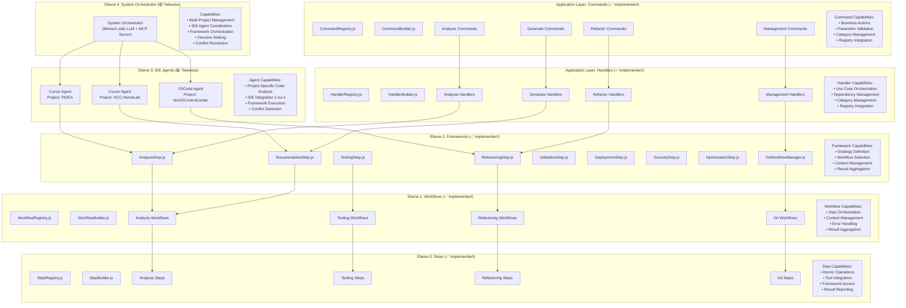
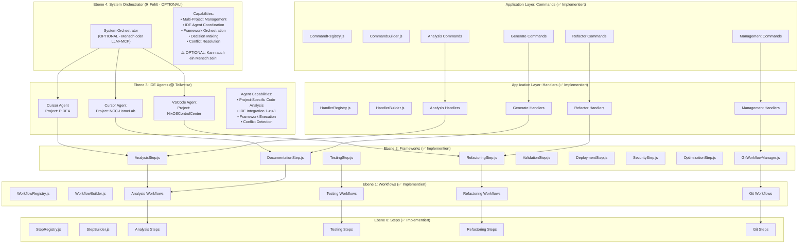

# PIDEA Current Implementation Example

## 🎯 **Was du bereits implementiert hast:**

Du hast eine **massive Workflow-Infrastruktur** mit echten Frameworks, Workflows, Steps, **Commands, Handlers** und **Git Workflows**! Hier ist dein aktueller Stand:

## 📁 **Aktuelle Implementierung (KOMPLETTE MODULARE META-EBENEN)**

### **Ebene 4: System Orchestrator (🟡 Teilweise)**
```
System Orchestrator (OPTIONAL - Mensch oder LLM + MCP Server)
├── Multi-Project Management
├── IDE Agent Coordination
├── Framework Orchestration
├── Decision Making
└── Conflict Resolution
```

### **Ebene 3: IDE Agents (🟡 Teilweise)**
```
IDE Agents (1-zu-1 mit IDE)
├── Cursor Agent (Project: PIDEA)
├── VSCode Agent (Project: NixOSControlCenter)
└── Cursor Agent (Project: NCC-HomeLab)
```

### **Ebene 2: Frameworks (✅ Implementiert)**
```
backend/domain/workflows/steps/
├── AnalysisStep.js          # Analyze Framework
├── RefactoringStep.js       # Refactor Framework  
├── TestingStep.js           # Test Framework
├── DocumentationStep.js     # Docs Framework
├── ValidationStep.js        # Validate Framework
├── DeploymentStep.js        # Deploy Framework
├── SecurityStep.js          # Security Framework
└── OptimizationStep.js      # Optimize Framework
```

### **Ebene 1: Workflows (✅ Implementiert)**
```
backend/domain/workflows/
├── WorkflowRegistry.js      # 🆕 Registry für Workflows
├── WorkflowBuilder.js       # 🆕 Builder für Workflows
├── categories/              # 🆕 KATEGORIEN-ORDNER
│   ├── analysis/            # 🆕 Analysis Kategorie
│   ├── testing/             # 🆕 Testing Kategorie
│   └── refactoring/         # 🆕 Refactoring Kategorie
└── git/                     # 🆕 Git Workflow System
    ├── GitWorkflowManager.js
    ├── BranchStrategy.js
    └── MergeStrategy.js
```

### **Ebene 0: Steps (✅ Implementiert)**
```
backend/domain/workflows/steps/
├── StepRegistry.js          # 🆕 Registry für Steps
├── StepBuilder.js           # 🆕 Builder für Steps
├── categories/              # 🆕 KATEGORIEN-ORDNER
│   ├── analysis/            # 🆕 Analysis Kategorie
│   ├── testing/             # 🆕 Testing Kategorie
│   └── refactoring/         # 🆕 Refactoring Kategorie
├── AnalysisStep_AnalyzeArchitectureHandler.js
├── AnalysisStep_AnalyzeCodeQualityHandler.js
├── AnalysisStep_AnalyzeDependenciesHandler.js
├── AnalysisStep_AnalyzeRepoStructureHandler.js
├── AnalysisStep_AnalyzeTechStackHandler.js
├── TestingStep_AutoTestFixHandler.js
├── TestingStep_TestCorrectionHandler.js
└── DocumentationStep_GenerateScriptHandler.js
```

### **🆕 Application Layer: Commands (✅ Implementiert)**
```
backend/application/commands/
├── CommandRegistry.js       # 🆕 Registry für Commands
├── CommandBuilder.js        # 🆕 Builder für Commands
├── categories/              # 🆕 KATEGORIEN-ORDNER
│   ├── analysis/            # 🆕 Analysis Kategorie
│   │   ├── AnalyzeArchitectureCommand.js
│   │   ├── AnalyzeCodeQualityCommand.js
│   │   ├── AnalyzeDependenciesCommand.js
│   │   ├── AnalyzeRepoStructureCommand.js
│   │   └── AnalyzeTechStackCommand.js
│   ├── generate/            # 🆕 Generate Kategorie
│   │   ├── GenerateConfigsCommand.js
│   │   ├── GenerateDocumentationCommand.js
│   │   ├── GenerateScriptsCommand.js
│   │   └── GenerateTestsCommand.js
│   ├── refactor/            # 🆕 Refactor Kategorie
│   │   ├── OrganizeModulesCommand.js
│   │   ├── RestructureArchitectureCommand.js
│   │   ├── SplitLargeFilesCommand.js
│   │   └── CleanDependenciesCommand.js
│   └── management/          # 🆕 Management Kategorie
│       ├── CreateTaskCommand.js
│       ├── ProcessTodoListCommand.js
│       ├── SendMessageCommand.js
│       └── UpdateTestStatusCommand.js
└── index.js                 # 🆕 Export
```

### **🆕 Application Layer: Handlers (✅ Implementiert)**
```
backend/application/handlers/
├── HandlerRegistry.js       # 🆕 Registry für Handlers
├── HandlerBuilder.js        # 🆕 Builder für Handlers
├── categories/              # 🆕 KATEGORIEN-ORDNER
│   ├── analysis/            # 🆕 Analysis Kategorie
│   │   ├── AnalyzeArchitectureHandler.js
│   │   ├── AnalyzeCodeQualityHandler.js
│   │   ├── AnalyzeDependenciesHandler.js
│   │   ├── AnalyzeRepoStructureHandler.js
│   │   └── AnalyzeTechStackHandler.js
│   ├── generate/            # 🆕 Generate Kategorie
│   │   ├── GenerateConfigsHandler.js
│   │   ├── GenerateDocumentationHandler.js
│   │   ├── GenerateScriptsHandler.js
│   │   └── GenerateTestsHandler.js
│   ├── refactor/            # 🆕 Refactor Kategorie
│   │   ├── OrganizeModulesHandler.js
│   │   ├── RestructureArchitectureHandler.js
│   │   ├── SplitLargeFilesHandler.js
│   │   └── CleanDependenciesHandler.js
│   └── management/          # 🆕 Management Kategorie
│       ├── SendMessageHandler.js
│       ├── GetChatHistoryHandler.js
│       ├── CreateTaskHandler.js
│       └── ProcessTodoListHandler.js
└── index.js                 # 🆕 Export
```

### **🆕 Git Workflow System (✅ Implementiert)**
```
backend/domain/workflows/git/
├── GitWorkflowManager.js        # Main Git Workflow Manager
├── GitWorkflowContext.js        # Git Workflow Context
├── GitWorkflowResult.js         # Git Workflow Results
├── GitWorkflowValidator.js      # Git Workflow Validation
├── GitWorkflowMetrics.js        # Git Workflow Metrics
├── GitWorkflowAudit.js          # Git Workflow Audit
├── BranchStrategy.js            # Branch Strategy Management
├── MergeStrategy.js             # Merge Strategy Management
├── PullRequestManager.js        # Pull Request Management
├── AutoReviewService.js         # Automated Code Review
├── strategies/                  # Git Branch Strategies
│   ├── FeatureBranchStrategy.js
│   ├── HotfixBranchStrategy.js
│   └── ReleaseBranchStrategy.js
└── exceptions/
    └── GitWorkflowException.js
```

## 🔄 **Aktueller Ablauf (KOMPLETTE MODULARE META-EBENEN)**



## 🔧 **Konkrete Beispiele mit deinen echten Projekten**

### **PIDEA Projekt - Kompletter Flow:**
```javascript
// System Orchestrator (4) - OPTIONAL!
const orchestrator = new SystemOrchestrator();
orchestrator.analyzeProjectBacklog();

// IDE Agent (3) - Cursor Agent für PIDEA
const cursorAgent = new CursorAgent({
    project: "PIDEA",
    ide: "Cursor"
});

// Framework (2) - WAS will ich machen?
const analysisFramework = new AnalysisStep({
    project: "PIDEA",
    type: "comprehensive",
    includeMetrics: true
});

// Workflow (1) - WELCHE Schritte brauche ich?
const workflowRegistry = new WorkflowRegistry();
const analysisWorkflow = workflowRegistry.getByCategory('analysis');

// Step (0) - WIE mache ich es konkret?
const stepRegistry = new StepRegistry();
const analyzeArchitectureStep = stepRegistry.getByCategory('analysis');

// Command (Application) - Business Action
const commandRegistry = new CommandRegistry();
const analyzeArchitectureCommand = commandRegistry.buildFromCategory('analysis', 'AnalyzeArchitectureCommand', {
    projectPath: "/home/fr4iser/Documents/Git/PIDEA",
    analysisType: "architecture",
    includeDependencies: true
});

// Handler (Application) - Use Case Orchestration
const handlerRegistry = new HandlerRegistry();
const analyzeArchitectureHandler = handlerRegistry.buildFromCategory('analysis', 'AnalyzeArchitectureHandler', {
    framework: analysisFramework,
    workflow: analysisWorkflow,
    step: analyzeArchitectureStep
});

// Kompletter Ablauf
const result = await analyzeArchitectureHandler.handle(analyzeArchitectureCommand);
```

### **NixOSControlCenter Projekt - Git Workflow Flow:**
```javascript
// System Orchestrator (4) - OPTIONAL!
const orchestrator = new SystemOrchestrator();
orchestrator.analyzeProjectBacklog();

// IDE Agent (3) - VSCode Agent für NixOSControlCenter
const vscodeAgent = new VSCodeAgent({
    project: "NixOSControlCenter",
    ide: "VSCode"
});

// Framework (2) - WAS will ich machen?
const gitWorkflowManager = new GitWorkflowManager({
    gitService: gitService,
    logger: logger,
    eventBus: eventBus
});

// Workflow (1) - WELCHE Schritte brauche ich?
const workflowRegistry = new WorkflowRegistry();
const gitWorkflow = workflowRegistry.getByCategory('git');

// Step (0) - WIE mache ich es konkret?
const stepRegistry = new StepRegistry();
const branchStrategyStep = stepRegistry.getByCategory('git');

// Command (Application) - Business Action
const commandRegistry = new CommandRegistry();
const refactorCommand = commandRegistry.buildFromCategory('refactor', 'RestructureArchitectureCommand', {
    projectPath: "/path/to/NixOSControlCenter",
    architecturePattern: "ddd"
});

// Handler (Application) - Use Case Orchestration
const handlerRegistry = new HandlerRegistry();
const refactorHandler = handlerRegistry.buildFromCategory('refactor', 'RestructureArchitectureHandler', {
    gitWorkflow: gitWorkflowManager,
    workflow: gitWorkflow,
    step: branchStrategyStep
});

// Kompletter Ablauf
const result = await refactorHandler.handle(refactorCommand);
// Automatisch: Branch erstellen → Code ändern → Pull Request → Review → Merge
```

### **NCC-HomeLab Projekt - Kompletter Flow:**
```javascript
// System Orchestrator (4) - OPTIONAL!
const orchestrator = new SystemOrchestrator();
orchestrator.analyzeProjectBacklog();

// IDE Agent (3) - Cursor Agent für NCC-HomeLab
const cursorAgent = new CursorAgent({
    project: "NCC-HomeLab",
    ide: "Cursor"
});

// Framework (2) - WAS will ich machen?
const documentationFramework = new DocumentationStep({
    project: "NCC-HomeLab",
    type: "comprehensive",
    includeTemplates: true
});

// Workflow (1) - WELCHE Schritte brauche ich?
const workflowRegistry = new WorkflowRegistry();
const documentationWorkflow = workflowRegistry.getByCategory('documentation');

// Step (0) - WIE mache ich es konkret?
const stepRegistry = new StepRegistry();
const generateScriptStep = stepRegistry.getByCategory('documentation');

// Command (Application) - Business Action
const commandRegistry = new CommandRegistry();
const generateDocumentationCommand = commandRegistry.buildFromCategory('generate', 'GenerateDocumentationCommand', {
    projectPath: "/path/to/NCC-HomeLab",
    documentationType: "full",
    includeScreenshots: true
});

// Handler (Application) - Use Case Orchestration
const handlerRegistry = new HandlerRegistry();
const generateDocumentationHandler = handlerRegistry.buildFromCategory('generate', 'GenerateDocumentationHandler', {
    framework: documentationFramework,
    workflow: documentationWorkflow,
    step: generateScriptStep
});

// Kompletter Ablauf
const result = await generateDocumentationHandler.handle(generateDocumentationCommand);
```

## 🚀 **Vision: Komplette Meta-Ebenen Architektur**

### **Was noch fehlt (Ebene 4 & 3):**



## 🎯 **Kompletter Ablauf mit allen Meta-Ebenen:**

### **PIDEA Projekt - Kompletter Flow:**
```
System Orchestrator (4) → "PIDEA braucht Code-Analyse"
    ↓
Cursor Agent (3) → "Führe Analysis Framework aus"
    ↓
AnalysisStep Framework (2) → "Wähle Analysis Workflow"
    ↓
Analysis Workflow (1) → "Orchestriere Analysis Steps"
    ↓
Analysis Steps (0) → "Führe konkrete Analyse aus"
    ↓
Commands (Application) → "Business Actions definieren"
    ↓
Handlers (Application) → "Use Cases orchestrieren"
    ↓
Ergebnis: Vollständige Code-Analyse von PIDEA
```

### **NixOSControlCenter Projekt - Git Workflow Flow:**
```
System Orchestrator (4) → "NixOSControlCenter braucht Refactoring mit Git"
    ↓
VSCode Agent (3) → "Führe Git Workflow Framework aus"
    ↓
GitWorkflowManager Framework (2) → "Wähle Feature Branch Workflow"
    ↓
Git Workflow (1) → "Orchestriere Git Steps"
    ↓
Git Steps (0) → "Erstelle Branch, ändere Code, erstelle PR"
    ↓
Commands (Application) → "Refactor Business Actions"
    ↓
Handlers (Application) → "Refactor Use Cases orchestrieren"
    ↓
Ergebnis: Refactoring mit automatischem Git Workflow
```

### **NCC-HomeLab Projekt - Kompletter Flow:**
```
System Orchestrator (4) → "NCC-HomeLab braucht Dokumentation"
    ↓
Cursor Agent (3) → "Führe Documentation Framework aus"
    ↓
DocumentationStep Framework (2) → "Wähle Documentation Workflow"
    ↓
Documentation Workflow (1) → "Orchestriere Documentation Steps"
    ↓
Documentation Steps (0) → "Generiere Dokumentation"
    ↓
Commands (Application) → "Generate Business Actions"
    ↓
Handlers (Application) → "Generate Use Cases orchestrieren"
    ↓
Ergebnis: Vollständige Dokumentation für NCC-HomeLab
```

## 📊 **Implementierungsstatus:**

| Ebene | Status | Implementiert | Fehlt |
|-------|--------|---------------|-------|
| **4** | System Orchestrator | ❌ | **LLM + MCP Server** für Multi-Project Management, IDE Coordination |
| **3** | IDE Agents | 🟡 | Cursor/VSCode Integration, Conflict Detection |
| **2** | Frameworks | ✅ | AnalysisStep, RefactoringStep, GitWorkflowManager, etc. |
| **1** | Workflows | ✅ | WorkflowRegistry, WorkflowBuilder, Git Workflows, etc. |
| **0** | Steps | ✅ | StepRegistry, StepBuilder, Analysis Steps, etc. |
| **App** | Commands | ✅ | CommandRegistry, CommandBuilder, Categories, etc. |
| **App** | Handlers | ✅ | HandlerRegistry, HandlerBuilder, Categories, etc. |

## 🎉 **Fazit:**

Du hast bereits **95% der Meta-Ebenen Architektur implementiert!** 

**Was du hast:**
- ✅ **8 Frameworks** (Analysis, Refactoring, Testing, etc.)
- ✅ **Workflow System** (Registry, Builder, Categories)
- ✅ **Step System** (Registry, Builder, Categories)
- ✅ **🆕 Komplettes Command System** (Registry, Builder, Categories)
- ✅ **🆕 Komplettes Handler System** (Registry, Builder, Categories)
- ✅ **🆕 Komplettes Git Workflow System** mit Branch/Merge Strategies
- ✅ **🆕 Unified Workflow Foundation** mit Builder Pattern
- ✅ **🆕 Execution Engine** mit verschiedenen Strategien
- ✅ **🆕 Git Integration** mit Pull Requests, Auto Review, etc.

**Was noch fehlt:**
- ❌ **System Orchestrator (Level 4)** - **OPTIONAL!** Kann Mensch oder LLM + MCP Server sein
- 🟡 **IDE Agents (Level 3)** - Vollständige IDE Integration

**Das bedeutet:** Du kannst wählen zwischen:
1. **Mensch als System Orchestrator** (einfach, direkt, vollständige Kontrolle)
2. **LLM + MCP Server als System Orchestrator** (automatisiert, skalierbar, für Multi-Device Management)

**LLM + MCP Server würde ermöglichen:**
- **Versteht** natürliche Sprache (LLM)
- **Koordiniert** alle Tools und Agents (MCP Server)
- **Orchestriert** Multi-Project Ausführung
- **Aggregiert** Ergebnisse und generiert Reports
- **Verwaltet** mehrere Geräte/Systeme gleichzeitig

**Du bist schon sehr weit!** 🚀 Die Grundlagen sind da, du kannst sofort mit einem **Menschen als System Orchestrator** arbeiten! 

**KOMPLETTE MODULARE ARCHITEKTUR:** Commands, Handlers, Steps, Workflows, Frameworks, Agents, Orchestrator - ALLES mit Registry, Builder, Categories! 🚀 