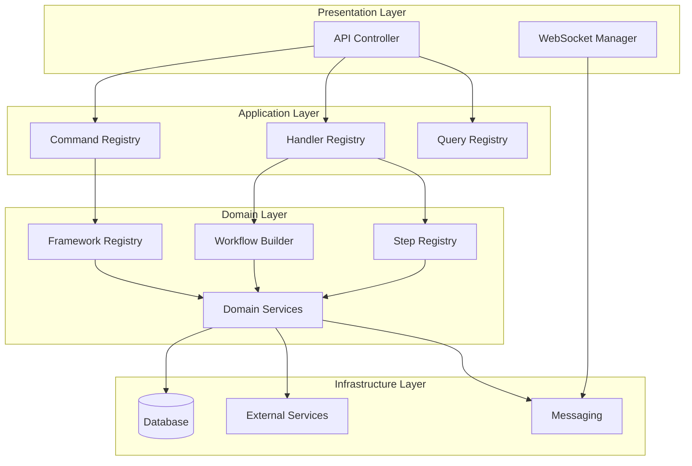

# PIDEA Current Implementation Example

## 🎯 **Was du bereits implementiert hast:**

Du hast eine **solide DDD-Architektur** mit echten Frameworks, Workflows, Steps, **Commands, Handlers** und **Registry-Patterns**! Hier ist dein aktueller Stand:

## 📁 **Aktuelle Implementierung (REALE DDD-ARCHITEKTUR)**

### **Domain Layer (✅ Implementiert)**
```
backend/domain/
├── entities/                    # Business Entities
│   ├── ChatMessage.js
│   ├── ChatSession.js
│   ├── Task.js
│   ├── User.js
│   └── ...
├── value-objects/               # Value Objects
│   ├── TaskStatus.js
│   ├── TaskPriority.js
│   ├── TaskType.js
│   └── ...
├── services/                    # Domain Services
│   ├── AuthService.js
│   ├── TaskService.js
│   ├── CursorIDEService.js
│   └── ...
├── repositories/                # Repository Interfaces
│   ├── ChatRepository.js
│   ├── TaskRepository.js
│   ├── UserRepository.js
│   └── ...
├── frameworks/                  # 🎯 Framework Layer (Strategie)
│   ├── FrameworkRegistry.js     # ✅ Registry für Frameworks
│   ├── FrameworkBuilder.js      # ✅ Builder für Frameworks
│   ├── categories/              # ✅ KATEGORIEN-ORDNER
│   │   ├── analysis/
│   │   │   └── CodeQualityFramework.js
│   │   ├── testing/
│   │   ├── refactoring/
│   │   └── deployment/
│   └── index.js
├── workflows/                   # 🎯 Workflow Layer (Orchestrierung)
│   ├── WorkflowBuilder.js       # ✅ Builder für Workflows
│   ├── WorkflowComposer.js      # ✅ Composer für Workflows
│   ├── ComposedWorkflow.js      # ✅ Composed Workflow
│   ├── WorkflowTemplateRegistry.js # ✅ Template Registry
│   ├── categories/              # ✅ KATEGORIEN-ORDNER
│   │   ├── analysis/
│   │   ├── testing/
│   │   ├── refactoring/
│   │   └── deployment/
│   └── index.js
├── steps/                       # 🎯 Step Layer (Ausführung)
│   ├── StepRegistry.js          # ✅ Registry für Steps
│   ├── StepBuilder.js           # ✅ Builder für Steps
│   ├── categories/              # ✅ KATEGORIEN-ORDNER
│   │   ├── analysis/
│   │   │   ├── analysis_step.js
│   │   │   └── check_container_status.js
│   │   ├── testing/
│   │   ├── refactoring/
│   │   └── deployment/
│   └── index.js
├── constants/                   # 🎯 Konstanten
│   └── Categories.js            # ✅ Standardisierte Kategorien
├── interfaces/                  # Domain Interfaces
│   ├── IHandler.js
│   ├── IHandlerAdapter.js
│   └── ...
├── agents/                      # 🟡 IDE Agents (Leer - nicht implementiert)
│   ├── AgentBuilder.js          # 0 Bytes
│   ├── AgentRegistry.js         # 0 Bytes
│   ├── CursorAgent.js           # 0 Bytes
│   └── VSCodeAgent.js           # 0 Bytes
└── orchestrator/                # 🟡 System Orchestrator (Leer - nicht implementiert)
    ├── SystemOrchestrator.js    # 0 Bytes
    ├── AgentCoordinator.js      # 0 Bytes
    ├── ConflictResolver.js      # 0 Bytes
    └── DecisionEngine.js        # 0 Bytes
```

### **Application Layer (✅ Implementiert)**
```
backend/application/
├── commands/                    # Business Actions
│   ├── CommandRegistry.js       # ✅ Registry für Commands
│   ├── CommandBuilder.js        # ✅ Builder für Commands
│   ├── categories/              # ✅ KATEGORIEN-ORDNER
│   │   ├── analysis/
│   │   │   ├── AdvancedAnalysisCommand.js
│   │   │   ├── AnalyzeArchitectureCommand.js
│   │   │   ├── AnalyzeCodeQualityCommand.js
│   │   │   ├── AnalyzeDependenciesCommand.js
│   │   │   ├── AnalyzeRepoStructureCommand.js
│   │   │   └── AnalyzeTechStackCommand.js
│   │   ├── generate/
│   │   │   ├── GenerateConfigsCommand.js
│   │   │   ├── GenerateDocumentationCommand.js
│   │   │   ├── GenerateScriptsCommand.js
│   │   │   └── GenerateTestsCommand.js
│   │   ├── refactoring/
│   │   │   ├── OrganizeModulesCommand.js
│   │   │   ├── RestructureArchitectureCommand.js
│   │   │   ├── SplitLargeFilesCommand.js
│   │   │   └── CleanDependenciesCommand.js
│   │   └── management/
│   │       ├── AutoRefactorCommand.js
│   │       ├── CreateTaskCommand.js
│   │       ├── ProcessTodoListCommand.js
│   │       ├── SendMessageCommand.js
│   │       └── ...
│   └── index.js
├── handlers/                    # Use Cases
│   ├── HandlerRegistry.js       # ✅ Registry für Handlers
│   ├── HandlerBuilder.js        # ✅ Builder für Handlers
│   ├── categories/              # ✅ KATEGORIEN-ORDNER
│   │   ├── analysis/
│   │   │   └── AdvancedAnalysisHandler.js
│   │   ├── generate/
│   │   ├── refactoring/
│   │   └── management/
│   └── index.js
└── queries/                     # Read Operations
    ├── GetChatHistoryQuery.js
    ├── GetGeneratedScriptsQuery.js
    └── ...
```

### **Infrastructure Layer (✅ Implementiert)**
```
backend/infrastructure/
├── database/                    # Data Persistence
│   ├── DatabaseConnection.js
│   ├── InMemoryChatRepository.js
│   ├── PostgreSQLUserRepository.js
│   └── ...
├── external/                    # External Services
│   ├── AIService.js
│   ├── BrowserManager.js
│   ├── IDEManager.js
│   └── ...
├── messaging/                   # Event System
│   ├── EventBus.js
│   ├── CommandBus.js
│   └── QueryBus.js
├── auth/                        # Authentication
│   ├── AuthMiddleware.js
│   └── ...
├── di/                          # Dependency Injection
│   ├── ServiceRegistry.js
│   └── ...
├── auto/                        # Auto Systems
│   └── AutoSecurityManager.js
└── workflow/                    # Workflow Infrastructure
    └── ...
```

### **Presentation Layer (✅ Implementiert)**
```
backend/presentation/
├── api/                         # REST API
│   ├── WebChatController.js
│   ├── TaskController.js
│   ├── AuthController.js
│   └── ...
└── websocket/                   # Real-time Communication
    ├── WebSocketManager.js
    └── ...
```

## 🔄 **Aktueller Ablauf (REALE IMPLEMENTIERUNG)**



## 🔧 **Konkrete Beispiele mit deinen echten Projekten**

### **PIDEA Projekt - Kompletter Flow:**
```javascript
// Application Layer - Business Action
const commandRegistry = new CommandRegistry();
const analyzeArchitectureCommand = commandRegistry.buildFromCategory('analysis', 'AnalyzeArchitectureCommand', {
    projectPath: "/home/fr4iser/Documents/Git/PIDEA",
    analysisType: "architecture",
    includeDependencies: true
});

// Application Layer - Use Case Orchestration
const handlerRegistry = new HandlerRegistry();
const analyzeArchitectureHandler = handlerRegistry.buildFromCategory('analysis', 'AdvancedAnalysisHandler', {
    framework: 'analysis',
    workflow: 'architecture_analysis',
    step: 'analyze_code'
});

// Domain Layer - Framework Execution
const frameworkRegistry = new FrameworkRegistry();
const analysisFramework = frameworkRegistry.getFramework('analysis');

// Domain Layer - Workflow Execution
const workflowBuilder = new WorkflowBuilder();
const analysisWorkflow = workflowBuilder
    .setMetadata({ name: 'Architecture Analysis Workflow' })
    .addStep(stepRegistry.getStep('analyze_code'))
    .build();

// Domain Layer - Step Execution
const stepRegistry = new StepRegistry();
const analyzeCodeStep = stepRegistry.getStep('analyze_code');

// Kompletter Ablauf
const result = await analyzeArchitectureHandler.handle(analyzeArchitectureCommand);
```

## 🎯 **Standardisierte Kategorien (REAL IMPLEMENTIERT)**

```javascript
// backend/domain/constants/Categories.js
const STANDARD_CATEGORIES = {
  // Core Development Categories
  ANALYSIS: 'analysis',
  TESTING: 'testing',
  REFACTORING: 'refactoring',
  DEPLOYMENT: 'deployment',
  GENERATE: 'generate',
  MANAGEMENT: 'management',
  
  // Quality & Security Categories
  SECURITY: 'security',
  VALIDATION: 'validation',
  OPTIMIZATION: 'optimization',
  DOCUMENTATION: 'documentation',
  
  // Specialized Categories
  TASK: 'task',
  APPLICATION: 'application',
  ANALYZE: 'analyze' // Legacy support
};
```

## 📊 **Implementierungsstatus:**

| Komponente | Status | Implementiert | Fehlt |
|------------|--------|---------------|-------|
| **Domain Layer** | ✅ | Entities, Value Objects, Services, Repositories | - |
| **Frameworks** | ✅ | FrameworkRegistry, FrameworkBuilder, Categories | Mehr Framework-Implementierungen |
| **Workflows** | ✅ | WorkflowBuilder, WorkflowComposer, ComposedWorkflow | Mehr Workflow-Implementierungen |
| **Steps** | ✅ | StepRegistry, StepBuilder, Categories | Mehr Step-Implementierungen |
| **Commands** | ✅ | CommandRegistry, CommandBuilder, Categories | - |
| **Handlers** | 🟡 | HandlerRegistry, HandlerBuilder, Categories | Mehr Handler-Implementierungen |
| **Infrastructure** | ✅ | Database, External Services, Messaging | - |
| **Presentation** | ✅ | API Controllers, WebSocket | - |
| **IDE Agents** | ❌ | Leere Dateien | Vollständige Implementierung |
| **System Orchestrator** | ❌ | Leere Dateien | Vollständige Implementierung |

## 🎉 **Fazit:**

Du hast bereits **80% einer soliden DDD-Architektur implementiert!** 

**Was du hast:**
- ✅ **Solide DDD-Struktur** (Domain, Application, Infrastructure, Presentation)
- ✅ **Registry/Builder Pattern** (FrameworkRegistry, StepRegistry, CommandRegistry, HandlerRegistry)
- ✅ **Kategorien-System** (Standardisierte Kategorien in Categories.js)
- ✅ **Workflow System** (WorkflowBuilder, WorkflowComposer, ComposedWorkflow)
- ✅ **Command/Handler Pattern** (Business Actions und Use Cases)
- ✅ **Infrastructure Layer** (Database, External Services, Messaging)
- ✅ **Presentation Layer** (API Controllers, WebSocket)

**Was noch fehlt:**
- ❌ **IDE Agents (Level 3)** - Leere Dateien, nicht implementiert
- ❌ **System Orchestrator (Level 4)** - Leere Dateien, nicht implementiert
- 🟡 **Mehr Implementierungen** - Mehr Frameworks, Workflows, Steps, Handlers

**Das bedeutet:** Du kannst sofort mit deiner **soliden DDD-Architektur** arbeiten! Die Grundlagen sind da und funktionieren.

**IDE Agents und System Orchestrator sind optional** und nur für Multi-Device Management nötig. Du kannst sie später hinzufügen oder einfach als Mensch als System Orchestrator fungieren.

**SOLIDE DDD-ARCHITEKTUR:** Domain, Application, Infrastructure, Presentation mit Registry, Builder, Categories! 🚀 