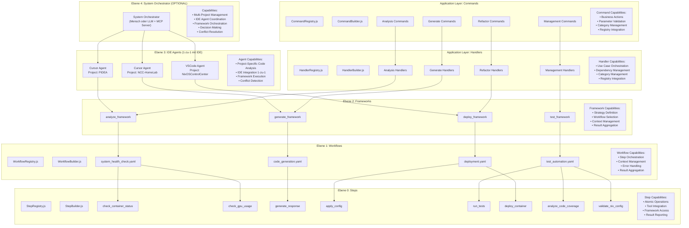

# Framework vs Workflow Relationship

## 🔄 **Detaillierte Beziehung**



## 📁 **Struktur in der Praxis**

```
automation-platform/
├── system-orchestrator/          # Ebene 4: System Orchestrator (OPTIONAL)
│   ├── Multi-Project Management
│   ├── IDE Agent Coordination
│   ├── Framework Orchestration
│   ├── Decision Making
│   └── Conflict Resolution
├── ide-agents/                   # Ebene 3: IDE Agents (1-zu-1 mit IDE)
│   ├── cursor-agent/
│   │   └── CursorAgent.js        # Project: PIDEA
│   ├── vscode-agent/
│   │   └── VSCodeAgent.js        # Project: NixOSControlCenter
│   └── cursor-agent-2/
│       └── CursorAgent.js        # Project: NCC-HomeLab
├── frameworks/                   # Ebene 2: WAS will ich machen?
│   ├── FrameworkRegistry.js      # 🆕 Registry für Frameworks
│   ├── FrameworkBuilder.js       # 🆕 Builder für Frameworks
│   ├── categories/               # 🆕 KATEGORIEN-ORDNER
│   │   ├── analyze_framework/
│   │   │   └── system_analyzer.py
│   │   ├── deploy_framework/
│   │   │   └── deployment_manager.py
│   │   ├── test_framework/
│   │   │   └── test_orchestrator.py
│   │   └── generate_framework/
│   │       └── code_generator.py
│   └── index.js                  # 🆕 Export
├── workflows/                    # Ebene 1: WELCHE Schritte brauche ich?
│   ├── WorkflowRegistry.js       # 🆕 Registry für Workflows
│   ├── WorkflowBuilder.js        # 🆕 Builder für Workflows
│   ├── categories/               # 🆕 KATEGORIEN-ORDNER
│   │   ├── analyze/
│   │   │   └── system_health.yaml   # Workflow-Definition
│   │   ├── deploy/
│   │   │   └── app_stack.yaml       # Workflow-Definition
│   │   ├── test/
│   │   │   └── automation.yaml      # Workflow-Definition
│   │   └── generate/
│   │       └── code_gen.yaml        # Workflow-Definition
│   └── index.js                  # 🆕 Export
├── steps/                        # Ebene 0: WIE mache ich es konkret?
│   ├── StepRegistry.js           # 🆕 Registry für Steps
│   ├── StepBuilder.js            # 🆕 Builder für Steps
│   ├── categories/               # 🆕 KATEGORIEN-ORDNER
│   │   ├── analysis/
│   │   │   ├── check_container_status.py
│   │   │   └── check_gpu_usage.py
│   │   ├── generate/
│   │   │   └── generate_response.py
│   │   ├── deploy/
│   │   │   ├── apply_config.py
│   │   │   └── deploy_container.py
│   │   └── test/
│   │       ├── run_tests.py
│   │       ├── analyze_code_coverage.py
│   │       └── validate_nix_config.py
│   └── index.js                  # 🆕 Export
├── application/                  # Application Layer: Commands & Handlers
│   ├── commands/                 # Business Actions
│   │   ├── CommandRegistry.js    # 🆕 Registry für Commands
│   │   ├── CommandBuilder.js     # 🆕 Builder für Commands
│   │   ├── categories/           # 🆕 KATEGORIEN-ORDNER
│   │   │   ├── analysis/
│   │   │   │   ├── AnalyzeArchitectureCommand.js
│   │   │   │   ├── AnalyzeCodeQualityCommand.js
│   │   │   │   └── AnalyzeDependenciesCommand.js
│   │   │   ├── generate/
│   │   │   │   ├── GenerateConfigsCommand.js
│   │   │   │   ├── GenerateDocumentationCommand.js
│   │   │   │   └── GenerateScriptsCommand.js
│   │   │   ├── refactor/
│   │   │   │   ├── OrganizeModulesCommand.js
│   │   │   │   ├── RestructureArchitectureCommand.js
│   │   │   │   └── SplitLargeFilesCommand.js
│   │   │   └── management/
│   │   │       ├── CreateTaskCommand.js
│   │   │       ├── ProcessTodoListCommand.js
│   │   │       └── SendMessageCommand.js
│   │   └── index.js              # 🆕 Export
│   └── handlers/                 # Use Cases
│       ├── HandlerRegistry.js    # 🆕 Registry für Handlers
│       ├── HandlerBuilder.js     # 🆕 Builder für Handlers
│       ├── categories/           # 🆕 KATEGORIEN-ORDNER
│       │   ├── analysis/
│       │   │   ├── AnalyzeArchitectureHandler.js
│       │   │   ├── AnalyzeCodeQualityHandler.js
│       │   │   └── AnalyzeDependenciesHandler.js
│       │   ├── generate/
│       │   │   ├── GenerateConfigsHandler.js
│       │   │   ├── GenerateDocumentationHandler.js
│       │   │   └── GenerateScriptsHandler.js
│       │   ├── refactor/
│       │   │   ├── OrganizeModulesHandler.js
│       │   │   ├── RestructureArchitectureHandler.js
│       │   │   └── SplitLargeFilesHandler.js
│       │   └── management/
│       │       ├── CreateTaskHandler.js
│       │       ├── ProcessTodoListHandler.js
│       │       └── SendMessageHandler.js
│       └── index.js              # 🆕 Export
```

## 🔧 **Konkrete Beispiele mit echten Projekten**

### 1. Framework Implementation (`analyze_framework.py`)
```python
class AnalyzeFramework:
    def __init__(self):
        self.registry = FrameworkRegistry()
        self.builder = FrameworkBuilder()
    
    def analyze_pidea_system(self):
        # Framework ruft Workflow auf
        workflow_registry = WorkflowRegistry()
        workflow = workflow_registry.getByCategory('analyze')
        return workflow.execute()
    
    def analyze_nixos_control_center(self):
        # Framework ruft Workflow auf
        workflow_registry = WorkflowRegistry()
        workflow = workflow_registry.getByCategory('analyze')
        return workflow.execute()
```

### 2. Workflow Definition (`system_health.yaml`)
```yaml
name: system_health_check
category: analyze
projects:
  - PIDEA
  - NixOSControlCenter
steps:
  - check_container_status
  - check_gpu_usage
  - log_results
```

### 3. Step Implementation (`check_container_status.py`)
```python
class CheckContainerStatusStep:
    def __init__(self):
        self.registry = StepRegistry()
        self.builder = StepBuilder()
    
    def execute(self, context):
        # Step macht konkrete Arbeit für PIDEA
        pidea_status = docker_engine.get_status("pidea-backend")
        nixos_status = docker_engine.get_status("nixos-control-center")
        
        return {
            "PIDEA": pidea_status,
            "NixOSControlCenter": nixos_status,
            "timestamp": datetime.now()
        }
```

### 4. NixOS-spezifischer Step (`validate_nix_config.py`)
```python
class ValidateNixConfigStep:
    def __init__(self):
        self.registry = StepRegistry()
        self.builder = StepBuilder()
    
    def execute(self, context):
        # Step für NixOSControlCenter
        config_path = "/etc/nixos/configuration.nix"
        validation_result = nix_engine.validate_config(config_path)
        
        return {
            "project": "NixOSControlCenter",
            "config_valid": validation_result.is_valid,
            "errors": validation_result.errors
        }
```

### 5. Command Implementation (`AnalyzeArchitectureCommand.js`)
```javascript
class AnalyzeArchitectureCommand {
    constructor(params) {
        this.registry = new CommandRegistry();
        this.builder = new CommandBuilder();
        this.projectPath = params.projectPath;
        this.analysisType = params.analysisType;
        this.includeDependencies = params.includeDependencies;
    }
    
    static fromCategory(category, name, params) {
        return this.registry.buildFromCategory(category, name, params);
    }
}
```

### 6. Handler Implementation (`AnalyzeArchitectureHandler.js`)
```javascript
class AnalyzeArchitectureHandler {
    constructor(dependencies) {
        this.registry = new HandlerRegistry();
        this.builder = new HandlerBuilder();
        this.framework = dependencies.framework;
        this.workflow = dependencies.workflow;
        this.step = dependencies.step;
    }
    
    async handle(command) {
        // Use Case Orchestration
        const framework = this.framework;
        const workflow = this.workflow;
        const step = this.step;
        
        const result = await framework.execute(workflow, step, command);
        return result;
    }
    
    static fromCategory(category, name, dependencies) {
        return this.registry.buildFromCategory(category, name, dependencies);
    }
}
```

## 🎯 **Warum diese Trennung?**

### **System Orchestrator sind "Meta-Manager"**
- Wissen WELCHE Projekte bearbeitet werden sollen
- Koordinieren IDE Agents
- Sind optional (Mensch oder LLM + MCP Server)

### **IDE Agents sind "Projekt-Manager"**
- Wissen WELCHES Projekt bearbeitet wird
- Führen Frameworks aus
- Sind 1-zu-1 mit IDE verbunden

### **Frameworks sind "Strategen"**
- Wissen WAS gemacht werden soll
- Rufen passende Workflows auf
- Sind wiederverwendbar

### **Workflows sind "Orchestratoren"**
- Wissen WELCHE Steps nötig sind
- Definieren die Reihenfolge
- Sind wiederverwendbar

### **Steps sind "Ausführer"**
- Wissen WIE es konkret gemacht wird
- Führen atomare Aktionen aus
- Sind wiederverwendbar

### **Commands sind "Business Actions"**
- Definieren Business Actions
- Validieren Parameter
- Sind kategorisiert

### **Handlers sind "Use Cases"**
- Orchestrieren Use Cases
- Verwalten Dependencies
- Sind kategorisiert

## 🔄 **Projekt-spezifische Beispiele**

### **PIDEA Projekt:**
```
System Orchestrator (4) → "PIDEA braucht Code-Analyse"
    ↓
Cursor Agent (3) → "Führe Analyze Framework aus"
    ↓
Analyze Framework (2) → "Wähle System Health Workflow"
    ↓
System Health Workflow (1) → "Orchestriere check_container_status"
    ↓
check_container_status Step (0) → "Prüfe pidea-backend Container"
    ↓
AnalyzeArchitectureCommand (App) → "Business Action definieren"
    ↓
AnalyzeArchitectureHandler (App) → "Use Case orchestrieren"
```

### **NixOSControlCenter Projekt:**
```
System Orchestrator (4) → "NixOSControlCenter braucht Tests"
    ↓
VSCode Agent (3) → "Führe Test Framework aus"
    ↓
Test Framework (2) → "Wähle Automation Workflow"
    ↓
Automation Workflow (1) → "Orchestriere validate_nix_config"
    ↓
validate_nix_config Step (0) → "Validiere /etc/nixos/configuration.nix"
    ↓
TestCorrectionCommand (App) → "Business Action definieren"
    ↓
TestCorrectionHandler (App) → "Use Case orchestrieren"
```

## ✅ **Zusammenfassung**

1. **System Orchestrator (4)** = "WELCHE Projekte?" (Meta-Management) - **OPTIONAL!**
2. **IDE Agents (3)** = "WELCHES Projekt?" (Projekt-Management)
3. **Frameworks (2)** = "WAS soll gemacht werden?" (Strategie)
4. **Workflows (1)** = "WELCHE Schritte brauche ich?" (Orchestrierung)
5. **Steps (0)** = "WIE mache ich es konkret?" (Ausführung)
6. **Commands (App)** = "Business Actions definieren" (Application Layer)
7. **Handlers (App)** = "Use Cases orchestrieren" (Application Layer)

**Du brauchst alle sieben Ebenen:**
- System Orchestrator für Multi-Project Management (OPTIONAL!)
- IDE Agents für Projekt-spezifische Ausführung
- Frameworks für die Strategie
- Workflows für die Orchestrierung
- Steps für die Ausführung
- Commands für Business Actions
- Handlers für Use Cases

**WICHTIG:** Diese sieben Ebenen funktionieren bereits! Du kannst sie sofort nutzen!

**Optional:** Du kannst später einen System Orchestrator (Ebene 4) hinzufügen für Multi-Device Management, aber das ist NICHT erforderlich!

Diese Trennung macht dein System maximal flexibel und skalierbar! 🚀

**KOMPLETTE MODULARE ARCHITEKTUR:** Commands, Handlers, Steps, Workflows, Frameworks, Agents, Orchestrator - ALLES mit Registry, Builder, Categories! 🚀 