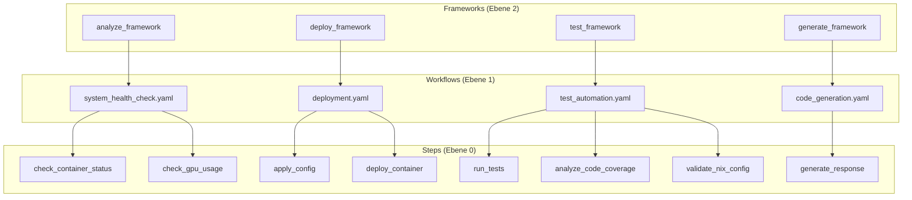

# Framework vs Workflow Relationship

## 🔄 **Detaillierte Beziehung**



## 📁 **Struktur in der Praxis**

```
automation-platform/
├── frameworks/                  # WAS will ich machen?
│   ├── analyze_framework/
│   │   └── system_analyzer.py
│   ├── deploy_framework/
│   │   └── deployment_manager.py
│   ├── test_framework/
│   │   └── test_orchestrator.py
│   └── generate_framework/
│       └── code_generator.py
├── workflows/                   # WELCHE Schritte brauche ich?
│   ├── analyze/
│   │   └── system_health.yaml   # Workflow-Definition
│   ├── deploy/
│   │   └── app_stack.yaml       # Workflow-Definition
│   ├── test/
│   │   └── automation.yaml      # Workflow-Definition
│   └── generate/
│       └── code_gen.yaml        # Workflow-Definition
└── steps/                       # WIE mache ich es konkret?
    ├── check_container_status.py
    ├── check_gpu_usage.py
    ├── generate_response.py
    ├── apply_config.py
    ├── run_tests.py
    ├── deploy_container.py
    ├── analyze_code_coverage.py
    └── validate_nix_config.py
```

## 🔧 **Konkrete Beispiele mit echten Projekten**

### 1. Framework Implementation (`analyze_framework.py`)
```python
class AnalyzeFramework:
    def analyze_pidea_system(self):
        # Framework ruft Workflow auf
        workflow = SystemHealthWorkflow()
        return workflow.execute()
    
    def analyze_nixos_control_center(self):
        # Framework ruft Workflow auf
        workflow = NixOSValidationWorkflow()
        return workflow.execute()
```

### 2. Workflow Definition (`system_health.yaml`)
```yaml
name: system_health_check
category: analyze
projects:
  - PIDEA
  - NixOSControlCenter
steps:
  - check_container_status
  - check_gpu_usage
  - log_results
```

### 3. Step Implementation (`check_container_status.py`)
```python
def check_container_status():
    # Step macht konkrete Arbeit für PIDEA
    pidea_status = docker_engine.get_status("pidea-backend")
    nixos_status = docker_engine.get_status("nixos-control-center")
    
    return {
        "PIDEA": pidea_status,
        "NixOSControlCenter": nixos_status,
        "timestamp": datetime.now()
    }
```

### 4. NixOS-spezifischer Step (`validate_nix_config.py`)
```python
def validate_nix_config():
    # Step für NixOSControlCenter
    config_path = "/etc/nixos/configuration.nix"
    validation_result = nix_engine.validate_config(config_path)
    
    return {
        "project": "NixOSControlCenter",
        "config_valid": validation_result.is_valid,
        "errors": validation_result.errors
    }
```

## 🎯 **Warum diese Trennung?**

### **Frameworks sind "Strategen"**
- Wissen WAS gemacht werden soll
- Rufen passende Workflows auf
- Sind wiederverwendbar

### **Workflows sind "Orchestratoren"**
- Wissen WELCHE Steps nötig sind
- Definieren die Reihenfolge
- Sind wiederverwendbar

### **Steps sind "Ausführer"**
- Wissen WIE es konkret gemacht wird
- Führen atomare Aktionen aus
- Sind wiederverwendbar

## 🔄 **Projekt-spezifische Beispiele**

### **PIDEA Projekt:**
```
Analyze Framework → System Health Workflow → check_container_status Step
```

### **NixOSControlCenter Projekt:**
```
Test Framework → Automation Workflow → validate_nix_config Step
```

## ✅ **Zusammenfassung**

1. **Frameworks (Ebene 2)** = "WAS soll gemacht werden?" (Strategie)
2. **Workflows (Ebene 1)** = "WELCHE Schritte brauche ich?" (Orchestrierung)
3. **Steps (Ebene 0)** = "WIE mache ich es konkret?" (Ausführung)

**Du brauchst alle drei Ebenen:**
- Frameworks für die Strategie
- Workflows für die Orchestrierung
- Steps für die Ausführung

Diese Trennung macht dein System maximal flexibel und skalierbar! 🚀 