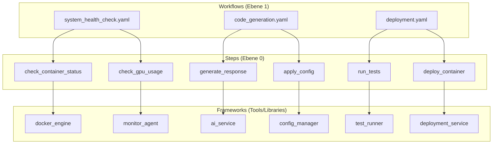
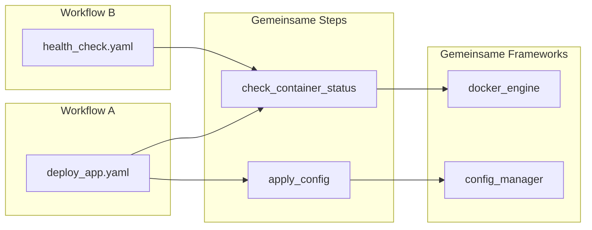

# Framework vs Workflow Relationship

## ❌ **Falsche Vorstellung:**
```
Workflow → Framework → Step
```

## ✅ **Korrekte Architektur:**
```
Workflow → Step → Framework
```

## 🔄 **Detaillierte Beziehung**



## 📁 **Struktur in der Praxis**

```
automation-platform/
├── workflows/                    # Definiert ABLÄUFE
│   ├── analyze/
│   │   └── system_health.yaml   # Workflow-Definition
│   └── deploy/
│       └── app_stack.yaml       # Workflow-Definition
├── steps/                       # Einzelne Aktionen
│   ├── check_container_status.py
│   ├── check_gpu_usage.py
│   ├── generate_response.py
│   └── apply_config.py
└── frameworks/                  # Werkzeugkästen
    ├── docker_engine/
    │   └── container_manager.py
    ├── monitor_agent/
    │   └── system_monitor.py
    ├── ai_service/
    │   └── llm_client.py
    └── config_manager/
        └── config_handler.py
```

## 🔧 **Konkrete Beispiele**

### 1. Workflow Definition (`system_health.yaml`)
```yaml
name: system_health_check
category: analyze
steps:
  - check_container_status
  - check_gpu_usage
  - log_results
```

### 2. Step Implementation (`check_container_status.py`)
```python
from frameworks.docker_engine.container_manager import ContainerManager

def check_container_status():
    # Step nutzt Framework
    container_manager = ContainerManager()
    status = container_manager.get_status("my-app")
    return {"status": status, "timestamp": datetime.now()}
```

### 3. Framework Implementation (`container_manager.py`)
```python
class ContainerManager:
    def get_status(self, container_name):
        # Framework-Logik
        return subprocess.run(["docker", "ps", "-q", "-f", f"name={container_name}"])
```

## 🎯 **Warum diese Trennung?**

### **Workflows sind "dumm"**
- Definieren nur die Reihenfolge
- Wissen nicht, WIE etwas gemacht wird
- Sind wiederverwendbar

### **Steps sind "schlau"**
- Wissen, WELCHE Frameworks sie brauchen
- Führen konkrete Aktionen aus
- Sind wiederverwendbar

### **Frameworks sind "Werkzeuge"**
- Enthalten die eigentliche Logik
- Sind wiederverwendbar
- Können von verschiedenen Steps genutzt werden

## 🔄 **Wiederverwendbarkeit**



## ✅ **Zusammenfassung**

1. **Workflows** = "Was soll gemacht werden?" (Reihenfolge)
2. **Steps** = "Wie wird es gemacht?" (Aktionen)
3. **Frameworks** = "Womit wird es gemacht?" (Werkzeuge)

**Du brauchst alle drei Ebenen:**
- Workflows für die Orchestrierung
- Steps für die Wiederverwendbarkeit
- Frameworks für die Modularität

Diese Trennung macht dein System maximal flexibel und skalierbar! 🚀 