# Meta-Ebenen Architecture mit Capabilities

## System Overview

```mermaid
graph TB
    subgraph "Ebene 4: System Orchestrator"
        SO[System Orchestrator]
        SO_CAP["Capabilities:\n• Computer Control\n• Browser Automation\n• Multi-Project Management\n• IDE Agent Coordination\n• Workflow Orchestration\n• Decision Making\n• Conflict Resolution"]
    end
    
    subgraph "Ebene 3: IDE Agents 1-zu-1 mit IDE"
        PA1["Cursor Agent\nProject: bot-setup"]
        PA2["VSCode Agent\nProject: web-init"]
        PA3["Cursor Agent\nProject: api-refactor"]
        
        PA_CAP["Agent Capabilities:\n• Project-Specific Code Analysis\n• IDE Integration 1-zu-1\n• Browser Automation\n• File System Access\n• Git Operations\n• Workflow Execution\n• Conflict Detection"]
    end
    
    subgraph "Ebene 2: Workflows"
        W1["System Health Check"]
        W2["Code Generation"]
        W3["Testing Pipeline"]
        W4["Deployment"]
        
        WF_CAP["Workflow Capabilities:\n• Step Orchestration\n• Context Management\n• Error Handling\n• Result Aggregation"]
    end
    
    subgraph "Ebene 1: Steps"
        S1["check_container_status"]
        S2["generate_response"]
        S3["apply_config"]
        S4["run_tests"]
        
        STEP_CAP["Step Capabilities:\n• Atomic Operations\n• Tool Integration\n• Framework Access\n• Result Reporting"]
    end
    
    subgraph "Ebene 0: Frameworks"
        F1["docker_engine"]
        F2["monitor_agent"]
        F3["ai_service"]
        F4["config_manager"]
        F5["test_runner"]
        F6["deployment_service"]
        
        FW_CAP["Framework Capabilities:\n• Tool Integration\n• API Access\n• System Interaction\n• Data Processing"]
    end
    
    %% Connections
    SO --> PA1
    SO --> PA2
    SO --> PA3
    
    PA1 --> W1
    PA1 --> W2
    PA2 --> W3
    PA3 --> W4
    
    W1 --> S1
    W2 --> S2
    W3 --> S3
    W4 --> S4
    
    S1 --> F1
    S2 --> F3
    S3 --> F4
    S4 --> F5
    
    %% Capability flows
    SO_CAP -.-> PA_CAP
    PA_CAP -.-> WF_CAP
    WF_CAP -.-> STEP_CAP
    STEP_CAP -.-> FW_CAP
```



## IDE Agent Relationship

```mermaid
graph TB
    subgraph "System Orchestrator"
        SO[System Orchestrator]
    end
    
    subgraph "Projects"
        P1["Project: bot-setup"]
        P2["Project: web-init"]
        P3["Project: api-refactor"]
    end
    
    subgraph "IDE Agents 1-zu-1 mit IDE"
        CURSOR1["Cursor Agent 1"]
        CURSOR2["Cursor Agent 2"]
        VSCODE1["VSCode Agent 1"]
    end
    
    subgraph "IDE Instances"
        IDE1["Cursor IDE\nProject: bot-setup"]
        IDE2["VSCode IDE\nProject: web-init"]
        IDE3["Cursor IDE\nProject: api-refactor"]
    end
    
    %% 1:1 Relationships
    SO --> CURSOR1
    SO --> VSCODE1
    SO --> CURSOR2
    
    CURSOR1 --> IDE1
    VSCODE1 --> IDE2
    CURSOR2 --> IDE3
    
    IDE1 --> P1
    IDE2 --> P2
    IDE3 --> P3
    
    %% Multi-IDE Scenario
    subgraph "Multi-IDE Scenario"
        M_PROJECT["Project: complex-app"]
        M_CURSOR["Cursor Agent"]
        M_VSCODE["VSCode Agent"]
        M_CURSOR_IDE["Cursor IDE"]
        M_VSCODE_IDE["VSCode IDE"]
        
        M_CURSOR --> M_CURSOR_IDE
        M_VSCODE --> M_VSCODE_IDE
        M_CURSOR_IDE --> M_PROJECT
        M_VSCODE_IDE --> M_PROJECT
        
        %% Conflict Resolution
        M_CONFLICT["Conflict Resolution\n• Affected Files Analysis\n• Coordination Protocols\n• Isolation Strategies"]
        M_CURSOR -.-> M_CONFLICT
        M_VSCODE -.-> M_CONFLICT
    end
```



## Multi-IDE Coordination Strategy


## Detailed Capability Matrix


## Workflow Execution Flow

```mermaid
sequenceDiagram
    participant SO as System Orchestrator
    participant PA as IDE Agent
    participant WF as Workflow
    participant ST as Step
    participant FW as Framework
    
    SO->>SO: Analyze Project Backlog
    SO->>PA: Create Project Run (1-zu-1 IDE)
    SO->>PA: Assign Workflows
    
    PA->>WF: Execute Workflow
    WF->>ST: Run Step
    ST->>FW: Call Framework Function
    FW-->>ST: Return Result
    ST-->>WF: Step Complete
    WF-->>PA: Workflow Complete
    PA-->>SO: Project Status Update
    
    Note over SO: System Orchestrator can:
    • Start multiple projects
    • Monitor all agents
    • Make decisions
    • Coordinate resources
    • Resolve IDE conflicts
```

## Capability Inheritance

```mermaid
graph TD
    subgraph "Level 4: System Orchestrator"
        SO[System Orchestrator]
        SO_CAPS["All Capabilities:\n• Computer Control\n• Browser Automation\n• Multi-Project Management\n• IDE Agent Coordination\n• Workflow Orchestration\n• Decision Making\n• Conflict Resolution\n• + All Lower Level Capabilities"]
    end
    
    subgraph "Level 3: IDE Agents 1-zu-1"
        IA["IDE Agents 1-zu-1"]
        IA_CAPS["Project Capabilities:\n• Code Analysis\n• IDE Integration 1-zu-1\n• Browser Control\n• File System Access\n• Git Operations\n• Workflow Execution\n• Conflict Detection\n• + All Lower Level Capabilities"]
    end
    
    subgraph "Level 2: Workflows"
        WF["Workflows"]
        WF_CAPS["Execution Capabilities:\n• Step Orchestration\n• Context Management\n• Error Handling\n• Result Aggregation\n• + All Lower Level Capabilities"]
    end
    
    subgraph "Level 1: Steps"
        ST["Steps"]
        ST_CAPS["Atomic Capabilities:\n• Atomic Operations\n• Tool Integration\n• Framework Access\n• Result Reporting\n• + All Lower Level Capabilities"]
    end
    
    subgraph "Level 0: Frameworks"
        FW["Frameworks"]
        FW_CAPS["Base Capabilities:\n• Tool Integration\n• API Access\n• System Interaction\n• Data Processing"]
    end
    
    SO --> IA
    IA --> WF
    WF --> ST
    ST --> FW
    
    SO_CAPS --> IA_CAPS
    IA_CAPS --> WF_CAPS
    WF_CAPS --> ST_CAPS
    ST_CAPS --> FW_CAPS
```



## Updated Meta-Levels Table

| Ebene | Name | Inhalt / Zweck | Beispiel |
|-------|------|----------------|----------|
| 4 | System-Orchestrator | KI-Manager für viele Projekte | "Manage all Project-IDs" |
| 3 | IDE Agent | Workflows für ein Projekt/IDE (1-zu-1) | "Cursor Agent für bot-setup" |
| 2 | Workflow | Reihenfolge von ausführbaren Steps | "System-Analyse" |
| 1 | Step | Einzelne Aktionen | "check_gpu_usage" |
| 0 | Framework | Werkzeugkästen und Tools | "docker_engine" |

## Key Insights

### IDE Agent Relationship
**1 IDE = 1 Agent** und **1 Project = 1 IDE Instance**:

1. **Single IDE per Project** (Standard)
   - `Cursor Agent` → `Cursor IDE` → `Project: bot-setup`
   - `VSCode Agent` → `VSCode IDE` → `Project: web-init`

2. **Multi-IDE per Project** (Erweiterte Szenarien)
   - `Cursor Agent` + `VSCode Agent` → `Project: complex-app`
   - **Benötigt**: Conflict Resolution durch System Orchestrator

### System Orchestrator Workflows
**JA!** Der System Orchestrator hat definitiv seine eigenen Workflows:

1. **Project Management Workflows**
   - `start_new_projects`
   - `monitor_all_agents`
   - `escalate_critical_issues`
   - `resource_allocation`

2. **Decision Making Workflows**
   - `analyze_project_backlog`
   - `prioritize_tasks`
   - `coordinate_agents`
   - `optimize_resources`

3. **Conflict Resolution Workflows**
   - `analyze_affected_files`
   - `coordinate_multi_ide`
   - `resolve_conflicts`
   - `isolate_work_areas`

4. **Meta-Automation Workflows**
   - `self_improvement`
   - `performance_optimization`
   - `capacity_planning`

### Capability Distribution

- **System Orchestrator (Level 4)**: Hat ALLE Capabilities + Meta-Management + Conflict Resolution
- **IDE Agents (Level 3)**: Projekt-spezifische Capabilities + Workflow Execution + Conflict Detection
- **Workflows (Level 2)**: Execution Capabilities + Step Orchestration
- **Steps (Level 1)**: Atomic Capabilities + Framework Integration
- **Frameworks (Level 0)**: Base Capabilities + Tool Integration

### Multi-IDE Coordination
- **Analyze Tools** analysieren Affected Files vorher
- **System Orchestrator** koordiniert IDE Agents
- **Conflict Resolution** verhindert Überschreibungen
- **Isolation Strategies** trennen Arbeitsbereiche klar

### Browser/Computer Control
- **System Orchestrator**: Kann Browser/Computer global steuern
- **IDE Agents**: Können Browser/Computer projektspezifisch nutzen
- **Workflows**: Nutzen diese Capabilities über Steps
- **Steps**: Führen konkrete Browser/Computer Aktionen aus
- **Frameworks**: Stellen die eigentlichen Tools bereit

### Framework Integration
- **Frameworks** sind die Basis-Ebene (Level 0)
- **Steps** nutzen Frameworks als Werkzeuge
- **Workflows** orchestrieren Steps
- **IDE Agents** führen Workflows aus
- **System Orchestrator** koordiniert alles

Diese 5-Ebenen-Architektur ist jetzt vollständig und berücksichtigt die IDE-Agent-Beziehungen korrekt! 🚀 