# Meta-Ebenen Architecture mit Capabilities

## System Overview

```mermaid
graph TB
    subgraph "Ebene 4: System Orchestrator (OPTIONAL!)"
        SO["System Orchestrator<br/>(Mensch oder LLM+MCP)"]
        SO_CAP["Capabilities:<br/>• Computer Control<br/>• Browser Automation<br/>• Multi-Project Management<br/>• IDE Agent Coordination<br/>• Framework Orchestration<br/>• Decision Making<br/>• Conflict Resolution<br/><br/>⚠️ OPTIONAL: Kann auch ein Mensch sein!"]
    end
    
    subgraph "Ebene 3: IDE Agents 1-zu-1 mit IDE"
        PA1["Cursor Agent<br/>Project: PIDEA"]
        PA2["VSCode Agent<br/>Project: NixOSControlCenter"]
        PA3["Cursor Agent<br/>Project: NCC-HomeLab"]
        
        PA_CAP["Agent Capabilities:<br/>• Project-Specific Code Analysis<br/>• IDE Integration 1-zu-1<br/>• Browser Automation<br/>• File System Access<br/>• Git Operations<br/>• Framework Execution<br/>• Conflict Detection"]
    end
    
    subgraph "Ebene 2: Frameworks"
        F1["Analyze Framework"]
        F2["Deploy Framework"]
        F3["Test Framework"]
        F4["Generate Framework"]
        
        FW_CAP["Framework Capabilities:<br/>• Strategy Definition<br/>• Workflow Selection<br/>• Context Management<br/>• Result Aggregation"]
    end
    
    subgraph "Ebene 1: Workflows"
        W1["WorkflowRegistry.js"]
        W2["WorkflowBuilder.js"]
        W3["System Health Check"]
        W4["Code Generation"]
        W5["Testing Pipeline"]
        W6["Deployment"]
        
        WF_CAP["Workflow Capabilities:<br/>• Step Orchestration<br/>• Context Management<br/>• Error Handling<br/>• Result Aggregation"]
    end
    
    subgraph "Ebene 0: Steps"
        S1["StepRegistry.js"]
        S2["StepBuilder.js"]
        S3["check_container_status"]
        S4["generate_response"]
        S5["apply_config"]
        S6["run_tests"]
        
        STEP_CAP["Step Capabilities:<br/>• Atomic Operations<br/>• Tool Integration<br/>• Framework Access<br/>• Result Reporting"]
    end
    
    subgraph "Application Layer: Commands"
        C1["CommandRegistry.js"]
        C2["CommandBuilder.js"]
        C3["Analysis Commands"]
        C4["Generate Commands"]
        C5["Refactor Commands"]
        C6["Management Commands"]
        
        CMD_CAP["Command Capabilities:<br/>• Business Actions<br/>• Parameter Validation<br/>• Category Management<br/>• Registry Integration"]
    end
    
    subgraph "Application Layer: Handlers"
        H1["HandlerRegistry.js"]
        H2["HandlerBuilder.js"]
        H3["Analysis Handlers"]
        H4["Generate Handlers"]
        H5["Refactor Handlers"]
        H6["Management Handlers"]
        
        HND_CAP["Handler Capabilities:<br/>• Use Case Orchestration<br/>• Dependency Management<br/>• Category Management<br/>• Registry Integration"]
    end
    
    %% Connections
    SO --> PA1
    SO --> PA2
    SO --> PA3
    
    PA1 --> F1
    PA1 --> F2
    PA2 --> F3
    PA3 --> F4
    
    F1 --> W3
    F2 --> W6
    F3 --> W5
    F4 --> W4
    
    W3 --> S3
    W4 --> S4
    W5 --> S5
    W6 --> S6
    
    C3 --> H3
    C4 --> H4
    C5 --> H5
    C6 --> H6
    
    H3 --> F1
    H4 --> F4
    H5 --> F2
    H6 --> F3
    
    %% Capability flows
    SO_CAP -.-> PA_CAP
    PA_CAP -.-> FW_CAP
    FW_CAP -.-> WF_CAP
    WF_CAP -.-> STEP_CAP
    CMD_CAP -.-> HND_CAP
    HND_CAP -.-> FW_CAP
```

## IDE Agent Relationship

```mermaid
graph TB
    subgraph "System Orchestrator"
        SO[System Orchestrator]
    end
    
    subgraph "Projects"
        P1["Project: PIDEA"]
        P2["Project: NixOSControlCenter"]
        P3["Project: NCC-HomeLab"]
    end
    
    subgraph "IDE Agents 1-zu-1 mit IDE"
        CURSOR1["Cursor Agent 1"]
        CURSOR2["Cursor Agent 2"]
        VSCODE1["VSCode Agent 1"]
    end
    
    subgraph "IDE Instances"
        IDE1["Cursor IDE<br/>Project: PIDEA"]
        IDE2["VSCode IDE<br/>Project: NixOSControlCenter"]
        IDE3["Cursor IDE<br/>Project: NCC-HomeLab"]
    end
    
    %% 1:1 Relationships
    SO --> CURSOR1
    SO --> VSCODE1
    SO --> CURSOR2
    
    CURSOR1 --> IDE1
    VSCODE1 --> IDE2
    CURSOR2 --> IDE3
    
    IDE1 --> P1
    IDE2 --> P2
    IDE3 --> P3
    
    %% Multi-IDE Scenario
    subgraph "Multi-IDE Scenario"
        M_PROJECT["Project: PIDEA"]
        M_CURSOR["Cursor Agent"]
        M_VSCODE["VSCode Agent"]
        M_CURSOR_IDE["Cursor IDE"]
        M_VSCODE_IDE["VSCode IDE"]
        
        M_CURSOR --> M_CURSOR_IDE
        M_VSCODE --> M_VSCODE_IDE
        M_CURSOR_IDE --> M_PROJECT
        M_VSCODE_IDE --> M_PROJECT
        
        %% Conflict Resolution
        M_CONFLICT["Conflict Resolution<br/>• Affected Files Analysis<br/>• Coordination Protocols<br/>• Isolation Strategies"]
        M_CURSOR -.-> M_CONFLICT
        M_VSCODE -.-> M_CONFLICT
    end
```

## Multi-IDE Coordination Strategy

## Detailed Capability Matrix

## Framework Execution Flow

## Capability Inheritance

```mermaid
graph TD
    subgraph "Level 4: System Orchestrator"
        SO[System Orchestrator]
        SO_CAPS["All Capabilities:\n• Computer Control\n• Browser Automation\n• Multi-Project Management\n• IDE Agent Coordination\n• Framework Orchestration\n• Decision Making\n• Conflict Resolution\n• + All Lower Level Capabilities"]
    end
    
    subgraph "Level 3: IDE Agents 1-zu-1"
        IA["IDE Agents 1-zu-1"]
        IA_CAPS["Project Capabilities:\n• Code Analysis\n• IDE Integration 1-zu-1\n• Browser Control\n• File System Access\n• Git Operations\n• Framework Execution\n• Conflict Detection\n• + All Lower Level Capabilities"]
    end
    
    subgraph "Level 2: Frameworks"
        FW["Frameworks"]
        FW_CAPS["Strategy Capabilities:\n• Strategy Definition\n• Workflow Selection\n• Context Management\n• Result Aggregation\n• + All Lower Level Capabilities"]
    end
    
    subgraph "Level 1: Workflows"
        WF["Workflows"]
        WF_CAPS["Execution Capabilities:\n• Step Orchestration\n• Context Management\n• Error Handling\n• Result Aggregation\n• + All Lower Level Capabilities"]
    end
    
    subgraph "Level 0: Steps"
        ST["Steps"]
        ST_CAPS["Atomic Capabilities:\n• Atomic Operations\n• Tool Integration\n• Framework Access\n• Result Reporting"]
    end
    
    subgraph "Application Layer: Commands"
        CMD["Commands"]
        CMD_CAPS["Business Capabilities:\n• Business Actions\n• Parameter Validation\n• Category Management\n• Registry Integration"]
    end
    
    subgraph "Application Layer: Handlers"
        HND["Handlers"]
        HND_CAPS["Use Case Capabilities:\n• Use Case Orchestration\n• Dependency Management\n• Category Management\n• Registry Integration"]
    end
    
    SO --> IA
    IA --> FW
    FW --> WF
    WF --> ST
    CMD --> HND
    HND --> FW
    
    SO_CAPS --> IA_CAPS
    IA_CAPS --> FW_CAPS
    FW_CAPS --> WF_CAPS
    WF_CAPS --> ST_CAPS
    CMD_CAPS --> HND_CAPS
    HND_CAPS --> FW_CAPS
```

## Updated Meta-Levels Table

| Ebene | Name | Inhalt / Zweck | Beispiel |
|-------|------|----------------|----------|
| 4 | System-Orchestrator | KI-Manager für viele Projekte | "Manage PIDEA, NixOSControlCenter, NCC-HomeLab" |
| 3 | IDE Agent | Frameworks für ein Projekt/IDE (1-zu-1) | "Cursor Agent für PIDEA" |
| 2 | Framework | Strategie und Workflow-Auswahl | "Analyze Framework" |
| 1 | Workflow | Reihenfolge von ausführbaren Steps | "System-Analyse" |
| 0 | Step | Einzelne Aktionen | "check_gpu_usage" |
| App | Commands | Business Actions | "AnalyzeArchitectureCommand" |
| App | Handlers | Use Cases | "AnalyzeArchitectureHandler" |

## Key Insights

### IDE Agent Relationship
**1 IDE = 1 Agent** und **1 Project = 1 IDE Instance**:

1. **Single IDE per Project** (Standard)
   - `Cursor Agent` → `Cursor IDE` → `Project: PIDEA`
   - `VSCode Agent` → `VSCode IDE` → `Project: NixOSControlCenter`

2. **Multi-IDE per Project** (Erweiterte Szenarien)
   - `Cursor Agent` + `VSCode Agent` → `Project: PIDEA`
   - **Benötigt**: Conflict Resolution durch System Orchestrator

### System Orchestrator Frameworks
**JA!** Der System Orchestrator hat definitiv seine eigenen Frameworks:

**WICHTIG:** Der System Orchestrator ist **OPTIONAL** und kann sein:
1. **👤 Mensch** (einfach, direkt, vollständige Kontrolle)
2. **🤖 LLM + MCP Server** (automatisiert, skalierbar, für Multi-Device Management)

**LLM + MCP Server würde sein:**
- **🧠 LLM**: Versteht natürliche Sprache, parst Commands, trifft Entscheidungen
- **🔧 MCP Server**: Koordiniert Tools, Agents, Frameworks
- **🎯 Orchestrator**: Multi-Project Management, Result Aggregation
- **🖥️ Multi-Device**: Verwaltet mehrere Geräte/Systeme gleichzeitig

1. **Project Management Frameworks**
   - `start_new_projects`
   - `monitor_all_agents`
   - `escalate_critical_issues`
   - `resource_allocation`

2. **Decision Making Frameworks**
   - `analyze_project_backlog`
   - `prioritize_tasks`
   - `coordinate_agents`
   - `optimize_resources`

3. **Conflict Resolution Frameworks**
   - `analyze_affected_files`
   - `coordinate_multi_ide`
   - `resolve_conflicts`
   - `isolate_work_areas`

4. **Meta-Automation Frameworks**
   - `self_improvement`
   - `performance_optimization`
   - `capacity_planning`

### Capability Distribution

- **System Orchestrator (Level 4)**: Hat ALLE Capabilities + Meta-Management + Conflict Resolution
  - **👤 Mensch**: Direkte Kontrolle, Entscheidungen, Koordination
  - **🤖 LLM + MCP Server**: Automatisierte Koordination, Multi-Device Management
- **IDE Agents (Level 3)**: Projekt-spezifische Capabilities + Framework Execution + Conflict Detection
- **Frameworks (Level 2)**: Strategy Capabilities + Workflow Selection
- **Workflows (Level 1)**: Execution Capabilities + Step Orchestration
- **Steps (Level 0)**: Atomic Capabilities + Tool Integration
- **Commands (Application)**: Business Action Capabilities + Parameter Validation
- **Handlers (Application)**: Use Case Capabilities + Dependency Management

### Multi-IDE Coordination
- **Analyze Tools** analysieren Affected Files vorher
- **System Orchestrator** koordiniert IDE Agents
- **Conflict Resolution** verhindert Überschreibungen
- **Isolation Strategies** trennen Arbeitsbereiche klar

### Browser/Computer Control
- **System Orchestrator**: Kann Browser/Computer global steuern
- **IDE Agents**: Können Browser/Computer projektspezifisch nutzen
- **Workflows**: Nutzen diese Capabilities über Steps
- **Steps**: Führen konkrete Browser/Computer Aktionen aus
- **Frameworks**: Stellen die eigentlichen Tools bereit

### Framework Integration
- **Frameworks** sind die Strategie-Ebene (Level 2)
- **Workflows** orchestrieren Steps (Level 1)
- **Steps** führen atomare Aktionen aus (Level 0)
- **IDE Agents** führen Frameworks aus (Level 3)
- **System Orchestrator** koordiniert alles (Level 4)
- **Commands** definieren Business Actions (Application Layer)
- **Handlers** orchestrieren Use Cases (Application Layer)

### Projekt-spezifische Beispiele

**PIDEA Projekt:**
- **System Orchestrator**: "PIDEA braucht Code-Analyse"
- **Cursor Agent**: "Führe Analyze Framework aus"
- **Analyze Framework**: "Wähle System Health Workflow"
- **System Health Workflow**: "Orchestriere check_container_status"
- **check_container_status Step**: "Prüfe pidea-backend Container"
- **AnalyzeArchitectureCommand**: "Business Action definieren"
- **AnalyzeArchitectureHandler**: "Use Case orchestrieren"

**NixOSControlCenter Projekt:**
- **System Orchestrator**: "NixOSControlCenter braucht Tests"
- **VSCode Agent**: "Führe Test Framework aus"
- **Test Framework**: "Wähle Automation Workflow"
- **Automation Workflow**: "Orchestriere validate_nix_config"
- **validate_nix_config Step**: "Validiere /etc/nixos/configuration.nix"
- **TestCorrectionCommand**: "Business Action definieren"
- **TestCorrectionHandler**: "Use Case orchestrieren"

### Modular Architecture Benefits

**Registry Pattern:**
- **CommandRegistry**: Zentrale Verwaltung aller Commands
- **HandlerRegistry**: Zentrale Verwaltung aller Handlers
- **StepRegistry**: Zentrale Verwaltung aller Steps
- **WorkflowRegistry**: Zentrale Verwaltung aller Workflows
- **FrameworkRegistry**: Zentrale Verwaltung aller Frameworks

**Builder Pattern:**
- **CommandBuilder**: Dynamische Command-Erstellung
- **HandlerBuilder**: Dynamische Handler-Erstellung
- **StepBuilder**: Dynamische Step-Erstellung
- **WorkflowBuilder**: Dynamische Workflow-Erstellung
- **FrameworkBuilder**: Dynamische Framework-Erstellung

**Category Pattern:**
- **analysis**: Analyse-bezogene Komponenten
- **generate**: Generierung-bezogene Komponenten
- **refactor**: Refactoring-bezogene Komponenten
- **management**: Management-bezogene Komponenten
- **testing**: Testing-bezogene Komponenten

Diese 7-Ebenen-Architektur ist jetzt vollständig und konsistent! 🚀

**KOMPLETTE MODULARE ARCHITEKTUR:** Commands, Handlers, Steps, Workflows, Frameworks, Agents, Orchestrator - ALLES mit Registry, Builder, Categories! 🚀 