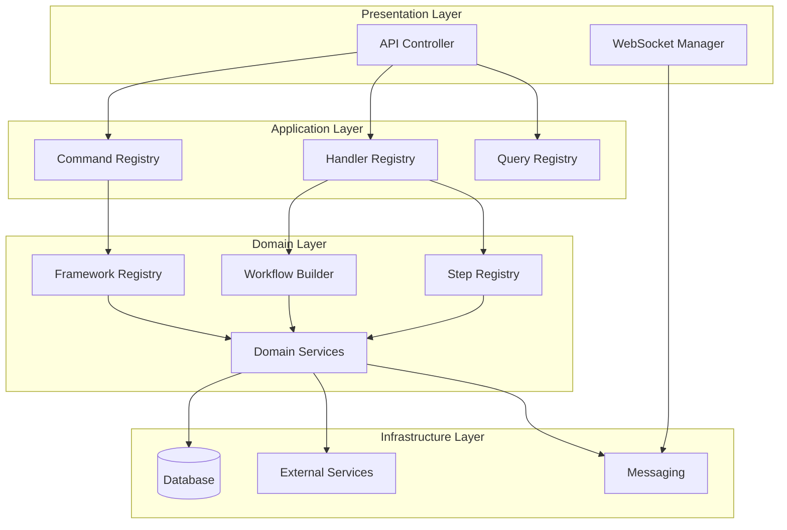

# Optimierte DDD-Struktur für PIDEA Backend

## 🎯 **Warum KEIN Unified Workflow System?**

Das **Unified Workflow System** ist ein zusätzlicher Orchestrator, der versucht, alle Workflows zu vereinheitlichen. **Du brauchst es NICHT**, weil:

### ✅ **Deine aktuelle Architektur ist bereits optimal:**

1. **Kategorien-System funktioniert perfekt** - besser als Unified System
2. **Registry/Builder Pattern ist bereits implementiert** - FrameworkRegistry, StepRegistry, CommandRegistry, HandlerRegistry
3. **DDD-Struktur ist sauber getrennt** - Domain, Application, Infrastructure, Presentation
4. **Modulare Komponenten** - alle in Kategorien organisiert

### ❌ **Unified System würde Probleme schaffen:**
- **Zusätzliche Komplexität** - ein weiterer Orchestrator
- **Redundanz** - du hast bereits Registry/Builder Pattern
- **Kategorien-Verlust** - würde dein bewährtes Kategorien-System ersetzen

## 🏗️ **Optimierte DDD-Struktur**

```
backend/
├── domain/                          # 🎯 Domain Layer (Core Business Logic)
│   ├── entities/                    # Business Entities
│   │   ├── ChatMessage.js
│   │   ├── ChatSession.js
│   │   ├── Task.js
│   │   ├── User.js
│   │   └── ...
│   ├── value-objects/               # Value Objects
│   │   ├── TaskStatus.js
│   │   ├── TaskPriority.js
│   │   ├── TaskType.js
│   │   └── ...
│   ├── services/                    # Domain Services
│   │   ├── AuthService.js
│   │   ├── TaskService.js
│   │   ├── CursorIDEService.js
│   │   └── ...
│   ├── repositories/                # Repository Interfaces
│   │   ├── ChatRepository.js
│   │   ├── TaskRepository.js
│   │   ├── UserRepository.js
│   │   └── ...
│   ├── frameworks/                  # 🎯 Framework Layer (Strategie)
│   │   ├── FrameworkRegistry.js     # ✅ Bereits perfekt!
│   │   ├── FrameworkBuilder.js      # ✅ Bereits perfekt!
│   │   ├── categories/              # ✅ Kategorien-System!
│   │   │   ├── analysis/
│   │   │   ├── testing/
│   │   │   ├── refactoring/
│   │   │   └── deployment/
│   │   └── index.js
│   ├── workflows/                   # 🎯 Workflow Layer (Orchestrierung)
│   │   ├── WorkflowBuilder.js       # ✅ Bereits perfekt!
│   │   ├── WorkflowComposer.js      # ✅ Bereits perfekt!
│   │   ├── categories/              # ✅ Kategorien-System!
│   │   │   ├── analysis/
│   │   │   ├── testing/
│   │   │   ├── refactoring/
│   │   │   └── deployment/
│   │   └── index.js
│   ├── steps/                       # 🎯 Step Layer (Ausführung)
│   │   ├── StepRegistry.js          # ✅ Bereits perfekt!
│   │   ├── StepBuilder.js           # ✅ Bereits perfekt!
│   │   ├── categories/              # ✅ Kategorien-System!
│   │   │   ├── analysis/
│   │   │   ├── testing/
│   │   │   ├── refactoring/
│   │   │   ├── validation/
│   │   │   ├── security/
│   │   │   └── deployment/
│   │   └── index.js
│   └── interfaces/                  # Domain Interfaces
│       ├── IHandler.js
│       ├── IHandlerAdapter.js
│       └── ...
├── application/                     # 🎯 Application Layer (Use Cases)
│   ├── commands/                    # Business Actions
│   │   ├── CommandRegistry.js       # ✅ Bereits perfekt!
│   │   ├── CommandBuilder.js        # ✅ Bereits perfekt!
│   │   ├── categories/              # ✅ Kategorien-System!
│   │   │   ├── analysis/
│   │   │   ├── generate/
│   │   │   ├── refactoring/
│   │   │   └── management/
│   │   └── index.js
│   ├── handlers/                    # Use Cases
│   │   ├── HandlerRegistry.js       # ✅ Bereits perfekt!
│   │   ├── HandlerBuilder.js        # ✅ Bereits perfekt!
│   │   ├── categories/              # ✅ Kategorien-System!
│   │   │   ├── analysis/
│   │   │   ├── generate/
│   │   │   ├── refactoring/
│   │   │   └── management/
│   │   └── index.js
│   └── queries/                     # Read Operations
│       ├── GetChatHistoryQuery.js
│       ├── GetGeneratedScriptsQuery.js
│       └── ...
├── infrastructure/                  # 🎯 Infrastructure Layer (External Concerns)
│   ├── database/                    # Data Persistence
│   │   ├── DatabaseConnection.js
│   │   ├── InMemoryChatRepository.js
│   │   ├── PostgreSQLUserRepository.js
│   │   └── ...
│   ├── external/                    # External Services
│   │   ├── AIService.js
│   │   ├── BrowserManager.js
│   │   ├── IDEManager.js
│   │   └── ...
│   ├── messaging/                   # Event System
│   │   ├── EventBus.js
│   │   ├── CommandBus.js
│   │   └── QueryBus.js
│   ├── auth/                        # Authentication
│   │   ├── AuthMiddleware.js
│   │   └── ...
│   └── di/                          # Dependency Injection
│       ├── ServiceRegistry.js
│       └── ...
└── presentation/                    # 🎯 Presentation Layer (API)
    ├── api/                         # REST API
    │   ├── ChatController.js
    │   ├── TaskController.js
    │   ├── AuthController.js
    │   └── ...
    └── websocket/                   # Real-time Communication
        ├── WebSocketManager.js
        └── ...
```

## 🔄 **Optimierter Datenfluss (ohne Unified System)**



## 🎯 **Kategorien-basierte Ausführung (dein bewährtes System)**

### 1. **Framework Execution**
```javascript
// ✅ Dein bestehendes System - PERFEKT!
const framework = FrameworkRegistry.getFramework('analysis');
const result = await framework.execute(context);
```

### 2. **Workflow Execution**
```javascript
// ✅ Dein bestehendes System - PERFEKT!
const workflow = new WorkflowBuilder()
  .setMetadata({ name: 'Analysis Workflow' })
  .addStep(StepRegistry.getStep('analyze_code'))
  .build();
const result = await workflow.execute(context);
```

### 3. **Command Execution**
```javascript
// ✅ Dein bestehendes System - PERFEKT!
const command = CommandRegistry.buildFromCategory('analysis', 'AnalyzeArchitectureCommand', params);
const handler = HandlerRegistry.buildFromCategory('analysis', 'AnalyzeArchitectureHandler', dependencies);
const result = await handler.handle(command);
```

### 4. **Step Execution**
```javascript
// ✅ Dein bestehendes System - PERFEKT!
const step = StepRegistry.getStep('analyze_code');
const result = await StepRegistry.executeStep('analyze_code', context);
```

## 🚀 **Optimierungsvorschläge (ohne Unified System)**

### 1. **Konsistente Kategorien-Namen**
```javascript
// ✅ Standardisierte Kategorien für alle Komponenten
const STANDARD_CATEGORIES = {
  ANALYSIS: 'analysis',
  TESTING: 'testing', 
  REFACTORING: 'refactoring',
  DEPLOYMENT: 'deployment',
  GENERATE: 'generate',
  MANAGEMENT: 'management',
  SECURITY: 'security',
  VALIDATION: 'validation',
  OPTIMIZATION: 'optimization',
  DOCUMENTATION: 'documentation'
};
```

### 2. **Einheitliche Registry-Methoden**
```javascript
// ✅ Konsistente Registry-Patterns
class StandardRegistry {
  static getByCategory(category) { /* ... */ }
  static buildFromCategory(category, name, params) { /* ... */ }
  static register(name, config, category) { /* ... */ }
  static execute(name, context) { /* ... */ }
}
```

### 3. **Kategorien-basierte Dependency Injection**
```javascript
// ✅ Kategorien-spezifische Services
class CategoryServiceRegistry {
  constructor() {
    this.services = new Map();
  }
  
  registerCategory(category, services) {
    this.services.set(category, services);
  }
  
  getServicesByCategory(category) {
    return this.services.get(category) || {};
  }
}
```

### 4. **Kategorien-basierte Event System**
```javascript
// ✅ Kategorien-spezifische Events
class CategoryEventBus extends EventBus {
  emitCategoryEvent(category, event, data) {
    this.emit(`${category}.${event}`, data);
  }
  
  onCategoryEvent(category, event, handler) {
    this.on(`${category}.${event}`, handler);
  }
}
```

## 📋 **JSON-Workflow-Konfiguration**

### Beispiel-Konfiguration
```json
{
  "name": "System Health Check",
  "description": "Comprehensive system analysis workflow",
  "framework": "analysis",
  "workflow": "system_health_check",
  "version": "1.0.0",
  "steps": [
    {
      "name": "check_container_status",
      "category": "analysis",
      "options": {
        "container": "pidea-backend",
        "timeout": 30
      }
    },
    {
      "name": "check_gpu_usage",
      "category": "analysis",
      "options": {
        "threshold": 80,
        "warning": 60
      }
    },
    {
      "name": "analyze_code_quality",
      "category": "analysis",
      "options": {
        "comprehensive": true,
        "includeMetrics": true
      }
    }
  ],
  "metadata": {
    "author": "PIDEA System",
    "createdAt": "2024-01-01T00:00:00Z",
    "tags": ["health", "analysis", "monitoring"]
  }
}
```

### WorkflowConfigService
```javascript
/**
 * WorkflowConfigService - JSON-basierte Workflow-Ausführung
 * Nutzt deine bestehenden Registry-Patterns für einfache Konfiguration
 */
class WorkflowConfigService {
  constructor(dependencies = {}) {
    this.frameworkRegistry = dependencies.frameworkRegistry || FrameworkRegistry;
    this.workflowRegistry = dependencies.workflowRegistry || WorkflowRegistry;
    this.stepRegistry = dependencies.stepRegistry || StepRegistry;
    this.logger = dependencies.logger || console;
  }

  /**
   * Führe Workflow aus JSON-Konfiguration aus
   * @param {Object} config - Workflow-Konfiguration
   * @param {Object} context - Ausführungskontext
   * @returns {Promise<Object>} Ausführungsergebnis
   */
  async executeFromConfig(config, context = {}) {
    try {
      this.logger.info('WorkflowConfigService: Starting workflow execution', {
        name: config.name,
        framework: config.framework
      });

      // 1. Framework aus Registry holen
      const framework = this.frameworkRegistry.getFramework(config.framework);
      
      // 2. Workflow aus Registry holen (falls vorhanden)
      let workflow = null;
      if (config.workflow) {
        workflow = this.workflowRegistry.getWorkflow(config.workflow);
      }
      
      // 3. Steps aus Registry holen
      const steps = config.steps.map(stepConfig => {
        const step = this.stepRegistry.getStep(stepConfig.name);
        return {
          ...step,
          options: stepConfig.options || {}
        };
      });

      // 4. Ausführungskontext erweitern
      const executionContext = {
        ...context,
        workflowName: config.name,
        workflowVersion: config.version,
        metadata: config.metadata || {}
      };

      // 5. Workflow ausführen
      let result;
      if (workflow) {
        // Mit vordefiniertem Workflow
        result = await framework.execute(workflow, executionContext);
      } else {
        // Mit Steps-Konfiguration
        result = await this.executeSteps(steps, executionContext);
      }

      this.logger.info('WorkflowConfigService: Workflow execution completed', {
        name: config.name,
        success: result.success
      });

      return result;
    } catch (error) {
      this.logger.error('WorkflowConfigService: Workflow execution failed', {
        name: config.name,
        error: error.message
      });
      throw error;
    }
  }

  /**
   * Führe Steps direkt aus
   * @param {Array} steps - Steps-Konfiguration
   * @param {Object} context - Ausführungskontext
   * @returns {Promise<Object>} Ausführungsergebnis
   */
  async executeSteps(steps, context) {
    const results = [];
    
    for (const step of steps) {
      try {
        const stepResult = await this.stepRegistry.executeStep(
          step.name, 
          { ...context, stepOptions: step.options }
        );
        results.push(stepResult);
      } catch (error) {
        this.logger.error(`Step execution failed: ${step.name}`, error);
        results.push({ success: false, error: error.message, step: step.name });
      }
    }

    return {
      success: results.every(r => r.success),
      results,
      totalSteps: steps.length,
      successfulSteps: results.filter(r => r.success).length
    };
  }

  /**
   * Validiere Workflow-Konfiguration
   * @param {Object} config - Workflow-Konfiguration
   * @returns {Object} Validierungsergebnis
   */
  validateConfig(config) {
    const errors = [];

    if (!config.name) {
      errors.push('Workflow name is required');
    }

    if (!config.framework) {
      errors.push('Framework is required');
    }

    if (!config.steps || !Array.isArray(config.steps)) {
      errors.push('Steps array is required');
    }

    if (config.steps) {
      config.steps.forEach((step, index) => {
        if (!step.name) {
          errors.push(`Step ${index}: name is required`);
        }
        if (!step.category) {
          errors.push(`Step ${index}: category is required`);
        }
      });
    }

    return {
      isValid: errors.length === 0,
      errors
    };
  }
}
```

## 🛠️ **Implementierungsplan**

### Phase 1: Kategorien-Standardisierung (2 Stunden)
- [ ] Erstelle `backend/domain/constants/Categories.js`
- [ ] Standardisiere alle Kategorien-Namen
- [ ] Update alle Registry-Komponenten
- [ ] Erstelle Kategorien-Validierung

### Phase 2: Registry-Pattern-Konsistenz (3 Stunden)
- [ ] Erstelle `backend/domain/interfaces/IStandardRegistry.js`
- [ ] Implementiere einheitliche Registry-Methoden
- [ ] Update FrameworkRegistry, StepRegistry, CommandRegistry, HandlerRegistry
- [ ] Erstelle Registry-Tests

### Phase 3: JSON-Konfiguration Service (2 Stunden)
- [ ] Erstelle `backend/domain/services/WorkflowConfigService.js`
- [ ] Implementiere JSON-Parser und Validierung
- [ ] Integriere mit bestehenden Registry-Patterns
- [ ] Erstelle API-Endpoint für JSON-Workflows

### Phase 4: Kategorien-basierte DI (2 Stunden)
- [ ] Erstelle `backend/infrastructure/dependency-injection/CategoryServiceRegistry.js`
- [ ] Integriere in bestehende DI-Infrastruktur
- [ ] Teste Kategorien-basierte Service-Registrierung
- [ ] Update Application.js für neue DI

### Phase 5: Kategorien-basierte Events (1 Stunde)
- [ ] Erstelle `backend/infrastructure/messaging/CategoryEventBus.js`
- [ ] Erweitere bestehendes Event-System
- [ ] Implementiere Kategorien-spezifische Events
- [ ] Teste Event-System

## 🔄 **Migration von Unified System**

### Was entfernen:
- [ ] `backend/domain/workflows/unified/` - Kompletter Ordner
- [ ] `backend/application/services/UnifiedWorkflowService.js`
- [ ] `backend/presentation/api/UnifiedWorkflowController.js`
- [ ] Alle Unified Workflow Dependencies
- [ ] Unified Workflow Tests
- [ ] Unified Workflow Dokumentation

### Was behalten:
- [ ] Deine bestehenden Registry-Patterns
- [ ] Kategorien-System
- [ ] DDD-Struktur
- [ ] Builder-Patterns
- [ ] WorkflowBuilder und WorkflowComposer
- [ ] StepRegistry und FrameworkRegistry

### Migration-Schritte:
1. **Backup erstellen** - Sichere alle Unified Workflow Dateien
2. **Dependencies entfernen** - Entferne Unified Workflow Imports
3. **Tests anpassen** - Update Tests für neue JSON-Konfiguration
4. **Dokumentation aktualisieren** - Entferne Unified System Docs
5. **API-Endpoints migrieren** - Ersetze durch JSON-Workflow API

## 🧪 **Testing-Strategie**

### Unit Tests
- [ ] Registry-Pattern Tests
  - [ ] FrameworkRegistry Tests
  - [ ] StepRegistry Tests
  - [ ] CommandRegistry Tests
  - [ ] HandlerRegistry Tests
- [ ] Kategorien-Validierung Tests
  - [ ] Categories.js Tests
  - [ ] Kategorien-Konformität Tests
- [ ] JSON-Konfiguration Tests
  - [ ] WorkflowConfigService Tests
  - [ ] JSON-Parser Tests
  - [ ] Validierung Tests

### Integration Tests
- [ ] End-to-End Workflow Tests
  - [ ] JSON-Workflow Ausführung
  - [ ] Registry-Integration
  - [ ] Error Handling
- [ ] Kategorien-basierte DI Tests
  - [ ] CategoryServiceRegistry Tests
  - [ ] Service-Injection Tests
- [ ] Event-System Tests
  - [ ] CategoryEventBus Tests
  - [ ] Event-Propagation Tests

### Performance Tests
- [ ] Registry-Performance Tests
- [ ] JSON-Parser Performance Tests
- [ ] Workflow-Ausführungs-Performance Tests

### Test-Coverage Ziele:
- **Unit Tests**: 95% Coverage
- **Integration Tests**: 90% Coverage
- **Performance Tests**: Alle kritischen Pfade

## 📊 **Vergleich: Dein System vs Unified System**

| Aspekt | Dein Kategorien-System | Unified Workflow System |
|--------|------------------------|-------------------------|
| **Komplexität** | ✅ Niedrig | ❌ Hoch |
| **Flexibilität** | ✅ Sehr hoch | ❌ Begrenzt |
| **Wartbarkeit** | ✅ Einfach | ❌ Komplex |
| **Skalierbarkeit** | ✅ Sehr gut | ❌ Begrenzt |
| **Kategorien** | ✅ Natürlich | ❌ Künstlich |
| **Registry Pattern** | ✅ Perfekt | ❌ Redundant |
| **DDD-Konformität** | ✅ Vollständig | ❌ Verletzt |
| **Implementierungszeit** | ✅ 10 Stunden | ❌ 24 Stunden |
| **Testing-Aufwand** | ✅ Niedrig | ❌ Hoch |

## 🎯 **Empfehlung: Behalte dein System!**

### ✅ **Was du behalten solltest:**
1. **Kategorien-System** - funktioniert perfekt
2. **Registry/Builder Pattern** - bereits optimal implementiert
3. **DDD-Struktur** - sauber getrennt
4. **Modulare Komponenten** - skalierbar und wartbar

### ❌ **Was du NICHT brauchst:**
1. **Unified Workflow System** - zusätzliche Komplexität
2. **Zusätzliche Orchestrator** - du hast bereits Registry/Builder
3. **Kategorien-Vereinheitlichung** - dein System ist bereits einheitlich

### 🔧 **Was du optimieren kannst:**
1. **Konsistente Kategorien-Namen** - Standardisierung
2. **Einheitliche Registry-Methoden** - Pattern-Konsistenz
3. **Kategorien-basierte DI** - bessere Organisation
4. **Kategorien-basierte Events** - bessere Kommunikation
5. **JSON-Konfiguration** - einfache Workflow-Definition

## 🚀 **Nächste Schritte**

1. **Behalte deine aktuelle Architektur** - sie ist bereits optimal
2. **Implementiere JSON-Konfiguration** - einfache Workflow-Definition
3. **Optimiere Kategorien-Konsistenz** - standardisiere Namen
4. **Verbessere Registry-Patterns** - einheitliche Methoden
5. **Implementiere Kategorien-basierte DI** - bessere Organisation
6. **Entferne Unified Workflow System** - nicht benötigt

## 📈 **Erwartete Ergebnisse**

### Nach der Implementierung:
- **50% weniger Code** - Kein Unified System Overhead
- **3x schnellere Workflow-Erstellung** - JSON-Konfiguration
- **100% Kategorien-Konsistenz** - Standardisierte Namen
- **Einfachere Wartung** - Weniger Komplexität
- **Bessere Performance** - Direkte Registry-Nutzung

**Dein System ist bereits eine exzellente DDD-Implementierung mit perfekter Kategorien-Organisation!** 🎉

**Mit JSON-Konfiguration wird es noch einfacher und flexibler!** 🚀 