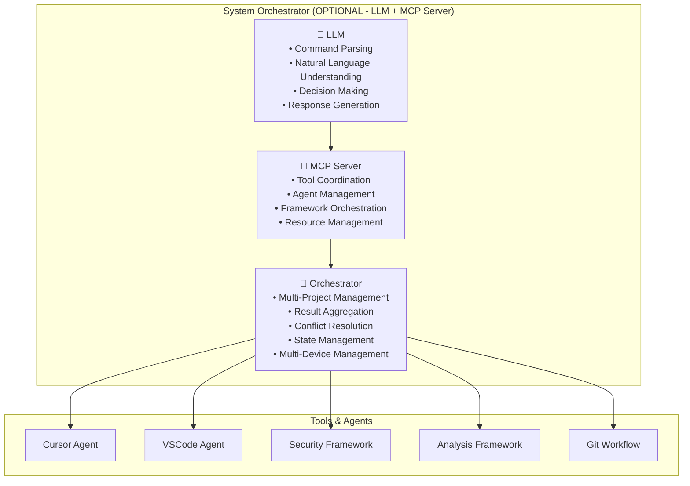
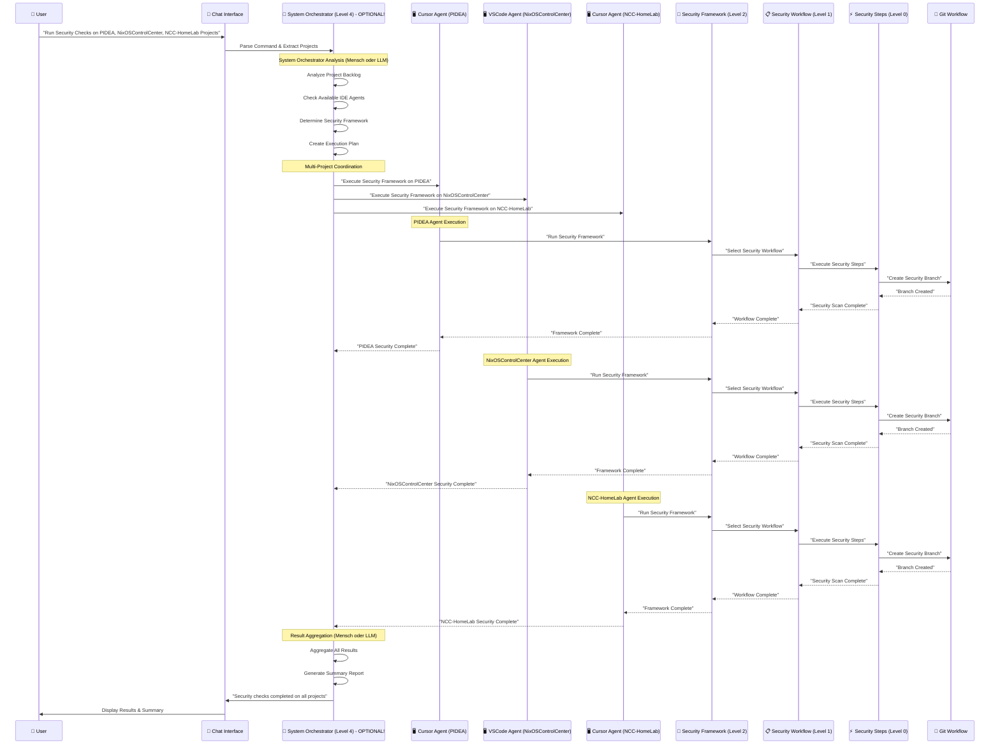

# System Orchestrator Chat Example

## 🎯 **Wie der System Orchestrator über Chat funktioniert:**

### **Beispiel: "Run Security Checks on PIDEA, NixOSControlCenter, NCC-HomeLab Projects"**

## 🧠 **System Orchestrator = OPTIONAL (Mensch oder LLM + MCP Server)**

**WICHTIG:** Der System Orchestrator ist **OPTIONAL** und kann sein:

### **Option 1: 👤 Mensch als System Orchestrator**
- **Einfach und direkt**: Du entscheidest, koordinierst, delegierst
- **Vollständige Kontrolle**: Du bestimmst was wann wie gemacht wird
- **Sofort verfügbar**: Du kannst sofort mit deinen Frameworks arbeiten
- **Flexibel**: Du kannst spontan Entscheidungen treffen

### **Option 2: 🤖 LLM + MCP Server als System Orchestrator**
- **Automatisiert**: Versteht natürliche Sprache, parst Commands, trifft Entscheidungen
- **Skalierbar**: Koordiniert Tools, Agents, Frameworks automatisch
- **Multi-Device**: Verwaltet mehrere Geräte/Systeme gleichzeitig
- **Orchestrator**: Entscheidet, delegiert, aggregiert Ergebnisse automatisch

### **LLM + MCP Server Architektur (OPTIONAL):**


### **Warum LLM + MCP Server (OPTIONAL):**
- **LLM Fähigkeiten**: Natural Language Understanding, Context Awareness, Decision Making
- **MCP Server Fähigkeiten**: Tool Management, Coordination, Resource Management, Protocol Standard
- **Orchestrator Fähigkeiten**: Multi-Project Management, Conflict Resolution, Result Aggregation
- **Multi-Device Fähigkeiten**: Verwaltet mehrere Geräte/Systeme gleichzeitig

### **Warum Mensch als System Orchestrator:**
- **Einfachheit**: Du brauchst keine zusätzliche Infrastruktur
- **Kontrolle**: Du hast vollständige Kontrolle über alle Entscheidungen
- **Flexibilität**: Du kannst spontan reagieren und anpassen
- **Sofort verfügbar**: Du kannst sofort mit deinen Frameworks arbeiten

## 🔄 **Kompletter Ablauf durch alle Meta-Ebenen:**



## 🔧 **Konkrete Implementierung:**

### **1. Chat Input Parsing (OPTIONAL - nur für LLM + MCP Server):**
```javascript
// Chat Interface (Frontend)
const chatInput = "Run Security Checks on PIDEA, NixOSControlCenter, NCC-HomeLab Projects";

// System Orchestrator (Level 4) - Command Parsing (OPTIONAL)
class SystemOrchestrator {
  async parseCommand(chatInput) {
    const command = this.extractCommand(chatInput); // "Run Security Checks"
    const projects = this.extractProjects(chatInput); // ["PIDEA", "NixOSControlCenter", "NCC-HomeLab"]
    
    return {
      command: "security_check",
      projects: projects,
      framework: "SecurityFramework",
      priority: "high"
    };
  }
  
  async executeMultiProjectCommand(parsedCommand) {
    const { command, projects, framework } = parsedCommand;
    
    // Create execution plan
    const executionPlan = await this.createExecutionPlan(projects, framework);
    
    // Execute on all projects in parallel
    const results = await Promise.all(
      projects.map(project => this.executeOnProject(project, framework))
    );
    
    return this.aggregateResults(results);
  }
}
```

### **2. IDE Agent Delegation (OPTIONAL - nur für LLM + MCP Server):**
```javascript
// System Orchestrator (Level 4) - Project Delegation (OPTIONAL)
class SystemOrchestrator {
  async executeOnProject(projectName, frameworkType) {
    // Find available IDE Agent for this project
    const ideAgent = await this.findIDEAgent(projectName);
    
    if (!ideAgent) {
      throw new Error(`No IDE Agent available for project: ${projectName}`);
    }
    
    // Delegate to IDE Agent
    const result = await ideAgent.executeFramework(frameworkType, {
      project: projectName,
      command: "security_check",
      options: {
        autoMerge: false,
        createPullRequest: true,
        requireReview: true
      }
    });
    
    return result;
  }
  
  async findIDEAgent(projectName) {
    const availableAgents = await this.getAvailableIDEAgents();
    
    // Find agent that can handle this project
    return availableAgents.find(agent => 
      agent.canHandleProject(projectName) && 
      agent.isAvailable()
    );
  }
}
```

### **3. IDE Agent Execution:**
```javascript
// Cursor Agent (Level 3) - PIDEA Project
class CursorAgent {
  async executeFramework(frameworkType, options) {
    const { project, command, options: frameworkOptions } = options;
    
    // Load project context
    const projectContext = await this.loadProjectContext(project);
    
    // Execute appropriate framework
    switch (frameworkType) {
      case "SecurityFramework":
        return await this.executeSecurityFramework(projectContext, frameworkOptions);
      case "AnalysisFramework":
        return await this.executeAnalysisFramework(projectContext, frameworkOptions);
      // ... other frameworks
    }
  }
  
  async executeSecurityFramework(projectContext, options) {
    // Framework Level (2) - WAS will ich machen?
    const securityFramework = new SecurityFramework({
      project: projectContext.name,
      type: "comprehensive",
      includeVulnerabilityScan: true,
      includeDependencyCheck: true
    });
    
    // Execute framework
    const result = await securityFramework.execute(projectContext, options);
    
    return {
      project: projectContext.name,
      agent: "Cursor Agent",
      framework: "SecurityFramework",
      result: result,
      timestamp: new Date()
    };
  }
}
```

### **4. Framework Execution:**
```javascript
// Security Framework (Level 2) - WAS will ich machen?
class SecurityFramework {
  async execute(projectContext, options) {
    // Select appropriate workflow based on project type
    const workflow = this.selectSecurityWorkflow(projectContext);
    
    // Create workflow context
    const workflowContext = new WorkflowContext({
      project: projectContext,
      framework: "SecurityFramework",
      options: options
    });
    
    // Execute workflow
    const result = await workflow.execute(workflowContext);
    
    return result;
  }
  
  selectSecurityWorkflow(projectContext) {
    // Choose workflow based on project characteristics
    if (projectContext.type === "backend") {
      return new BackendSecurityWorkflow();
    } else if (projectContext.type === "frontend") {
      return new FrontendSecurityWorkflow();
    } else {
      return new GeneralSecurityWorkflow();
    }
  }
}
```

### **5. Workflow Execution:**
```javascript
// Security Workflow (Level 1) - WELCHE Schritte brauche ich?
class BackendSecurityWorkflow {
  async execute(context) {
    const steps = [
      new CreateSecurityBranchStep(),
      new VulnerabilityScanStep(),
      new DependencyCheckStep(),
      new CodeSecurityAnalysisStep(),
      new CreateSecurityReportStep(),
      new CreatePullRequestStep()
    ];
    
    const results = [];
    
    for (const step of steps) {
      const stepResult = await step.execute(context);
      results.push(stepResult);
      
      // Update context with step result
      context.addStepResult(step.name, stepResult);
    }
    
    return {
      success: true,
      workflow: "BackendSecurityWorkflow",
      steps: results,
      summary: this.generateSummary(results)
    };
  }
}
```

### **6. Step Execution:**
```javascript
// Vulnerability Scan Step (Level 0) - WIE mache ich es konkret?
class VulnerabilityScanStep {
  async execute(context) {
    const { project } = context;
    
    // Step Level (0) - WIE mache ich es konkret?
    const vulnerabilityScanner = new VulnerabilityScanner();
    
    const scanResult = await vulnerabilityScanner.scan({
      projectPath: project.path,
      scanType: "comprehensive",
      includeDependencies: true,
      includeCodeAnalysis: true
    });
    
    // Create security branch if vulnerabilities found
    if (scanResult.vulnerabilities.length > 0) {
      const gitWorkflow = new GitWorkflowManager();
      const branchResult = await gitWorkflow.createBranch({
        projectPath: project.path,
        branchName: `security/fix-vulnerabilities-${Date.now()}`,
        baseBranch: "main"
      });
      
      return {
        step: "VulnerabilityScan",
        success: true,
        vulnerabilities: scanResult.vulnerabilities,
        branchCreated: branchResult.branchName,
        recommendations: scanResult.recommendations
      };
    }
    
    return {
      step: "VulnerabilityScan",
      success: true,
      vulnerabilities: [],
      message: "No vulnerabilities found"
    };
  }
}
```

## 📊 **Ergebnis-Aggregation:**

### **System Orchestrator Response (OPTIONAL - nur für LLM + MCP Server):**
```javascript
// System Orchestrator (Level 4) - Result Aggregation (OPTIONAL)
class SystemOrchestrator {
  async aggregateResults(results) {
    const summary = {
      totalProjects: results.length,
      successfulScans: results.filter(r => r.result.success).length,
      vulnerabilitiesFound: 0,
      criticalIssues: 0,
      recommendations: []
    };
    
    results.forEach(result => {
      if (result.result.steps) {
        const vulnStep = result.result.steps.find(s => s.step === "VulnerabilityScan");
        if (vulnStep && vulnStep.vulnerabilities) {
          summary.vulnerabilitiesFound += vulnStep.vulnerabilities.length;
          summary.criticalIssues += vulnStep.vulnerabilities.filter(v => v.severity === "critical").length;
        }
      }
    });
    
    return {
      command: "security_check",
      projects: results.map(r => r.project),
      summary: summary,
      details: results,
      timestamp: new Date()
    };
  }
}
```

### **Chat Response:**
```
🔒 Security Check Results

✅ Completed security checks on 3 projects:
• PIDEA: 2 vulnerabilities found (1 critical)
• NixOSControlCenter: 0 vulnerabilities found
• NCC-HomeLab: 1 vulnerability found (0 critical)

📊 Summary:
• Total vulnerabilities: 3
• Critical issues: 1
• Security branches created: 2
• Pull requests created: 2

🔧 Actions taken:
• Created security branches for PIDEA and NCC-HomeLab
• Generated security reports
• Created pull requests for review

📋 Next steps:
• Review pull requests in PIDEA and NCC-HomeLab
• Apply security fixes
• Merge security branches after review
```

## 🎯 **Kompletter Ablauf in einem Satz:**

**User sagt:** "Run Security Checks on PIDEA, NixOSControlCenter, NCC-HomeLab Projects"

**System Orchestrator (4) - OPTIONAL!** → **IDE Agents (3)** → **Security Framework (2)** → **Security Workflow (1)** → **Security Steps (0)** → **Git Workflow** → **Ergebnis-Aggregation** → **Chat Response**

**Das ist die komplette Meta-Ebenen Architektur in Aktion!** 🚀

## 🎯 **Wichtige Erkenntnis:**

**Du brauchst den System Orchestrator NICHT!** Du kannst sofort mit deinen Frameworks arbeiten:

1. **👤 Du als System Orchestrator**: Direkte Kontrolle, sofort verfügbar
2. **🤖 LLM + MCP Server als System Orchestrator**: Optional für Multi-Device Management

**Deine Frameworks, Workflows und Steps funktionieren bereits!** Du kannst sie direkt nutzen! 🚀 